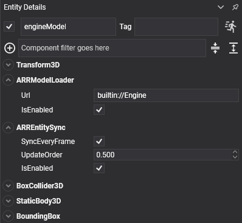

# Getting started
---

Follow the steps below to quickly start running Azure Remote Rendering on your Evergine project:

1. Create an Azure Remote Rendering instance at Azure portal (you need an Azure account).
    * Once created, copy your account id, key, and domain. You will need them to configure the session on your app.
2. Create a new Evergine project, or open an existing one.
3. Install the Evergine.ARR add-on using the add-on managemer in Evergine Studio.


4. Add the Azure Remote Rendering service to your Application

```csharp
public partial class MainApplication : Application
{
    public MainApplication()
    {
        ...
        this.Container.RegisterInstance(new AzureRemoteRenderingService());

        ForegroundTaskScheduler.Foreground.Configure(this.Container);
        BackgroundTaskScheduler.Background.Configure(this.Container);
    }
    ...
```

5. Go to Evergine Studio, add the ARRSessionManager component on the Environment manager entity and configure it using your credentials.


6. Add the Azure Remote Rendering proxy camera component to the main camera.


7. For each big model that you want to render remotely, add an entity with _ARRModelLoader_ and _ARREntitySync_ components.



> [!Note]
> The Url of your model can be obtained from Azure Remote Rendering instance in Azure Portal. If you don't have any, you can use the default builtin://Engine.

And that's it! The project should be ready to render the model(s) on windows or other platforms like UWP or Mixed Reality. Check out the [demo](https://github.com/EvergineTeam/AzureRemoteRendering) for more information or the [MRTK add-on](https://github.com/EvergineTeam/MixedRealityToolkit) to add AR controls to your project and start interacting with your models.
