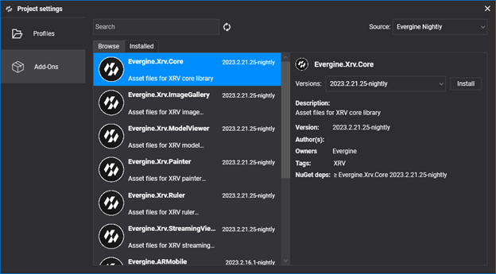

# Getting Started

---

In this section, we present step-by-step instructions to get ready to execute XRV on your device.

## Project Setup

1. Create a new project using [Evergine Launcher](../../evergine_launcher/create_project.md). You should include an extra template project, apart from Windows, for your target device. For example, with a Meta Quest headset, you can choose between _Xamarin_ and/or _.NET 6_ project templates.

2. Once Evergine Studio is opened, add an MRTK add-on. You can check [how to add add-ons to an existing project](../../addons/index.md).


3. With the MRTK add-on installed, you need to add the _Evergine.XRV.Core_ add-on using the project management dialog again.


> [!NOTE]
> All XRV add-ons have an associated NuGet package. Like Evergine packages, nightly builds of XRV are available on a public NuGet feed. Preview packages will be published on NuGet.org. So, for nightly builds, you should update your nuget.config file to include the Evergine nightly feed:
```xml
<?xml version="1.0" encoding="utf-8"?>
<configuration>
  <packageSources>
    <add key="nuget.org" value="https://api.nuget.org/v3/index.json" />
    <add key="Evergine Nightly" value="https://pkgs.dev.azure.com/plainconcepts/Evergine.Nightly/_packaging/Evergine.NightlyBuilds/nuget/v3/index.json" />
  </packageSources>
</configuration>
```

4. Change the default scene SunLight entity value for Illuminance to a value of 1.


## Code Setup

1. Register the background scheduler in your Application constructor.

```csharp
public MyApplication()
{
    this.Container.RegisterType<Settings>();
    this.Container.RegisterType<Clock>();
    this.Container.RegisterType<TimerFactory>();
    this.Container.RegisterType<Random>();
    this.Container.RegisterType<ErrorHandler>();
    this.Container.RegisterType<ScreenContextManager>();
    this.Container.RegisterType<GraphicsPresenter>();
    this.Container.RegisterType<AssetsDirectory>();
    this.Container.RegisterType<AssetsService>();
    this.Container.RegisterType<ForegroundTaskSchedulerService>();
    this.Container.RegisterType<WorkActionScheduler>();

    BackgroundTaskScheduler.Background.Configure(this.Container);
}
```

2. Change your scene class to implement XRScene.
```csharp
public class MyScene : XRScene
{
    protected override Guid CursorMatPressed => EvergineContent.MRTK.Materials.Cursor.CursorPinch;

    protected override Guid CursorMatReleased => EvergineContent.MRTK.Materials.Cursor.CursorBase;

    protected override Guid HoloHandsMat => EvergineContent.MRTK.Materials.Hands.QuestHands;

    protected override Guid SpatialMappingMat => Guid.Empty;

    protected override Guid HandRayTexture => EvergineContent.MRTK.Textures.line_dots_png;

    protected override Guid HandRaySampler => EvergineContent.MRTK.Samplers.LinearWrapSampler;

    protected override Guid LeftControllerModelPrefab => Guid.Empty;

    protected override Guid RightControllerModelPrefab => Guid.Empty;

    protected override float MaxFarCursorLength => 0.5f;

    //...
}
```

3. Add Microsoft.Bcl.AsyncInterfaces to the shared project.
```xml
<PackageReference Include="Microsoft.Bcl.AsyncInterfaces" Version="7.0.0" />
```

4. Finally, create an XrvService instance and initialize it under OnPostCreateXRScene.

MyApplication.cs
```csharp
public override void Initialize()
{
    base.Initialize();
    this.InitializeXrv();

    // ...
}

private void InitializeXrv()
{
    var xrv = new XrvService();
    this.Container.RegisterInstance(xrv);
}
```

MyScene.cs
```csharp
protected override void OnPostCreateXRScene()
{
    base.OnPostCreateXRScene();
    var xrv = Application.Current.Container.Resolve<XrvService>();
    xrv.Initialize(this);
}
```

## Platform Setup

### Android

On some platforms like Android, you may encounter build errors like this:
```
error XA2002: Cannot resolve reference: `Evergine.Editor.Extension`, referenced by `Evergine.MRTK.Editor`. Please add a NuGet package or assembly reference for `Evergine.Editor.Extension`, or remove the reference to `Evergine.MRTK.Editor`.
```
Simply add Evergine.Editor.Extension to your project, and it should work.

Also, to make use of the passthrough capability, remember to uncomment the related parts of your code in MainActivity.cs and in the Android manifest file.

### UWP (Mixed Reality)

In UWP, you may encounter some PRI generation errors that you can fix by editing your project file and adding the following:
```xml
<AppxGeneratePrisForPortableLibrariesEnabled>false</AppxGeneratePrisForPortableLibrariesEnabled>
```

Also, if you add modules that require internet access or want to use voice commands, ensure that you enable Internet Client and Microphone capabilities. For voice commands, you should also add an explicit reference in the Mixed Reality project to the _Evergine.Xrv.Core_ NuGet package.

## Add More Modules

With all this, you can run the application, but the only thing you can do is open the hand menu and its two default buttons to open Settings and Help windows. To add more functionalities, you can add any of the existing [XRV modules](modules/index.md), [create your own module](modules/customModule/index.md), or just add new elements using the XRV API.


You can also take a look at our [XRV sample](https://github.com/EvergineTeam/XRVSample) that includes all our public modules.