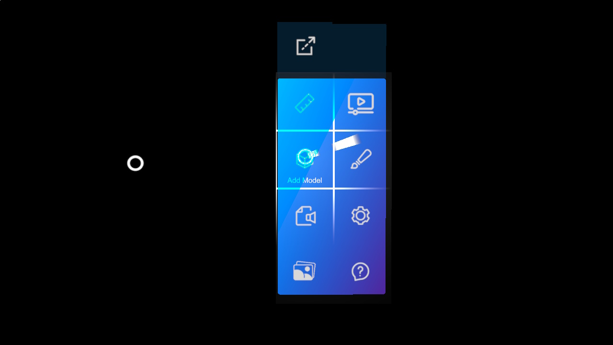

# Hand menu

One of the main features that XRV offers is the hand menu. This is an element that shows a set of buttons that can be added or removed programmatically, and which container is attached to user's wrist. When user turns his palm, menu will be displayed or hidden depending on palm orientation. It works for both left and right hands.



Each one of the configured modules for an XRV application, have the possibility to add a new button to this menu. For this, in module definition class just create an instance for _HandMenuButton_ property.

```csharp
public class MyModule : Module 
{
    public override MenuButtonDescription HandMenuButton { get; protected set; }

    public override void Initialize(Scene scene)
    {
        this.HandMenuButton = new MenuButtonDescription 
        {
            // Button configuration here
        };
    }
}
```

If you set a _null_ value to this property, no button will be automatically added to the hand menu.

### Hand menu button configuration
Here you will find a table with elements that can be configured for each one of hand menu buttons using _MenuButtonDescription_.

| Property | Description |
| ------ | ------------------- |
| **IconOn** | Material identifier to be used when button is in _on_ state for a toggle button, or just button icon for a non-toggle button.
| **IconOff** | Material identifier to be used when button is in _off_ state (for toggle buttons only). |
| **IsToggle** | Indicates if button should be a toggle button or not.
| **TextOn** | Button text to be used when button is in _on_ state for a toggle button, or just button icon for a non-toggle button. This property is a _Func\<string>_ to let user to define different values depending on application display language.
| **TextOff** | Button text to be used when button is in _off_ state (for toggle buttons only). This property is a _Func\<string>_ to let user to define different values depending on application display language. |
| **VoiceCommandOn** | Voice command to activate button when it is in _on_ state for a toggle button, or just button icon for a non-toggle button.
| **VoiceCommandOff** | Voice command to activate button when it is in _off_ state (for toggle buttons only).

### Attaching/detaching hand menu
User has the possibility to detach menu from his hand, using _Detach_ button located at the top of the menu. Doing this, menu will change its layout and behave like a standard window. User can make it to follow him or just stay pinned whenever user wants.


To bring menu back to the wrist, user just have to press detached menu _Close_ button.

### Adding buttons programmatically

You can also add or remove buttons programmatically, apart from button that you may have added (or not) from your own application module definitions. Notice that _XrvService_ exposes a _HandMenu_ property that will let you apply some custom configuration to the menu. Menu buttons collection can be modified at runtime.

```csharp
var xrv = Application.Current.Container.Resolve<XrvService>();
var handMenu = xrv.HandMenu;
var buttonDefinition = new MenuButtonDescription 
{
    // Button configuration here
}

// adding a new button
handMenu.ButtonDescriptors.Add(buttonDefinition);

// removing a defined button
handMenu.ButtonDescriptors.Remove(buttonDefinition);
```

### Hand menu layout

We don't have support to modify built-in hand menu shape or layout. You can just modify number of buttons per column. This property has a minimal size of 4 buttons per column, as this is necessary for detached menu state.

To modify number of buttons per column just use following code snippet.

```csharp
handMenu.ButtonsPerColumn = 5;
```

### Hand menu starting tutorial
An tutorial animation can be displayed every time application is started, to let users know that the should turn their hand if they want to display the menu and interact with the application.


To hide this animation on application start, you can do it with this code snippet. Note that you should deactivate the flag after XRV initialization (hand menu will not available before that).

```csharp
var xrv = Application.Current.Container.Resolve<XrvService>();
xrv.Initialize(this);
xrv.HandMenu.DisplayTutorial = false;
```