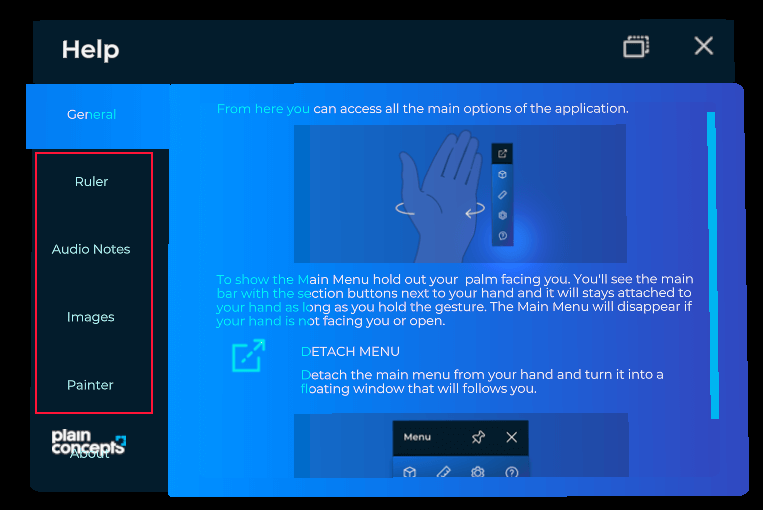

# Help System

Other of the predefined that _XRV_ offers is _Help_ window. This window is intended to contain some text and images guidance for application users, to learn how to use it. It works in the same way as [Settings System](settings_system.md): you can associate a help section to your custom module, or you can add or remove items programmatically. To open _Help_ window, just press  button that you can find in hand menu.



This window is a _TabbedWindow_ and you have two ways of adding new elements.
- Adding a help section to your custom module

```csharp
public class MyModule : Module
{
    public override TabItem Settings { get; protected set; }

    public override void Initialize(Scene scene)
    {
        this.Help = new TabItem()
        {
            Name = () => "Module Name",
            Contents = this.CreateContents() // Entity with help item contents.
        };
    }
}
```

- Using _HelpSystem_ API

```csharp
var settings = this.xrvService.Help;
var item = new TabItem
{
    Order = 1,
    Name = "My item",
    Contents = () => this.CreateContents(),
};
settings.AddTabItem(this.settingsItem);
```

You can also remove an existing item using _RemoveTabItem_ method.