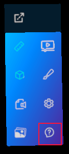

#Help System

Help system relies on tabs control to add custom help for modules.
You can access to help system thrown hand menu icon



All you have to do is create a `TabItem` and add it to `Help` property in your `Module`.

```csharp
// In the module class
this.Help = new TabItem()
{
    Name = () => "Module Name",
    Contents = this.Content, // Entity containing help control.
};
```

Now a new tab will appear below General in help section with your custom help on it.


