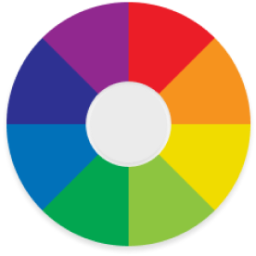

# Description

Draw lines with different colors and thickness in your scene, is useful to draw attention to something in your scene.


You can use both hands, even simultaneously.

# Installation // TODO

# Instantiate from code

```csharp
// Find XrvService instantiation...

var xrv = new XrvService()
.AddModule(new PainterModule());
```

# Usage

Open from hand menu 

> [!NOTE]
> Draw/Remove lines, only available if paint dialog is open

From menu you can select color, thickness and tools.


## Actions:

-  : Pinch fingers and drag to draw line.
-  : Pinch fingers and drag to remove line.
-  : Do nothing.
-  : Undo last action.
-  : Clean all lines.

## Color

Select color for line.



Current color is marked by dot.


## Thickness

Choose between available thickness

  
