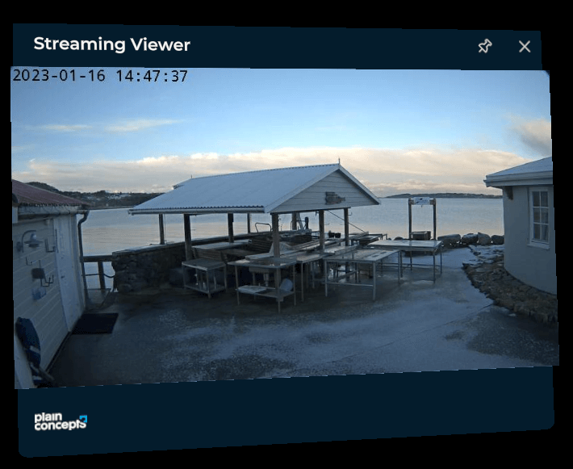

# Streaming Viewer module

This module lets you load a video stream from a _MJPEG_ source. This is the unique streaming protocol that we support in current version. Video size can't be configured: this means that window size may vary depending on returned size of images provided by the server.



> [!NOTE]
> It's required provided JPEG responses counts with _Content-Length_ header to make it work properly.

## Installation

This module is packaged as [Evergine add-on](../../../index.md). To use it in your project, just install it from _Project Settings > Add-Ons_ window.


Then, just register the module programmatically within your XRV service instance.

```csharp
var xrv = new XrvService()
    .AddModule(new StreamingViewerModule 
    {
        SourceURL = "http://<HOST>/video.mjpg"
    });
```

## Android-based systems

In Android-based systems, like Meta Quest, there are some constraints about clear text traffic. By default, it is not allowed. If you set a source that is not served over HTTPS, you must white-list camera domain or IP address using appropriate native mechanism. Please see [Android documentation](https://developer.android.com/training/articles/security-config#CleartextTrafficPermitted) for more information.

1. Add a XML file under Android resources folder. We are giving it a name _like network_security_config.xml_

```xml
<?xml version="1.0" encoding="utf-8"?>
<network-security-config>
  <domain-config cleartextTrafficPermitted="true">
    <!-- Sample IP cameras for Streaming Viewer module -->
    <domain includeSubdomains="true">IP address or domain name</domain>
  </domain-config>
</network-security-config>
```

2. Register security configuration within your application definition under Android manifest file

```xml
<application android:allowBackup="true" android:icon="@mipmap/ic_launcher" android:label="@string/app_name" android:roundIcon="@mipmap/ic_launcher_round" android:supportsRtl="true" android:networkSecurityConfig="@xml/network_security_config">
  <!-- ... -->
</application>  
```

## Usage

- Use  hand menu button to open streaming window.