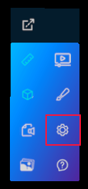
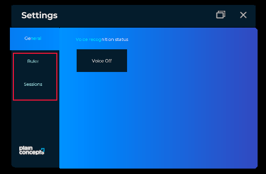

# Settings System

Settings system relies on tabs control to add custom settings for modules.
You can access to setting system thrown hand menu icon



All you have to do is create a `TabItem` and add it to `Settings` property in your `Module`.

```csharp
// In the module class
this.Settings = new TabItem()
{
    Name = () => "Module Name",
    Contents = this.Content, // Entity containing settings control.
};
```

Now a new tab will appear below general in settings section with your custom settings on it.


