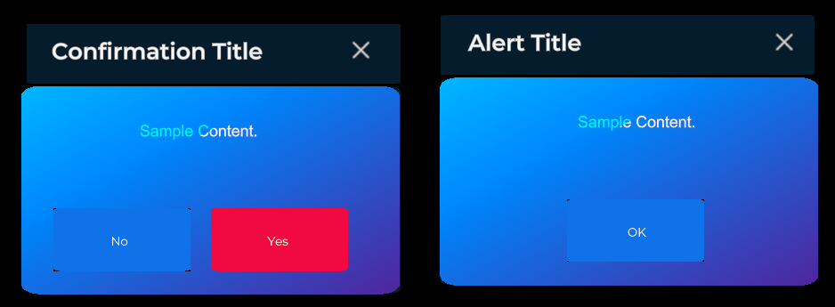
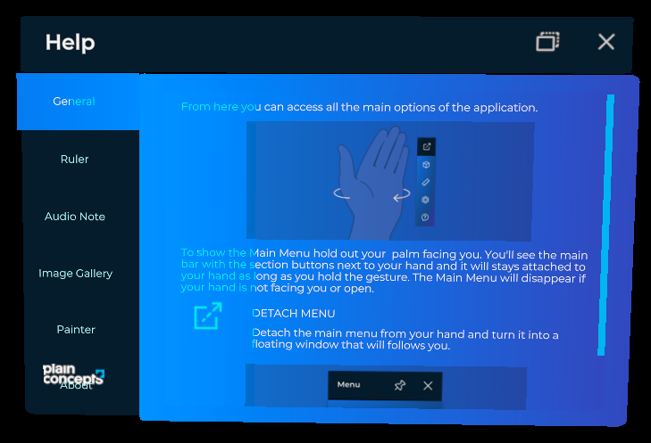

# Windows System

One of the main features that XRV offers is windows system. With windows system you can raise customizable Dialogs to inform the user or offer options.



Windows system manages this dialogs and offer an uniform view and uniform use, for user supervised information.

You can also use windows system to create a window like view of your content, with all the functionalities, like close window or follow behavior.



## Methods

Windows system provides methods for create windows

| Methods             | Description                                                                             |
| ------------------- | --------------------------------------------------------------------------------------- |
| `ShowAlertDialog`   | Shows alert dialog with title, content and text for the close button.                   |
| `ShowConfirmDialog` | Shows a confirmation dialog with title, content and personalized text for yes/no button |
| `CreateWindow`      | Shows a window with content.                                                            |

| Properties  | Description                                                         |
| ----------- | ------------------------------------------------------------------- |
| `Distances` | You can set distance in meters where you want the window to appear. |

## Examples

### Alert Dialog

```csharp
// create alert dialog
var alertDelete = this.xrvService.WindowSystem.ShowAlertDialog("Alert Title", "Sample Content.", "OK");
// Show dialog
alertDelete.Open();
```

### Confirmation Dialog

Show a confirmation dialog where we want the user to take a decision.

```csharp
// Create confirmation dialog
var confirmDelete = this.xrvService.WindowSystem.ShowConfirmDialog("Confirmation Title", "Sample Content.", "No", "Yes");
// Show dialog
confirmDelete.Open();
// Get Close event
dialog.Closed += this.Dialog_Closed;
```

Now implement actions on decision.

```csharp
private async void Dialog_Closed(object sender, EventArgs e)
{
    var dialog = sender as ConfirmDialog;
    dialog.Closed -= this.Dialog_Closed; // Remove callback.

    if (dialog.Result != ConfirmDialog.AcceptKey)
    {
        // Accept action
    }
    else
    {
        // Reject  action
    }
}
```

### Window with content

We have some content (entity) we want to appear inside a window.

```csharp
 // Setting Window
var window = this.xrv.WindowSystem.CreateWindow((config) =>
{
    config.Title = "Title"; // title for window
    config.Size = new Vector2(150,70); // width height in meters
    config.DisplayFrontPlate = false; // shows backplate
    config.DisplayLogo = false; // shows logo
    config.Content = entity; // content
});

// Show window
window.Open();
```

### Custom Distance

You want a window that appears at 0.5 meters in front of the user, we are going to need a to add a key to distances, for example "custom"

```csharp
 // Add distance to Distances
this.windowsSystem.Distances.SetDistance("custom", 0.5f);
```

Now configure the window to open with this distance key

```csharp
window.DistanceKey = "custom";
window.Open(); // Window will open at distance 0.5 meters from headset
```
