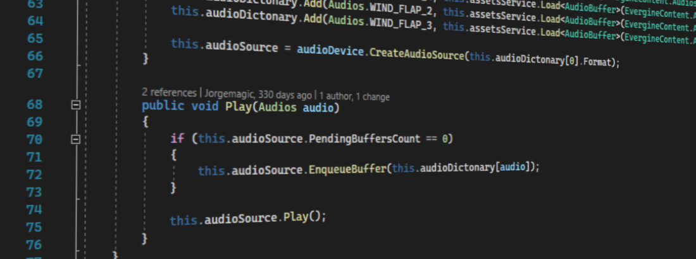

# Create audio from code



In this section are explained in more detail the all important elements to reproduce audio in your project.

## Audio Device
**Audio Device** is a class that represents an audio output device. Evergine supports to audio device implementations:

| Audio Device Implementation  | Platforms supported  | Description |
| ----                         | ----                 | ----        |
| **XAudioDevice**             | Windows, Hololens    | A lower-level audio API for Microsoft Windows, Xbox 360 and Windows Phone 8, the successor to DirectSound on Windows and a supplement to the original XAudio on the Xbox 360. |
| **ALAudioDevice**            | Windows, Web, Android, IOS, Linux, Mac | A cross-platform audio application programming interface (API). It is designed for efficient rendering of multichannel three-dimensional positional audio. Its API style and conventions deliberately resemble those of OpenGL. OpenAL is an environmental 3D audio library, which can add realism to a game by simulating attenuation (degradation of sound over distance), the Doppler effect (change in frequency as a result of motion), and material densities. OpenAL aimed to originally be an open standard and open-source replacement for proprietary (and generally incompatible with one another) 3D audio APIs such as DirectSound and Core Audio, though in practice has largely been implemented on various platforms as a wrapper around said proprietary APIs or as a proprietary and vendor-specific fork. |

In the **Program.cs** class in Evergine project template is possible to see the implementation used as Audio Device:

**Creating a XAudio2 implementation**
```csharp
// Creates XAudio device
var xaudio = new global::Evergine.XAudio2.XAudioDevice();
application.Container.RegisterInstance(xaudio);
```

**Creating a OpenAL implementation**
```csharp
// Creates OpenAL device
var audioDevice = new Evergine.OpenAL.ALAudioDevice();
application.Container.RegisterInstance(audioDevice);
```
Its methods more relevant are:

| Method  | Description  |
| ----    | ----         |
| **CreateAudioSource** | Creates an audio source where you can enqueue audio buffers. |
| **CreateAudioBuffer** | Creates an audio buffer. |


## Audio Buffer

The **audio buffer** represents a sound. When you drag an audio file to the Evergine Studio and audio asset is created automatically. You can load an audioBuffer from an audio asset using the [**AssetService**](../evergine_studio/assets/use.md):
```csharp
// Create audioBuffer from audio asset.
AudioBuffer audioBuffer = assetsService.Load<AudioBuffer>(EvergineContent.Audio.sound1_wav);
```
It is possible to create an audio buffer with procedural data too:

```csharp
// Create buffer
this.format = new WaveFormat(false);
this.buffer = this.AudioDevice.CreateAudioBuffer();

// Fill with data
var bufferData = new byte[100 * this.format.BlockAlign];
this.buffer.Fill(bufferData, 0, bufferData.Length, this.format);
```

For more details see the [AudioBuffer](xref:Evergine.Common.Audio.AudioBuffer) API reference


## Audio Source

The **audio source** represents the audio queue where it is possible to enqueue several audio buffers and reproduce them one after another.


To enqueue an audio buffer and playing it:
```csharp

// Load audio buffer
AudioBuffer audioBuffer = assetsService.Load<AudioBuffer>(EvergineContent.Audio.sound1_wav);

// Gets Audio Device instance
AudioDevice audioDevice = Application.Current.Container.Resolve<AudioDevice>();

// Create Audio Source
AudioSource audioSource = audioDevice.CreateAudioSource(audioBuffer.Format);

// Enqueue audio buffer
if (audioSource.PendingBufferCount == 0)
{
	audioSource.EnqueueBuffer(audioBuffer);
}

// Play the audio source.
audioSource.Play();
```

Its methods more relevants are:

| Method  | Description  |
| ----    | ----         |
| **EnqueueBuffer**  |  Enqueue an audio buffer.  |
| **Play** | Play all buffers enqueued in the audio source.|
| **Pause** | Pause the audio source reproduction. |
| **Stop**  | Stop the audio source reproduction. |

For more details see the [AudioSource](xref:Evergine.Common.Audio.AudioSource) API reference