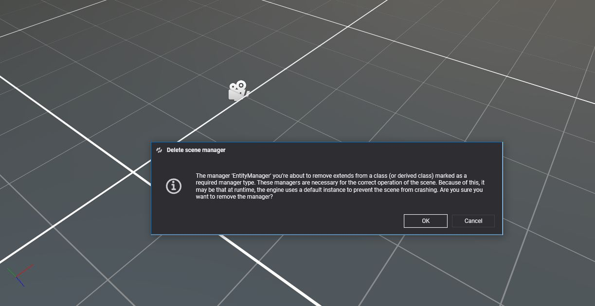

# Scene Managers

In **Evergine** the **SceneManagers** are elements that control some important aspects of the scene. They are not based as entities because they behave as a global element of the scene and cannot be attached into a specific entity. 

All SceneManagers in a Scene can be accessed using the `Scene.Managers` property. This allow to register and access SceneManagers.

## Default SceneManagers.
**Evergine** scenes are created with some **SceneManagers** by default. These are:

| SceneManager | Access Property | Description |
| ------------ | ----------- | -----|
| **EntityManager** | ```this.Managers.EntityManager``` | Controls the entities of the scene. More information in the [EntityManager](../component_arch/entities/entity_manager.md) article.
| **AssetsSceneManager** | ```this.Managers.AssetsSceneManager``` | Controls the asset of the scene. More information below.
| **BehaviorManager** | ```this.Managers.BehaviorManager``` | Manages the behavior update execution of the scene and their priority order.
| **RenderManager** | ```this.Managers.RenderManager``` | Handles the **Rendering** of the scene. More information in the [Rendering](../../graphics/rendering_overview.md) article.
| **EnvironmentManager** | ```this.Managers.EnvironmentManager``` | Controls the environmental information of the scene. Their Reflection Probes, their environmental radiance and irrandiance maps, etc. More information in the [Environment](../../graphics/environment.md) article.
| **PhysicManager3D** | ```this.Managers.PhysicManager3D```| Manages the physic simulation. All the Rigid or Static bodies are registered into this manager. More information in the [Physic Manager and Bullet](../../physics/physicmanager_bullet.md) article.

>[!NOTE]
> The **PhysicsManager3D** scene manager is not registered by default although in the project template it's loaded in the **RegisterManagers** method of the template scene class.

### Assets Scene Manager
The **AssetsSceneManager** controls all the asset loaded in the scene. When the scene is disposed **AssetsSceneManager** automatically unloads all the assets of the scene, releasing all the GPU memory in the process. More information in the [Use Assets](../../evergine_studio/assets/use.md) article.
 
## Create custom SceneManager

In the previous section we've covered all the default **SceneManagers** of the scene. However you can create your own **SceneManager**.

For doing that:
- Create a new class in the **Evergine** project in the **Visual Studio Solution**.
- Set that the new class inherit from **SceneManager** class.

The new created scene manager can use all the **lifecycle** methods like **OnAttached**, **OnDetach**, etc. More information in [Life cycle](../lifecycle_elements.md) article.

### UpdatableSceneManager

In addition, instead on creating a class that inherit **SceneManager** we can choose to inherit from **UpdatableSceneManager**. This class has an **Update** method that will be called in every frame. This is useful for managers that need to update some components in real time. For example, **PhysicManager3D** controls the physic simulation using this method.

## Using SceneManagers

### Register a Scene Manager
We can register a new **SceneManager** from code like this:

```csharp

// We can register a scene manager directly using the actual instance.
this.Managers.AddManager(new MyManager());

// Alternatively we can register by type. Useful when dealing with abstract classes.
this.Managers.AddManager<PhysicsManager3D>(new BulletPhysicsManager3D());

```

### Unregister a Scene Manager.

We can also unregister calling the following function:

```csharp

// We can remove the manager using its instance.
this.Managers.RemoveManager(myManagerInstance);

// Or the type. For example, next line will remove BulletPhysicsManager3D manager that we registered in the previous section.
this.Managers.RemoveManager<PhysicsManager3D>();
```

### Obtaining a SceneManager
We can obtain a registered **SceneManager** in several ways.

#### Using [BindSceneManager] attribute

With the [BindSceneManager] attribute in your Component or another custom SceneManager (See the [Binding article](../bindings/index.md))

```csharp

public class MyComponent : Component 
{    
    [BindSceneManager]
    public RenderManager RenderManager;

    protected override void Start()
    {
        // Once the component is attached, the RenderManager property has being bound...
        this.RenderManager.DebugLines = true;
    }
}

```

#### Searching the SceneManager directly
 
Using the SceneManager.FindManager<T>() you can find your desired manager

```csharp

MyManager manager = this.Managers.FindManager<MyManager>();

// This for example will return the BulletPhysicsManager3D registered before.
PhysicsManager3D physics = this.Managers.FindManager<PhysicsManager3D>();

// For default SceneManagers you can access using quick properties :)
RenderManager renderManager = this.Managers.RenderManager;

```

## Scene managers in Evergine Studio
Until _Evergine 2022.2.16_, default scene template included an entity named _SceneManagers_ to configure some of built-in managers. From now, this entity is no longer included when you create a new scene, as scene managers are included in a separate panel.

 

In that panel, you count with a user interface very similar to _Entity Details_ panel, where you can manage components for an entity. In this case, you can manage scene managers for your scene. Behavior is the same: to add a new manager, just make use of add button and search for the element you want.


By default, managers search window will scan all available managers in your project and Evergine core libraries. If you don't want that one of your custom managers to be selectable, mark your class with _[Discoverable(false)]_ attribute.

```
[Discoverable(false)]
public class MyManager : SceneManager
{
}
```

To remove a manager from a scene, just right click over the element and select remove option. There are a few managers that are required for the engine to correctly work, so you should be careful about removing them. Anyways, a confirmation message will be displayed if you try to remove one of those managers.



### Migrating older scenes
For scenes created with Until _Evergine 2022.2.16_ or below, _Evergine Studio_ will ask you for asset update once you open the scene file. It will automatically copy your custom values for shadows and environment managers located in obsolete _SceneManagers_ entity to scene managers saved within your scene. 

 

It is recommendable to confirm scene update when requested, but this process can't be undone if, for some reason, you decide to go back to _Evergine 2022.2.16_. Once scene asset is updated, _SceneManagers_ entity will be removed and replaced by entries in managers file section.