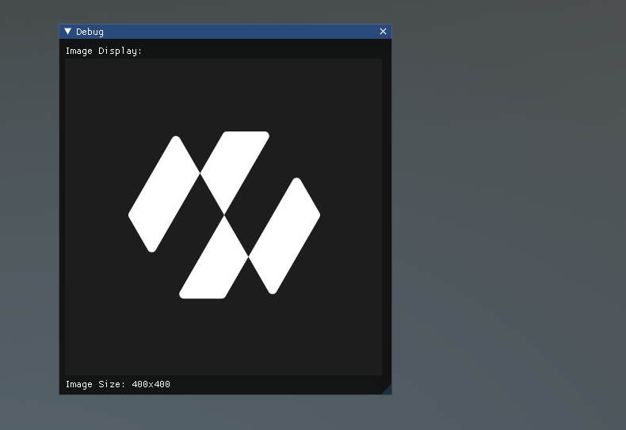

# Features
---

Here is a list of different controls that you can create with just a few lines of code. Here is the complete list:

## Window

**Windows** are draggable containers of controls. They can receive and lose focus when clicked. Because of this, they are implemented slightly differently from the other controls. Each Window has an ID number, and its contents are declared inside a separate function that is called when the Window has focus.

```csharp
using Evergine.Framework;
using System;
using Evergine.UI;
using Evergine.Bindings.Imgui;
using Evergine.Mathematics;

namespace ImGUI
{
    public unsafe class MyUI : Behavior
    {
        bool open = true;

        protected override void Update(TimeSpan gameTime)
        {
            ImguiNative.igSetNextWindowPos(new Vector2(420, 120), ImGuiCond.Appearing, new Vector2(1, 0.5f));
            ImguiNative.igSetNextWindowSize(new Vector2(400, 100), ImGuiCond.Appearing);
            ImguiNative.igBegin("MyWindow", open.Pointer(), ImGuiWindowFlags.None);

            // Controls

            ImguiNative.igEnd();
        }
    }
}
```


## LabelText

The **LabelText** is non-interactive. It is for display only. It cannot be clicked or otherwise moved. It is best for displaying information only.

```csharp
using Evergine.Framework;
using System;
using Evergine.UI;
using Evergine.Bindings.Imgui;

namespace ImGUI
{
    public unsafe class MyUI : Behavior
    {
        bool open = true;

        protected override void Update(TimeSpan gameTime)
        {
            ImguiNative.igBegin("MyWindow", open.Pointer(), ImGuiWindowFlags.None);

            ImguiNative.igLabelText("This is a label", "Value1");
            ImguiNative.igLabelText("This is another label", "Value2");

            ImguiNative.igEnd();
        }
    }
}
```


## Button

The **Button** is a typical interactive button. It will respond a single time when clicked, no matter how long the mouse remains depressed. The response occurs as soon as the mouse button is released.

```csharp
using Evergine.Framework;
using System;
using Evergine.UI;
using Evergine.Bindings.Imgui;
using Evergine.Mathematics;

namespace ImGUI
{
    public unsafe class MyUI : Behavior
    {
        uint clicked;
        bool open = true;

        protected override void Update(TimeSpan gameTime)
        {
            ImguiNative.igBegin("MyWindow", open.Pointer(), ImGuiWindowFlags.None);

            if (ImguiNative.igButton("Press me", new Vector2(100, 25)))
            {
                clicked++;
            }

            if (clicked > 0)
            {
                ImguiNative.igText("Thanks for clicking me!");
            }

            ImguiNative.igEnd();
        }
    }
}
```


## Text

The **Text** Control is an interactive, editable single-line field containing a text string.

```csharp
using Evergine.Framework;
using System;
using Evergine.UI;
using Evergine.Bindings.Imgui;

namespace ImGUI
{
    public unsafe class MyUI : Behavior
    {
        bool open = true;

        protected override void Update(TimeSpan gameTime)
        {
            ImguiNative.igBegin("MyWindow", open.Pointer(), ImGuiWindowFlags.None);

            ImguiNative.igText("This is a text control");

            ImguiNative.igEnd();
        }
    }
}

```


## InputText

The **InputText** Control is an interactive, editable area containing a text string.

```csharp
using Evergine.Framework;
using System;
using Evergine.UI;
using Evergine.Bindings.Imgui;
using Evergine.Mathematics;
using System.Text;

namespace ImGUI
{
    public unsafe class MyUI : Behavior
    {
        bool open = true;

        // Create a StringBuilder to hold the input text
        StringBuilder inputText = new StringBuilder(256);

        protected override void Update(TimeSpan gameTime)
        {
            ImguiNative.igBegin("Input Text Example", open.Pointer(), ImGuiWindowFlags.None);

            // Set window size
            ImguiNative.igSetNextWindowSize(new Vector2(400, 150), ImGuiCond.FirstUseEver);

            // Create the input text field
            fixed (byte* buffer = Encoding.UTF8.GetBytes(inputText.ToString().PadRight(256, '\0')))
            {
                if (ImguiNative.igInputText("Enter text:", buffer, 256, ImGuiInputTextFlags.None, null, null))
                {
                    inputText.Clear();
                    inputText.Append(Encoding.UTF8.GetString(buffer, 256).TrimEnd('\0'));
                }
            }

            // Display the current input text
            ImguiNative.igText($"Current text: {inputText}");

            // Add a button to clear the input
            if (ImguiNative.igButton("Clear", new Vector2(100, 30)))
            {
                inputText.Clear();
            }

            ImguiNative.igEnd();
        }
    }
}
```


## Toggle

The **Toggle** Control creates a checkbox with a persistent on/off state. The user can change the state by clicking on it.

```csharp
using Evergine.Framework;
using System;
using Evergine.UI;
using Evergine.Bindings.Imgui;

namespace ImGUI
{
    public unsafe class MyUI : Behavior
    {
        bool open = true;

        // Create a boolean to hold the state of the toggle
        bool isToggled = false;

        protected override void Update(TimeSpan gameTime)
        {
            ImguiNative.igBegin("MyWindow", open.Pointer(), ImGuiWindowFlags.None);

            // Create the toggle button
            if (ImguiNative.igCheckbox("Toggle me", isToggled.Pointer()))
            {
                // This code block will run when the toggle state changes
                System.Console.WriteLine($"Toggle state changed to: {isToggled}");
            }

            // Display the current state of the toggle
            ImguiNative.igText($"Toggle state: {(isToggled ? "ON" : "OFF")}");

            ImguiNative.igEnd();
        }
    }
}
```


## Toolbar

A **Toolbar** is a graphical control element that displays a row of selectable items, typically represented as icons or buttons. It provides quick access to frequently used commands or options within an application.

```csharp
using Evergine.Framework;
using System;
using Evergine.UI;
using Evergine.Bindings.Imgui;
using Evergine.Mathematics;
using System.Text;

namespace ImGUI
{
    public unsafe class MyUI : Behavior
    {
        bool open = true;

        // Toolbar state
        bool isBold = false;
        bool isItalic = false;
        bool isUnderline = false;
        int fontSize = 12;
        int alignmentState = 0; // 0: Left, 1: Center, 2: Right

        protected override void Update(TimeSpan gameTime)
        {
            ImguiNative.igBegin("Text Editor Toolbar", open.Pointer(), ImGuiWindowFlags.None);

            // Set window size
            ImguiNative.igSetNextWindowSize(new Vector2(600, 100), ImGuiCond.FirstUseEver);

            // Begin a horizontal layout for the toolbar
            ImguiNative.igBeginGroup();

            // Text style toggles
            if (ToggleButton("B", isBold, new Vector2(30, 30))) isBold = !isBold;
            if (ImguiNative.igIsItemHovered(ImGuiHoveredFlags.None)) ImguiNative.igSetTooltip("Toggle Bold");
            ImguiNative.igSameLine(0, 5);

            if (ToggleButton("I", isItalic, new Vector2(30, 30))) isItalic = !isItalic;
            if (ImguiNative.igIsItemHovered(ImGuiHoveredFlags.None)) ImguiNative.igSetTooltip("Toggle Italic");
            ImguiNative.igSameLine(0, 5);

            if (ToggleButton("U", isUnderline, new Vector2(30, 30))) isUnderline = !isUnderline;
            if (ImguiNative.igIsItemHovered(ImGuiHoveredFlags.None)) ImguiNative.igSetTooltip("Toggle Underline");
            ImguiNative.igSameLine(0, 15);

            // Font size adjustment
            if (ImguiNative.igButton("-", new Vector2(30, 30)) && fontSize > 8) fontSize--;
            if (ImguiNative.igIsItemHovered(ImGuiHoveredFlags.None)) ImguiNative.igSetTooltip("Decrease Font Size");
            ImguiNative.igSameLine(0, 5);

            ImguiNative.igText($"{fontSize}");
            ImguiNative.igSameLine(0, 5);

            if (ImguiNative.igButton("+", new Vector2(30, 30)) && fontSize < 72) fontSize++;
            if (ImguiNative.igIsItemHovered(ImGuiHoveredFlags.None)) ImguiNative.igSetTooltip("Increase Font Size");
            ImguiNative.igSameLine(0, 15);

            // Text alignment
            if (ImguiNative.igButton("Left", new Vector2(50, 30))) alignmentState = 0;
            if (ImguiNative.igIsItemHovered(ImGuiHoveredFlags.None)) ImguiNative.igSetTooltip("Align Left");
            ImguiNative.igSameLine(0, 5);

            if (ImguiNative.igButton("Center", new Vector2(50, 30))) alignmentState = 1;
            if (ImguiNative.igIsItemHovered(ImGuiHoveredFlags.None)) ImguiNative.igSetTooltip("Align Center");
            ImguiNative.igSameLine(0, 5);

            if (ImguiNative.igButton("Right", new Vector2(50, 30))) alignmentState = 2;
            if (ImguiNative.igIsItemHovered(ImGuiHoveredFlags.None)) ImguiNative.igSetTooltip("Align Right");

            ImguiNative.igEndGroup();

            // Display the current text style
            ImguiNative.igText($"Text Style: {(isBold ? "Bold " : "")}{(isItalic ? "Italic " : "")}{(isUnderline ? "Underline " : "")}");
            ImguiNative.igText($"Font Size: {fontSize}");
            ImguiNative.igText($"Alignment: {(alignmentState == 0 ? "Left" : alignmentState == 1 ? "Center" : "Right")}");

            ImguiNative.igEnd();
        }

        // Helper method to create a toggle button
        private bool ToggleButton(string label, bool isActive, Vector2 size)
        {
            ImguiNative.igPushStyleColor_Vec4(ImGuiCol.Button, isActive ? new Vector4(0.2f, 0.7f, 0.2f, 1.0f) : new Vector4(0.2f, 0.2f, 0.2f, 1.0f));
            bool clicked = ImguiNative.igButton(label, size);
            ImguiNative.igPopStyleColor(1);
            return clicked;
        }
    }
}

```


## Images

**Image** controls in ImGui allow you to display images within your user interface. When working with ImGui in C# using Evergine bindings, you can use these controls to show textures, icons, or any other graphical elements.

```csharp
using Evergine.Framework;
using System;
using Evergine.UI;
using Evergine.Bindings.Imgui;
using Evergine.Mathematics;
using System.Threading.Tasks;

namespace LoadingImages
{
    public class MyUI : Behavior
    {
        bool open = true;
        IntPtr image;

        [BindSceneManager]
        ImGuiManager imguiManager;

        protected override void Start()
        {
            base.Start();
            DownloadImage();
        }

        private async void DownloadImage()
        {
            string url = $"https://pbs.twimg.com/profile_images/1460919352862158851/T0aHus0C_400x400.jpg";
            var textureimage = await ImGUIHelpers.DownloadTextureFromUrl(url);
            image = imguiManager.CreateImGuiBinding(textureimage);
        }

        protected override unsafe void Update(TimeSpan gameTime)
        {
            ImguiNative.igBegin("Debug", open.Pointer(), ImGuiWindowFlags.None);

            // Set window size
            ImguiNative.igSetNextWindowSize(new Vector2(500, 500), ImGuiCond.FirstUseEver);

            ImguiNative.igText("Image Display:");

            if (image != IntPtr.Zero)
            {
                Vector2 imageSize = new Vector2(400, 400);
                ImguiNative.igImage(image, imageSize, new Vector2(0, 0), new Vector2(1, 1), new Vector4(1, 1, 1, 1), new Vector4(0, 0, 0, 0));
                ImguiNative.igText($"Image Size: {imageSize.X}x{imageSize.Y}");
            }
            else
            {
                ImguiNative.igTextColored(new Vector4(1, 0, 0, 1), "Failed to load image");
            }

            ImguiNative.igEnd();
        }
    }
}
```



## SelectionGrid

A **SelectionGrid** is a user interface component that displays a grid of selectable items. It allows users to choose one or more items from a set of options presented in a grid layout.

```csharp
using Evergine.Framework;
using System;
using Evergine.UI;
using Evergine.Bindings.Imgui;
using Evergine.Mathematics;
using System.Text;
using System.Collections.Generic;

namespace ImGUI
{
    public unsafe class MyUI : Behavior
    {
        bool open = true;

        private List<string> items;
        private List<bool> selectedItems;
        private int columns = 3;

        protected override void Start()
        {
            base.Start();

            // Initialize items
            items = new List<string>
            {
                "Item 1", "Item 2", "Item 3", "Item 4", "Item 5",
                "Item 6", "Item 7", "Item 8", "Item 9", "Item 10"
            };

            // Initialize selection state
            selectedItems = new List<bool>(new bool[items.Count]);
        }

        protected override void Update(TimeSpan gameTime)
        {
            ImguiNative.igBegin("Selection Grid", open.Pointer(), ImGuiWindowFlags.None);

            // Set window size
            ImguiNative.igSetNextWindowSize(new Vector2(400, 300), ImGuiCond.FirstUseEver);

            ImguiNative.igText("Select items from the grid:");

            // Calculate item width based on available space and number of columns
            float windowWidth = ImguiNative.igGetWindowWidth();
            float itemWidth = (windowWidth - (columns - 1) * ImguiNative.igGetStyle()->ItemSpacing.X) / columns;

            for (int i = 0; i < items.Count; i++)
            {
                if (i % columns != 0)
                    ImguiNative.igSameLine(0, -1);

                ImguiNative.igPushID_Int(i);
                bool selectedBool = selectedItems[i];
                if (ImguiNative.igSelectable_BoolPtr(items[i], selectedBool.Pointer(), ImGuiSelectableFlags.None, new Vector2(itemWidth, 0)))
                {
                    selectedItems[i] = !selectedItems[i];
                }
                ImguiNative.igPopID();
            }

            ImguiNative.igSeparator();

            ImguiNative.igText("Selected items:");
            for (int i = 0; i < items.Count; i++)
            {
                if (selectedItems[i])
                {
                    ImguiNative.igBulletText(items[i]);
                }
            }

            ImguiNative.igEnd();
        }
    }
}

```


## Slider

A **Slider** is a user interface control that allows users to select a value from a continuous range by sliding a handle along a horizontal or vertical track.

```csharp
using Evergine.UI;
using Evergine.Bindings.Imgui;
using Evergine.Mathematics;
using System.Text;

namespace ImGUI
{
    public unsafe class MyUI : Behavior
    {
        bool open = true;

        private float sliderValue = 50f;
        private float minValue = 0f;
        private float maxValue = 100f;

        protected override void Update(TimeSpan gameTime)
        {
            ImguiNative.igBegin("Horizontal Slider", open.Pointer(), ImGuiWindowFlags.None);

            // Set window size
            ImguiNative.igSetNextWindowSize(new Vector2(400, 200), ImGuiCond.FirstUseEver);

            ImguiNative.igText("Adjust the slider:");

            fixed (float* valuePointer = &sliderValue)
            {
                // Create the slider
                if (ImguiNative.igSliderFloat("##slider", valuePointer, minValue, maxValue, "%.1f", ImGuiSliderFlags.None))
                {
                    // This code block will run when the slider value changes
                    System.Console.WriteLine($"Slider value changed to: {sliderValue}");
                }
            }

            // Display the current value
            ImguiNative.igText($"Current Value: {sliderValue:F1}");

            ImguiNative.igEnd();
        }
    }
}
```


