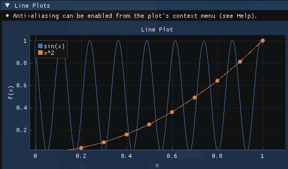
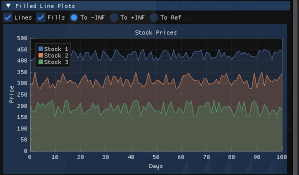

## ImPlot
---

This extension also allow you to use the ImPlot library, this is an immediate mode, GPU accelerated plotting library for ImGUI, this project and source code is available on github at: https://github.com/epezent/implot.

> [!NOTE]
> The C# wrapper is generated on top of a c-api wrapper version of this library, so some samples may not work directly but all the features are supported.

# Features

The list of supported plot are:

## Line Plots

A **line plot** or chart plot is a type of chart which displays information as a series of data points called 'markers' connected by straight line segments. It is a basic type of chart common in many fields. It is similar to a scatter plot except that the measurement points are ordered (typically by their x-axis value) and joined with straight line segments. A line plot is often used to visualize a trend in data over intervals of time.

## Filled Line Plots

## Shaded Plots

## Scatter Plots

A **scatter plot** is a type of plot or mathematical diagram using Cartesian coordinates to display values for typically two variables for a set of data. If the points are coded (color/shape/size), one additional variable can be displayed. The data are displayed as a collection of points, each having the value of one variable determining the position on the horizontal axis and the value of the other variable determining the position on the vertical axis.

## Realtime Plots

## Stairstep Plots

## Bar Plots

A bar chart or bar graph is a chart or graph that presents categorical data with rectangular bars with heights or lengths proportional to the values that they represent. The bars can be plotted vertically or horizontally.

## Bar Groups

## Bar Stacks

## Error Bars

## Stem Plots

## Infinite Lines

## Pie Charts

A pie chart (or a circle chart) is a circular statistical graphic, which is divided into slices to illustrate numerical proportion. In a pie chart, the arc length of each slice (and consequently its central angle and area) is proportional to the quantity it represents. While it is named for its resemblance to a pie which has been sliced, there are variations on the way it can be presented.

## Heatmaps

A heat map (or heatmap) is a data visualization technique that shows magnitude of a phenomenon as color in two dimensions. The variation in color may be by intensity, giving obvious visual cues to the reader about how the phenomenon is clustered or varies over space.

## Histogram

A histogram is an approximate representation of the distribution of numerical data.
To construct a histogram, the first step is the range of values that divide the entire range of values into a series of intervals and then count how many values fall into each interval.

## Histogram 2D

## Digital Plots
