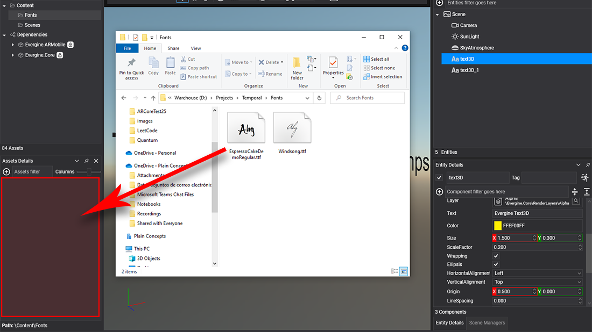

# Import Fonts
---

The **font** asset allow you render text in your project using differents font families and styles.

## Import a Font asset in Evergine Studio
You can create a font by dragging a font file to the [Assets Details](../../evergine_studio/interface.md) panel, as explained [in this article](../../evergine_studio/assets/create.md).

## Font files in content directory
**Fonts** imported in **Evergine** create an aditional metadata `.weft` file.

## Supported formats:
**Evergine** supports the following font file formats:

| Extension |  Description | 
| ----| ----| 
| `.ttf`| 

**TrueType** is an outline font standard developed by Apple in the late 1980s as a competitor to Adobe's Type 1 fonts used in PostScript. It has become the most common format for fonts on the classic Mac OS, macOS, and Microsoft Windows operating systems.
 
The primary strength of TrueType was originally that it offered font developers a high degree of control over precisely how their fonts are displayed, right down to particular pixels, at various font sizes. With widely varying rendering technologies in use today, pixel-level control is no longer certain in a TrueType font. 

|
| `.otf` | 

**OpenType** is a format for scalable computer fonts. It was built on its predecessor TrueType, retaining TrueType's basic structure and adding many intricate data structures for prescribing typographic behavior. OpenType is a registered trademark of Microsoft Corporation.

The specification germinated at Microsoft, with Adobe Systems also contributing by the time of the public announcement in 1996.

Because of wide availability and typographic flexibility, including provisions for handling the diverse behaviors of all the world's writing systems, OpenType fonts are used commonly on major computer platforms.
 