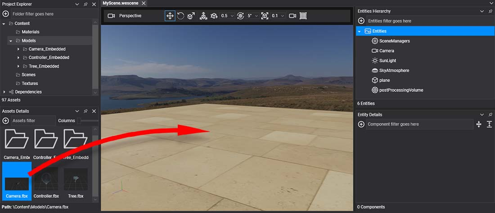

# Using Models


In this document you will learn how to load and use **Models** in your applications.

## Load Model from code
The following sample code can be used to instantiate an existing **Model** asset (`camera.fbx` in this case) into your scene, creating a entity hierarchy.

```csharp
protected override void CreateScene()
{
    var assetsService = Application.Current.Container.Resolve<AssetsService>();

    // Load Model assets
    Model cameraModel = assetsService.Load<Model>(EvergineContent.Models.Camera_fbx);

    // Apply to an entity
    Entity camera = cameraModel.InstantiateModelHierarchy(assetsService);

    // Alternatively this method accepts the name of the root entity.
    Entity camera = cameraModel.InstantiateModelHierarchy("coolCamera", assetsService);

    // Adds the entity into the scene.
    this.Managers.EntityManager.Add(camera);
}
```

## How to create models from Evergine Studio.

For instantiating a **Model** into a **Scene** just drag the model asset from the *Asset Details Panel* into  your **Scene**.



This will instantiate a full hierarchy of entities into the **Scene**.


The new created hiearchy has the next kind of entities:

| Node Type | Description |
| --------- | --------------- |
| **Root**  | The root node of the hierarchy. If the model contains animation this entity will contain the **Animation3D** component.
| **Node** | Nodes without geometry attached. They are empty entities with just a **Transform3D** with the specific position, scale and orientation.
| **Mesh** | <div><p>Node that contains geometry. It contains the following components: <li>**MeshComponent**, specifying with mesh from the model it will show.</li><li>**MaterialComponent**. For every different material from the entity mesh, a component will be created.</li><li>**MeshRenderer** for rendering the geometry.</li></div>
| **Skin** | If the node contains a skinned mesh, it will have the same components of a normal *Mesh* node, but using **SkinnedMeshRenderer** component instead.

As you can see this, entity hierarchy mirrors the inner **Model** asset structure seen [here](index.md).