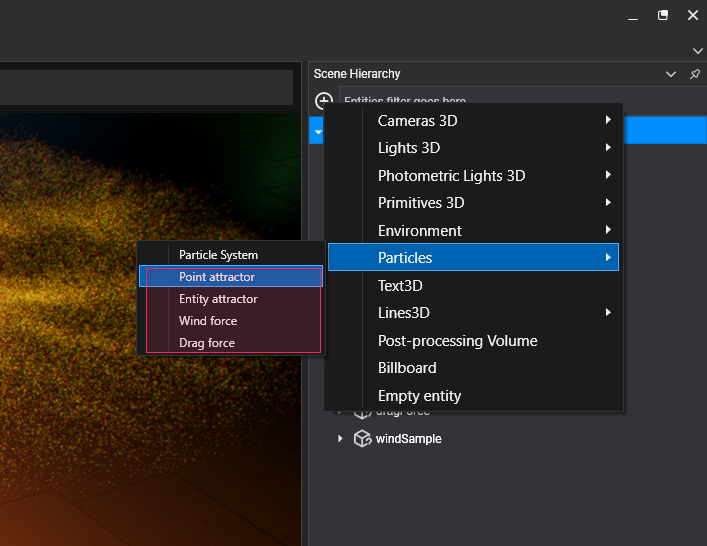

# Particle Forces

<video autoplay loop muted width="100%" height="auto">
  <source src="images/particle_forces_header.mp4" type="video/mp4">
</video>

**Particle forces** are components that, once attached to an entity, can alter the behavior of a **Particle System**. They primarily alter the velocity of the particles according to a set of rules.

## Creating Forces in Evergine Studio

In the Entities Hierarchy panel of your Scene Editor, click "Add Entity" and select **Particles**, then choose the type of force you want to create:

* Point attractor
* Entity attractor
* Wind force
* Drag force

We will discuss the force types later in this article.



This will create a new entity in the **Scene**.


The newly created entity has a **Transform3D** component and a new component, depending on the type of force (see below).

## Creating Forces by Code

The following sample code can be used to instantiate an existing material asset and apply it to an entity in your scene.
```csharp
protected override void CreateScene()
{
    // Creates the entity. A Point Attractor in this sample.
    Entity particleForce = new Entity()
        .AddComponent(new Transform3D())
        .AddComponent(new PointAttractorForce()
        {
            ForceCategory = CollisionCategory3D.All
        });

    this.Managers.EntityManager.Add(particleForce);
}
```

## Common Properties

All particle forces share a common base class (**BaseForce**). This class contains the following properties, making them accessible to all forces:

| Property       | Default value | Description |
|----------------|----------------|-------------|
| Strength       | _1_            | Factor of how much the force affects the particles. |
| Force Category | _All_           | Category of the force. A force only affects particle systems that share the same ForceCategory. |
| Range Enabled  | _true_         | If the force has a maximum range effect. |
| Range          | _1_            | The maximum distance at which the particle system is affected by the force. |
| Decay Enabled  | _true_         | If true, the particle force will decay over its range. |

## Types of Forces

As stated previously, **Evergine** supports the following particle system forces:

### Point Attractor Force
This force gravitationally pulls all the particles into a point. In addition to the common properties of the base class, **Particle Attractor Force** adds properties for managing a _cutout_ behavior.

#### Cutout Effect
The cutout effect is a behavior affecting particles that get closer to the attractor center. Instead of being gravitationally pulled to the center and orbiting around that point, the cutout effect causes particles to be dragged directly to its center without escaping or continuing to orbit. This is useful when we want to control particles that go to a specific point without endlessly orbiting around its center.

<video autoplay loop muted width="auto" height="auto">
    <source src="images/cutout_on_off.mp4" type="video/mp4">
</video>

| Property        | Default value | Description                                                               |
|-----------------|----------------|---------------------------------------------------------------------------|
| Cutout Enabled  | _false_        | Enables the _cutout_ behavior of the force.                               |
| Cutout Strength | _All_          | The intensity at which the particles are dragged into a vortex pit.       |
| Cutout Range    | _true_         | The range within which the particles start falling into the force center. |

### Entity Attractor Force

<video autoplay loop muted width="auto" height="auto">
    <source src="images/entity_attractor.mp4" type="video/mp4">
</video>

The **Entity Attractor Force** is similar to the Point Attractor Force, but the particles are attracted to an Entity, specifically to all the meshes contained in an entity. It has the same **Cutout** parameters as previously stated, but in addition, it has the following properties:

| Property             | Default value | Description                                                |
|----------------------|----------------|------------------------------------------------------------|
| Source Entity Path   | _null_         | The path of the target entity of the force.                 |
| Source Topology      | _Vertex_       | The part of the mesh topology towards which the particles are attracted. Its values can be _Vertex_ or _Triangle_.|

>[!NOTE]
>In this version, **Evergine** does not support _Triangle_ as **Source Topology**.

### Wind Force

The **Wind Force** pushes the particles in the **entity's forward direction** around its effect area (if the range is enabled). It doesn't have additional parameters. Its strength controls how much the particles are pushed by the wind.

<video autoplay loop muted width="auto" height="auto">
    <source src="images/wind.mp4" type="video/mp4">
</video>

### Drag Force

The **Drag Force** drags the particles around its effect area (if the range is enabled). It doesn't have additional parameters. Its strength controls how much the particles are dragged by the force.

<video autoplay loop muted width="auto" height="auto">
    <source src="images/drag.mp4" type="video/mp4">
</video>