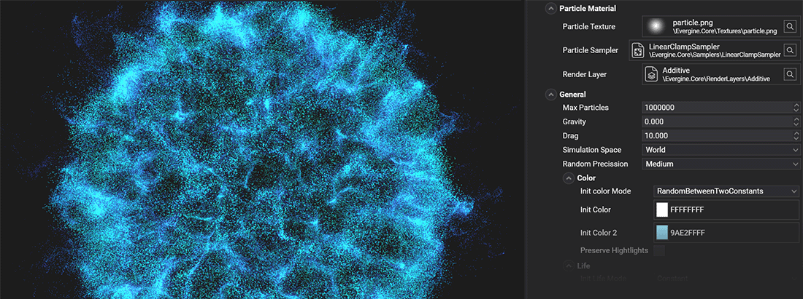
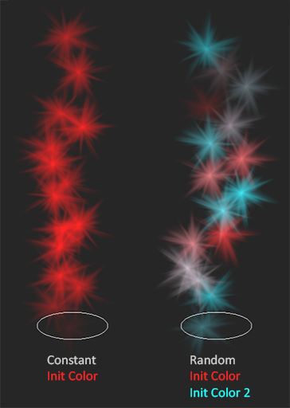

# Particle System properties

A particle system has the next properties.

## Particles Material
Group that manages the properties relative to the particle  material.

|  Property      | Default value | Description   |
| ---- | ---- | ---- | 
| **Texture**  | _particle.png_            | The texture that will appear in each particle quad. |
| **Sampler State**  | _LinearClampSampler_            | The texture sampler state. |
| **RenderLayer**  | _Additive_            | The texture render layer. |

## General properties
Properties that controls the basic aspects of the particle system.

|  Property      | Default value | Description   |
| ---- | ---- | ---- | 
| **Max Particles**  | _1000_ | The maximum amount of particles the emitter can handle. The emission will be paused if it reaches this number. |
| **Gravity**  | _0_ | 

Sets the gravity of the particle system.
<li>Gravity value of 9.8</li><video autoplay loop muted width="480"><source src="images/gravity.mp4" type="video/mp4"></video>

| **Drag**  | _0_ | 

The amount of resistance the particle will find.
<li>Drag value of 0.</li><video autoplay loop muted width="480"><source src="images/drag_off.mp4" type="video/mp4"></video><li>Drag value of 2.</li><video autoplay loop muted width="480"><source src="images/drag_on.mp4" type="video/mp4"></video>
 |
| **Simulation Space**  | _World_ | 

Sets the simulation space of the particle. In **Local** space the particle positions stays relative to its emitter transform. In **World** space all coordinates are global.
<li>Simulation Space value of World.</li><video autoplay loop muted width="480"><source src="images/world_space.mp4" type="video/mp4"></video><li>Simulation Space value of Local.</li><video autoplay loop muted width="480"><source src="images/local_space.mp4" type="video/mp4"></video>
 |
| **Random Precission**  | _Medium_ | The precision of the random values generated, both in _GPU_ and _CPU_ simulations. **High** precision will randomize better but with a performance cost and the **Low** precision will improve performance but produce less random values. **Medium** precission (_default value_) offers a good balance.|

### Life
The life configuration panel controls the particle remaining life time when it's emitted. 

| Property | Default value | Description |
|----------|--------------|-------------|
| Init Life mode | _Constant_ | Sets whether the life time of the particle is **Constant** (_Init Life_) or **RandomBetweenTwoConstants** (A random value between _Init Life_ and _Init Life2_). |
| Init Life | _5_ | The initial color of the particle. |
| Init Life 2 | _5_ | The second value of the initial color range.

The next video shows how different life parameters behave:

<video autoplay loop muted width="256">
    <source src="images/random_life.mp4" type="video/mp4">
</video>

### Color
The initial color configuration panel controls the particle color when it's emitted. 

| Property | Default value | Description |
|----------|--------------|-------------|
| Init Color mode | _Constant_ | Sets whether the initial color is **Constant** (_Init Color_) or **RandomBetweenTwoConstants** (A random value between _Init Color_ and _Init Color2_). |
| Init Color | _White_ | The initial color of the particle. |
| Init Color 2 | _White_ | The second value of the initial color range.
| Preserve Highlights | _false_ | If true, the tint effect of the initial color on the particle texture will decay when the texture color gets whiter.   |

The next image shows two examples of initial color setting.

### Size
The initial size configuration panel controls the particle size when it's emitted. 

| Property | Default value | Description |
|----------|--------------|-------------|
| Init Size mode | _Constant_ | Sets whether the initial size is **Constant** (_Init Size_) or **RandomBetweenTwoConstants** (A random value between _Init Size_ and _Init Size_). |
| Init Size | _0.1_ | The initial size of the particle. |
| Init Size 2 | _0.1_ | The second value of the initial size range.

The next image shows two examples of initial size setting.

### Speed
The initial speed configuration panel controls the particle speed magnitude (in space units per second) when it's emitted. The initial **Velocity** of the particle will be the initial direction vector multiplied by the **Speed** of the particle.

| Property | Default value | Description |
|----------|--------------|-------------|
| Init Speed mode | _Constant_ | Sets whether the initial speed is **Constant** (_Init Speed_) or **RandomBetweenTwoConstants** (A random value between _Init Speed_ and _Init Speed_). |
| Init Speed | _0.1_ | The initial speed of the particle. |
| Init Speed 2 | _0.1_ | The second value of the initial speed range.

The next video shows how different speed parameters behave:

<video autoplay loop muted width="256">
    <source src="images/random_speed.mp4" type="video/mp4">
</video>

### Angle
The initial angle configuration panel controls the particle quad angle when it's emitted. 

| Property | Default value | Description |
|----------|--------------|-------------|
| Init Angle mode | _Constant_ | Sets whether the initial angle is **Constant** (_Init Angle_) or **RandomBetweenTwoConstants** (A random value between _Init Angle_ and _Init Angle_). |
| Init Angle | _0_ | The initial angle of the particle in degrees. |
| Init Angle 2 | _0_ | The second value of the initial angle range in degrees.

The next image shows two examples of initial size setting.

### Angular Speed
The angular speed configuration panel controls the particle rotation speed when it's emitted. The quad will spin facing the camera with this angular speed.

| Property | Default value | Description |
|----------|--------------|-------------|
| Init Angular Speed mode | _Constant_ | Sets whether the initial angular speed is **Constant** (_Init Angular Speed_) or **RandomBetweenTwoConstants** (A random value between _Init Angular Speed_ and _Init Angular Speed_). |
| Init Angular Speed | _0_ | The initial angular speed of the particle. |
| Init Angular Speed 2 | _0_ | The second value of the initial angular speed range. |

The next video shows a random angular speed of **[-180, 180]**.

<video autoplay loop muted width="128">
    <source src="images/angular_speed.mp4" type="video/mp4">
</video>

## Shapes
The *Shape* group defines all the properties to manage the volume or surface where the particles can be emitted.

|  Property      | Default value | Description   |
| ---- | ---- | ---- | 
| **Shape type**  | _Point_ | 
_Enum_ that contains all the shape emitter types. Currently the options are:
<li>Point</li><li>Sphere</li><li>Box</li><li>Circle</li><li>Entity</li><li>Edge</li>|

More information about these shapes here: [Particle Shapes](particle_shapes.md).

## Spawn 
The spawn information

The *Spawn* property defines when and how many particles are emitted.

|  Property      | Default value | Description   |
| ---- | ---- | ---- | 
| **Spawn type**  | _Rate_ | 
_Enum_ that contains all the spawn emitter types. Currently the options are:
<li>Rate</li><li>Burst</li><li>Distance</li> |

More information about the spawn management here: [Particle Spawn](particle_spawn.md).

## Color over life
These properties manages how the particle color changes over life.

| Property | Default value | Description |
|----------|--------------|-------------|
| Color Animated | _false_ | Sets whether the particle color is animated through its life time. |
| Color Over Live 1 | _Transparent_ | Sets whether the particle color is animated through its life time. |
## Size over life
## Noise
## Forces
