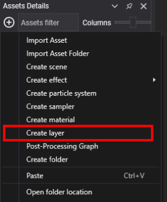

# Create RenderLayer
---


`RenderLayers` control the drawing order of your meshes and allow configuration of the rasterizer state, blend state, and depth-stencil parameters for each draw call that renders your mesh.

## Creating a RenderLayer Asset in Evergine Studio
To create a new `RenderLayer` asset in **Evergine Studio**, follow these steps:

1. Open the [**Assets Details**](../../evergine_studio/interface.md) panel.
2. Click on the  button to open the create menu.
3. Select the _"Create Layer"_ option from the dropdown menu.



This will create a new `RenderLayer` asset in the selected folder of your project.

### Inspecting the RenderLayer Asset
Once created, you can view and edit `RenderLayer` assets in the [**Assets Details**](../../evergine_studio/interface.md) panel by selecting a folder in the [**Project Explorer**](../../evergine_studio/interface.md).


### RenderLayer Files in the Content Directory
`RenderLayer` files are stored with the `.werl` extension in the content directory. You can manage these files directly or through the Evergine Studio interface.


## Creating a RenderLayer Programmatically
The following sample code demonstrates how to create a custom `RenderLayer` programmatically and apply it to an entity in your scene. In this example, the `RenderLayer` is created using the `StandardEffect` and configured with an opaque rendering state:

```csharp
protected override void CreateScene()
{
    var assetsService = Application.Current.Container.Resolve<AssetsService>();

    // Create a custom RenderLayer with specified render states
    RenderLayerDescription customLayer = new RenderLayerDescription()
    {
        RenderState = new RenderStateDescription()
        {
            RasterizerState = new RasterizerStateDescription()
            {
                CullMode = CullMode.Back,
                FillMode = FillMode.Wireframe,
            },
            BlendState = BlendStates.Opaque,
            DepthStencilState = DepthStencilStates.ReadWrite,
        },
        Order = 0,
        SortMode = SortMode.FrontToBack,
    };

    // Load the standard effect
    Effect standardEffect = assetsService.Load<Effect>(EvergineContent.Effects.StandardEffect);

    // Create a material using the custom RenderLayer
    Material material = new Material(standardEffect)
    {
        LayerDescription = customLayer
    };

    // Apply the material to an entity
    Entity primitive = new Entity()
        .AddComponent(new Transform3D())
        .AddComponent(new MaterialComponent() { Material = material })
        .AddComponent(new TeapotMesh())
        .AddComponent(new MeshRenderer());

    this.Managers.EntityManager.Add(primitive);
}
```