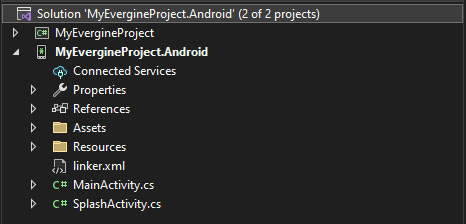

# Android platform

## Create a new application

Use Evergine launcher to add _Android_ as one of your project platforms. Current _Android_ template runs with _Xamarin Android_, and we have a new _Android .NET6_ template that runs with _.NET6 for Android_.

### Prerequisites
If you choose _Android_ template, you need to install _Xamarin_ and cross-platform development tools using _Visual Studio_ installer.

In other hand, if you choose _Android .NET6_ template, you should install Android workload for _.NET6_. You can do it using a PowerShell console.

`dotnet workload install android`

## Project structure
For both flavors of Android templates, project structure is similar. The differences are:
- Project type, as _.NET6_ solution uses latest _.NET SDK_ project style.
- For _.NET6_ project, Evergine libraries targets also copy dll map files, that have no effect in Android projects that runs under _.NET6_.

## Application deployment
There is no support for deployment on _Android_ emulators, so you should use a physical device for development. Evergine uses _Vulkan_ as graphics backend for _Android_, that is included since _Android Nougat_ and later versions.

