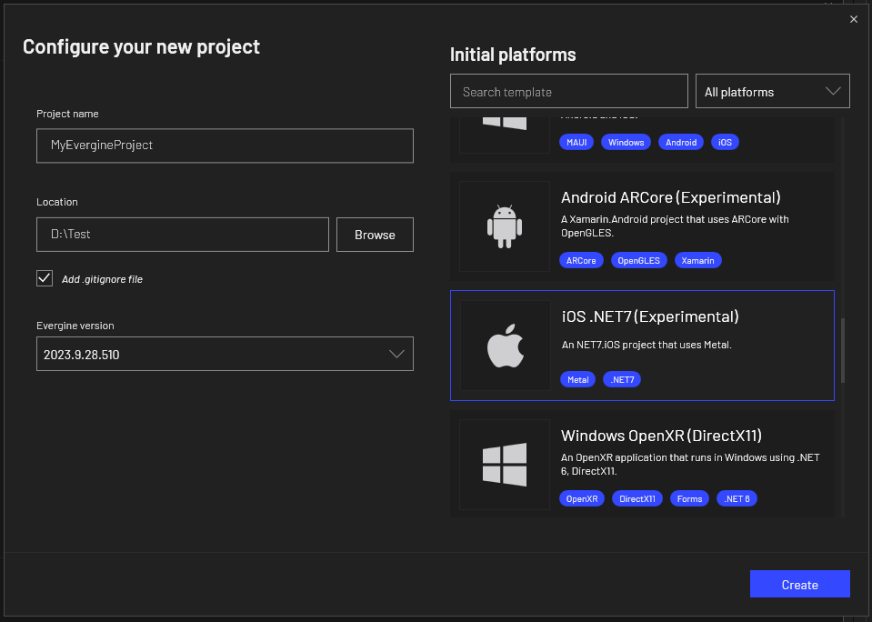

# iOS platform

Recently, Evergine can deploy applications on iOS devices. It is possible due to a _Metal API_ integration and the awesome work done in _.NET8_

## Create a new application

Use Evergine launcher to add iOS as one of your project platforms. Current _iOS_ template runs with _.NET8.0 for iOS_. This template will create all necessary code to allow your application to be deployed on iOS devices.

### Prerequisites

#### Visual Studio for Windows

Right now, the iOS template for Evergine is designed to be opened in  **Visual Studio for Windows**, and if you open that solution in Mac, it won't compile properly. 

However, if you want to finally deploy your solution in a iOS device (iPhone or iPad) or iOS Simulator, you need to pair your Visual Studio to Mac. You can find useful information [here](https://learn.microsoft.com/en-us/dotnet/maui/ios/pair-to-mac).

#### iOS Workload

In order to compile and deploy iOS projects using Evergine,  you should install iOS workload for _.NET 8.0_. You can do it using a PowerShell console:

`dotnet workload install ios`

## Project structure
The project structure created when you add an iOS tempalte are the following:

It will add a project with `net8.0-ios` target framework. It creates a Evergine view embedded in a storyboard. You can create your own native iOS user interface and integrate it with Evergine 3D applications.

## Application deployment

As we mentioned before, to deploy your Evergine application, you will need to Pair your Visual Studio to Mac. [Here](https://learn.microsoft.com/en-us/dotnet/maui/ios/pair-to-mac) you can find detailed information about this, but here are the main steps required:

1. Once your Evergine iOS project is opened in Visual Studio, press the **Pair to Mac** button: 
2. The **Pair to Mac** dialog displays a list of Mac build hosts, select one in the list and press **Connect**. It is possible that you will require to enter credentials to connect to the selected machine.

### Deploy to iOS Simulator
Once your Visual Studio is connected to a Mac, you are able to deploy, you can select one of the available Simulators listed in the Run button:

Once the aplication is deployed, Visual Studio will launch the iOS Simulator in your Windows desktop, allowing to debug and control your Evergine application.

### Deploy to iOS Device

Running to iOS device will require to setup your iOS project. [Here](https://learn.microsoft.com/en-us/xamarin/ios/get-started/installation/device-provisioning/) you can find useful information about how to prepare your iOS project to be deployed.

Once you have properly setup your application, you can select one of the available devices in Visual studio and Run your application on it.