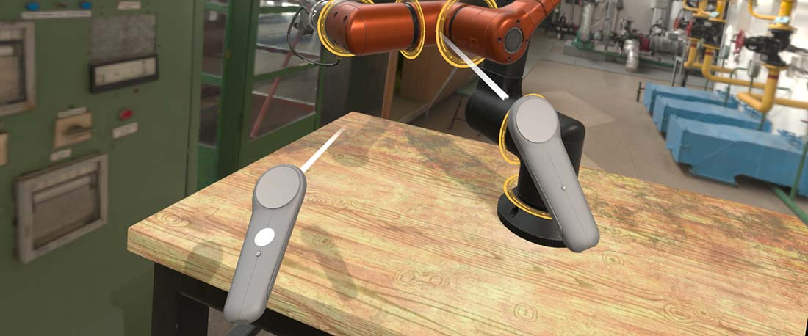

# XR Input Tracking

In XR, it's usual that the user interact with different XR input devices such as Motion Controllers, Hands, Trackers, etc..

The InputTracking subsystem of XRPlatform keep control and track all connected devices in the XR session. Using `XRPlatform.InputTracking` you can obtain and list all connected devices of your system, and get access to its information. 

However, it is more straightforward to use Components that help developers to integrate the device tracking status into your Entity and components.

## Track XR Components
The following components will change the entity Transform by setting the device position and orientation:

* **TrackXRController:** Represent and track a tipical motion controller. This component inherit from `TrackXRDevice`, and additionally, it will expose the state of its buttons, triggers and much more.
* **TrackXRArticulatedHand:** In the case that your XR system has hand tracking support, it will provide access to the articulated hand state. Additionally, it will expose a list of hand joint poses.
* **AdvancedTrackXRDevice:** This component allows you to track all kind of xr devices, such as base stations, generic trackers, etc...

## In this section
- [Tracking Controllers (TrackXRController)](trackxrcontroller.md)
- [Tracking Hands (TrackXRArticulatedHand)](trackxrarticulatedhand.md)
- [Advanced Tracking Devices (AdvancedTrackXRDevice)](advancedtrackxrdevice.md)
