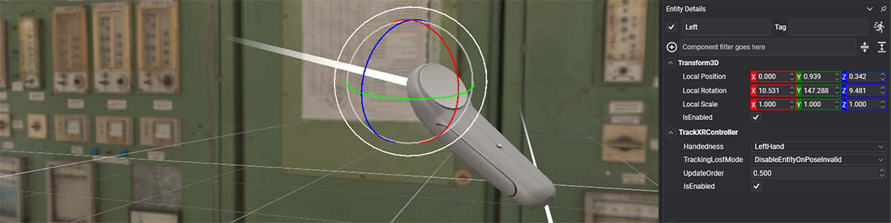

# TrackXRController



This component is used to track and obtain the controller input state (buttons, triggers, etc...). Most of VR platforms supports controller devices, such as Oculus Touchs, Vive Controllers, or Valve Idnex Controllers.

## Properties
When you add this component to your entity, you will show this in Evergine Studio:


| Property | Description |
| --- | --- |
| **Handedness** | With this property you will indicate the handedness of the device that you want to track: <ul><li>`LeftHand` to specify the left hand.</li><li>`RightHand` to specify the right hand.</li><li>`Undefined` if the device has no specific handedness.</li></ul> |
| **TrackingLostMode** | Specify the strategy to follow in case that the device is not well tracked: <ul><li>`DisableEntityOnPoseInvalid` disable the entity if the tracked pose is not valid. In the case that the device is well tracked again, the entity will be enabled again. *This is the default value.*</li><li>`KeepLastPose` stop to track the entity if the pose is not valid, maintaining the entity with the last pose received.</li><li>`DisableEntityOnDisconnection` disable the entity only if the selected device is no longer connected.</li></ul> |
| **ControllerState** | Structure that expose the controller input state. |

## Controller State

Give the user access to the following properties through the `XRControllerGenericState` structure:

| Property | Description |
| --- | --- |
| **IsConnected** | Indiacates whether this device is connected. |
| **Trigger** | Return a 0-1 float value of the trigger state. |
| **TriggerButton** | Gives the `ButtonState` enum of the trigger, to check if it is pressed or not. |
| **Grip** | Indicates if the grip button is pressed. |
| **ThumbStick** | 'Vector2' value that indicates the direction of the tipical mini-stick in the controller. |
| **ThumbStickButton** | 'ButtonState' That indicates if the thumbstick is pressed. |
| **Touchpad** | 'Vector2' value that indicates the direction of the touchpad placed in some VR controllers. |
| **Menu** | 'ButtonState' of the menu button. |
| **Button1** | 'ButtonState' of the typical first button of a controller (it can be usually labelled as A or X). |
| **Button2** | 'ButtonState' of the typical second button of a controller (it can be usually labelled as B or Y). |

## Using TrackXRController

### Create a TrackXRController from code
In the following code you will find how to create an entity that track a controller from code:

```csharp
        protected override void CreateScene()
        {
            base.CreateScene();

            var material = Application.Current.Container
                .Resolve<AssetsService>()
                .Load<Material>(DefaultResourcesIDs.DefaultMaterialID);

            // Left entity
            var leftDevice = new Entity()
                .AddComponent(new Transform3D())
                .AddComponent(new MaterialComponent() { Material = material })
                .AddComponent(new TeapotMesh() { Size = 0.15f })
                .AddComponent(new MeshRenderer())
                .AddComponent(new TrackXRController()
                {
                    Handedness = XRHandedness.LeftHand // select the left device
                })
                .AddComponent(new ScaleEntityWithController()); // Described in the next section :)

            this.Managers.EntityManager.Add(leftDevice);
        }
```

### Read the Controller State

Small sample to read the controller state:

```csharp
public class ScaleEntityWithController : Behavior
    {
        [BindComponent]
        private Transform3D transform;
        
        [BindComponent]
        private TrackXRController trackXRController;

        protected override void Update(TimeSpan gameTime)
        {
            if (trackXRController.IsConnected)
            {
                // Scale the entity if the user press the trigger (from 1 to 2)
                this.transform.LocalScale = Vector3.One *  (1 + trackXRController.ControllerState.Trigger);
            }
        }
    }
```