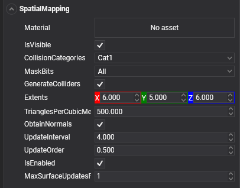

# XR Spatial Mapping


Some XR Devices has built-in cameras that continuously scan the environment, allowing it to construct virtual world geometry for real-world objects. This ability allows developers to create convincing interactions between virtual content and the real world (such as occluding and physically interacting with real-world objects). The process of mapping real-world surfaces into the virtual world is called **Spatial Mapping**.

## Supported Devices

Currently in Evergine, the following devices has **Spatial Mapping** support:

| Device | XR Platform |
| --- | --- |
| **HoloLens 2** | Windows Mixed Reality. |

## SpatialMapping Component

To start using Spatial Mapping in your application, you only need to create an Entity and add the `SpatialMapping` component:



This component will request to the XR Platform a collection of Spatial Mapping surfaces, wich consist in meshes that conforms the detected environment by the XR Device. Internally, this component will create a collection of child entities, each one is responsible to maintain and render a single surface with the giving properties wich will be described after.


### Properties

#### Mesh generation properties

The following properties specify how the spatial mapping meshes will be generated:

| Property | Description |
| --- | --- |
| **TrianglesPerCubicMeter** (Default 500) | The triangles per cubic meter of the generated Spatial Mapping Meshes. With this property you can control the overall quality of the generated meshes. <br/> Lower values generate meshes with less quality but increase the overall performance, and greater values provides a better spatial mapping quality, but with a performance penalty. *Default value is 500* |
| **ObtainNormals** (Default true) |  Indicates that the generated mesh will provides normals. *Default value is `true`* |
| **Extends** (Default [6, 5, 6]) | This property define a volume area (measured in meters) centered in the XR Device user in wich all spatial mapping surfaces are updated and generated. Distant surfaces are discarded to prevent a performance penalty. *Default value is an area of 6m x 5m x 6m* |
| **Material** | Specify wich material will be used to render the Spatial Mapping meshes. If no material is provided, the spatial mapping surfaces won't be rendered. *Default value is `null`* |

#### Update Mesh properties

The following properties indicates how often the spatial mapping surfaces will be updated or generated:

| Property | Description |
| --- | --- |
| **UpdateInterval** (Default 0) | Frequency (in seconds) in wich SpatialMapping component will update its surfaces. In case of 0, the spatial mapping will not be updated (keeping the first requested spatial mapping surfaces). Increase this value *Default value is 0* |
| **MaxSurfaceUpdatesPerFarame** (Default 1) |  Indicate how many surfaces will be processed per frame. When SpatialMapping request an update, it gives a list of surfaces that require to update. Setting this value allows you to control how many surfaces will be processed in a single frame. This prevents the application to increase the CPU usage and cause a FPS drop. *Default value is 1* |

#### Collision Mesh properties

One of most important utilities for Spatial Mapping is to generate Physics colliders of the detected surfaces, allowing to physically interact with the environment.

| Property | Description |
| --- | --- |
| **GenerateColliders** (Default false) | Indicates if physic colliders will be generated for detected spatial mapping surfaces. Generating colliders has an important performance penalty, so we reconmend to only enable colliders if it is neccesary  *Default value is `false`* |
| **CollisionCategory** (Default Cat1) |  Specify the CollisionCategory property of spatial mapping physics colliders (It has no effect if GenerateColliders value is false). *Default value is `Cat1`* |
| **MaskBits** (Default All) |  Specify the MaskBits propery of spatial mapping physics colliders (It has no effect if GenerateColliders value is false). *Default value is `All`* |

## Using SpatialMapping from code

```csharp
protected override void CreateScene()
{
    base.CreateScene();

    // Spatial Mapping entity
    var spatialMapping = new Entity()
        .AddComponent(new Transform3D())
        .AddComponent(new SpatialMapping() 
        { 
            UpdateInterval = 5 // Update spatial mapping surfaces every 5 seconds
            GenerateColliders = true // Generate colliders
        });

    this.Managers.EntityManager.Add(spatialMapping);
}
```