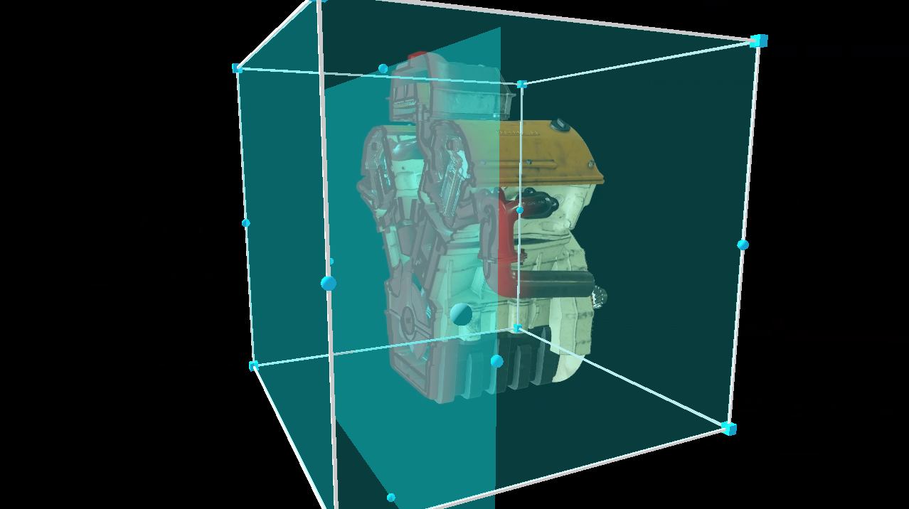

# Azure Remote Rendering (ARR)

---

Azure Remote Rendering brings your highest quality 3D content and interactive experiences to mixed reality.

This service uses the computing power of Azure to render even the most complex models in the cloud and streams them in real time to your devices, allowing users to interact and collaborate with 3D content in amazing detail. It’s an open-source project and can be found in [this repository](https://github.com/EvergineTeam/AzureRemoteRendering).

## In this section

* [Getting started](getting_started.md)
