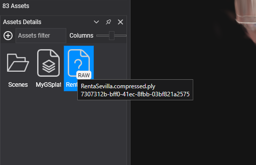
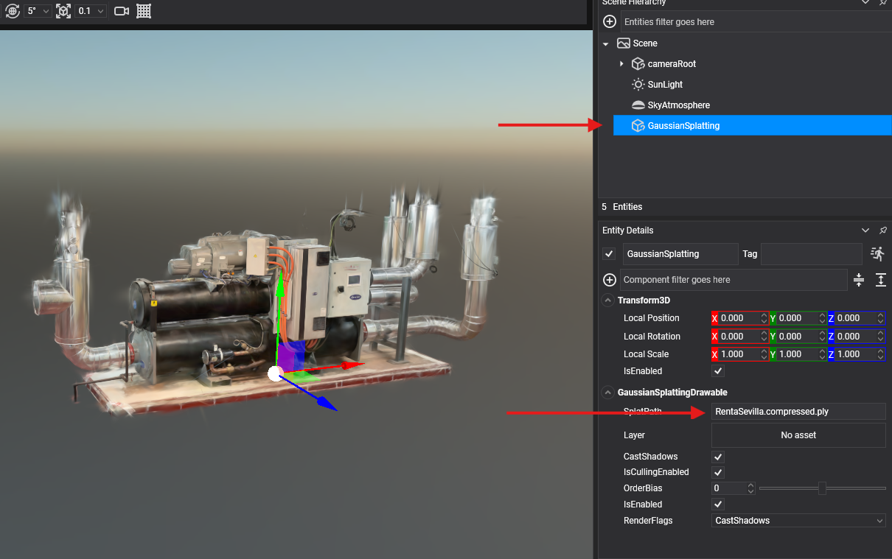

# Getting Started
---
Follow these steps to begin working with 3D Gaussian Splatting in your Evergine applications:

## Project Setup

### 1. Create a New Project

Use [Evergine Launcher](../../evergine_launcher/create_project.md) to start a new project. Along with Windows, select an additional template for your target device.

### 2. Add the Evergine.GaussianSplatting Add-on

Open Evergine Studio and add the Evergine.GaussianSplatting add-on to your project. Refer to [this guide](../../addons/index.md) for instructions on adding add-ons.


> [!NOTE]
> Gaussian Splatting add-ons are available as NuGet packages. For nightly builds, update `nuget.config` to include the Evergine nightly feed:

```xml
<?xml version="1.0" encoding="utf-8"?>
<configuration>
  <packageSources>
    <add key="nuget.org" value="https://api.nuget.org/v3/index.json" />
    <add key="Evergine Nightly" value="https://pkgs.dev.azure.com/plainconcepts/Evergine.Nightly/_packaging/Evergine.NightlyBuilds/nuget/v3/index.json" />
  </packageSources>
</configuration>
```

### 3. Add Your Splat File to the Project

In Evergine Studio, add a supported 3D Gaussian Splatting file (`.splat` or compressed `.ply` file) to your project:



### 4. Create the Gaussian Splatting Entity 

In your scene, create a new Empty Entity and add the `GaussianSplattingDrawable` component.
Set the `SplatPath` property to the path of the 3D Gaussian Splat file.




## GaussianSplattingDrawable Properties

The `GaussianSplattingDrawable` component has the following properties:

| Property           | Description |
|--------------------|-------------|
| **SplatPath** | The path of the Gaussian Splatting file. You can change this property at runtime to dynamically update the Gaussian Splatting scene. |
| **IsSplatSceneLoaded** | Indicates if a Gaussian Splatting scene is loaded. |
| **Layer** | The layer that will be used to render the Gaussian Splatting. |


And the following event:

| Event           | Description |
|--------------------|-------------|
| **OnSplatSceneLoaded** | Fired when a Gaussian Splatting scene is successfully loaded. |

## Create Gaussian Splatting from Code

This is the code necessary to load a Gaussian Splatting file into your Evergine scene:

```cs
var gaussianSplattingEntity = new Entity()
    .AddComponent(new Transform3D())
    .AddComponent(new GaussianSplattingDrawable()
    {
        SplatPath = "MySplatPlyFile.ply"
    });

this.Managers.EntityManager.Add(gaussianSplattingEntity);
```