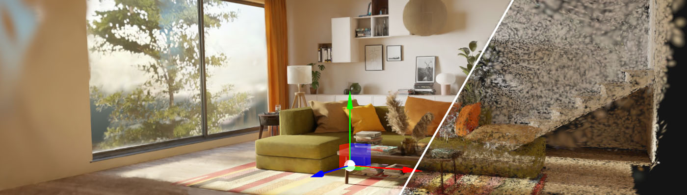
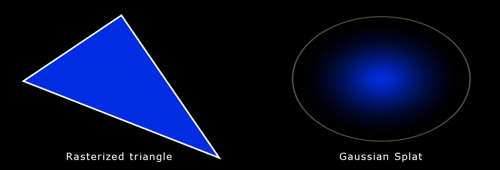

# 3D Gaussian Splatting

---

**Evergine Gaussian Splatting** provides a robust solution for integrating state-of-the-art 3D Gaussian Splatting technology into Evergine applications. By leveraging the unique benefits of Gaussian Splatting, Evergine paves the way for groundbreaking advancements in interactive graphics and simulation, setting a new standard for modern application performance.

## Supported Formats

Currently, this add-on supports the following 3D Gaussian Splatting formats:

### Compressed PLY Format `.ply`

This format is a modification of the traditional `.ply` and can be summarized as follows:

* The scene is split into chunks of 256 splats.
* For each chunk, the minimum and maximum (x, y, z) values for position and scale are stored in floating point.
* For each splat in the chunk, a normalized and quantized value for position, scale (relative to chunk extents), orientation, and color is stored.

### Splat `.splat`

A `.splat` file is a simple format that stores the parameters and attributes used in Gaussian Splatting. It contains packed information for each splat (color, position, rotation, scale).

## What is 3D Gaussian Splatting?

Gaussian Splatting is a rendering technique developed in the 1990s within the scientific field. However, its recent application to real-time scene visualization, presented in August 2023 at SIGGRAPH, has brought it back into the spotlight.

Gaussian Splatting is a rasterization technique for real-time 3D reconstruction and rendering of images captured from multiple viewpoints.

3D space is defined as a set of Gaussians, with each Gaussian’s parameters calculated through machine learning. This means:

* Having data that describes the scene.
* Rendering the data on the screen.

It is, therefore, analogous to triangle rasterization in computer graphics, which is used to draw many triangles on the screen. However, instead of drawing triangles, Gaussians are used. Each Gaussian is described by the following parameters:

* **Position:** where it is located (XYZ)
* **Covariance:** how it stretches/scales (3×3 matrix)
* **Color:** RGB
* **Alpha:** its transparency (α)

Here’s an example with 7 million Gaussian splats:

## In this Section
* [Getting Started](getting_started.md)
* [Web Setup](web_setup.md)

