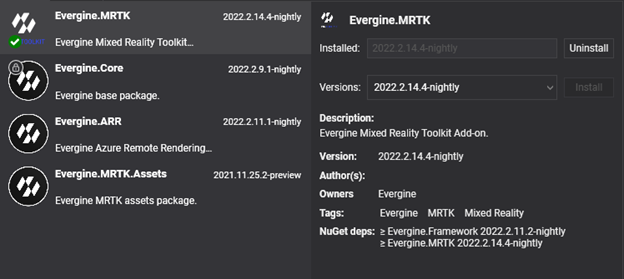

# Add-ons

---
Add-ons are **Evergine** packages that add specific functionalities and assets to your project. They are meant to resolve some key issues that companies face when they create industrial 3D applications using their common resources.

They may contain assets, prefabs, behaviors, components, and NuGet packages that will be incorporated into your project after installation.

## Available Add-ons

* [MRTK](mrtk/index.md)
* [XRV](xrv/index.md)

## Add-ons in Evergine Studio

To check which packages are installed in your application, you just need to look at the Project Explorer tab in Evergine Studio and inspect the Dependencies section:

## Add-ons Manager

The Add-ons manager helps you install new add-ons. There are three possibilities to open it:

1. Use the File menu, where you will find a new “Manage dependencies” menu item.
2. Under the Assets explorer, there is a node named “Dependencies.” Right-clicking on that will show a context menu with a menu entry with the same name as mentioned above.
3. Access “Project settings”; there are now two tabs, one for project profiles and another for project add-ons.

The manager contains two tabs: _Browse_, where you can find all available add-ons, and _Installed_, where you can check all add-ons currently in use in your project. Both tabs contain a similar user interface. Above those tabs, you will find a search area:

* Text search to filter results by name and tags.
* Source selector to limit results to a specific package source.

Depending on the search criteria, the number of displayed add-ons may vary. Each add-on item within the list displays the following information:

* Name, icon, and description.
* Under the icon, in the bottom left corner, it will display a tick inside a green circle if you are already using the latest available version, or an arrow inside a blue circle if you are using that add-on but there is a newer version available.
* In the top right corner, you will find the latest available version vs. the installed version (if any). For those add-ons whose latest version is already in use, a single version label is displayed.
* Also, if you move your mouse over the list items, some buttons to install the latest add-on version or remove an add-on should appear.

When selecting an item in the list, a detail view is loaded with all the information related to an add-on. There, you can also install or uninstall the add-on, and you are even able to install a specific version. Note the NuGet dependencies section, which indicates the minimal versions of the engine and/or third-party NuGet packages. As it is mandatory to have aligned versions of the engine packages, if you try to install an add-on with an engine dependency higher than the one you are using, a project restart will be required and automatically scheduled.

For add-ons whose NuGet dependencies are not expressed as explicit version numbers, you should install those packages manually. On the other hand, for third-party NuGet dependencies with explicit version numbers, they will be added or updated automatically once the package is added.

## Customize assets

By default, all assets included in a package cannot be modified. This is indicated by this lock icon: .

However, you can modify an asset included in the package. When you modify a package asset and try to save it, the following message appears, indicating if you want to create a new copy of this asset in your project:

Automatically, a new copy of the asset will be created in your local folder project, overwriting the one provided by the package. By doing this, you can modify or adapt Evergine core assets to your application requirements.

## Develop new Add-ons

The ability to include new add-ons to external companies will be available in future releases. For now, only add-ons created by **Evergine Team** can be installed through **Evergine Studio**.

### Upcoming packages

Evergine is under continuous development, and more upcoming packages are on the way:

| Package | Description |
| --- | --- |
| **Noesis GUI** | Using [NoesisGUI](https://www.noesisengine.com/) with Evergine allows you to create appealing User Interfaces using powerful XAML tools like Microsoft Expression Blend. |
| **CAD Formats** | Take your industrial CAD/3D model and bring it into your Evergine application. |
| **Bing Maps** | Provides [Bing Maps](https://www.bingmapsportal.com/) integration with Evergine, allowing you to utilize Bing Maps 3D mapping data in your application. |