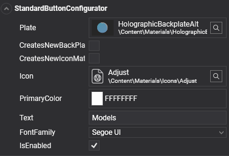
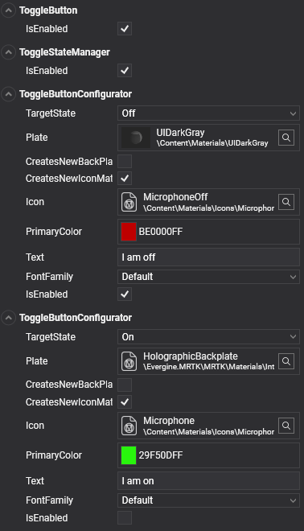

# Configurators
---
Configurator components simplify customization and, in some cases, extend functionality for specific controls. To use a configurator, add it to the root of a prefab after instantiating the prefab.

Examples for each configurator can be found in the test scenes within the _MRTK Demo_ project.

## Standard Button Configurator
The **Standard Button Configurator** allows easy customization of certain button elements, such as the icon, button text, and material plate. If you want to change the color without affecting other button instances, check the _CreatesNewIconMaterialInstance_ and _CreatesNewBackPlateMaterialInstance_ options to ensure unique instances.

| **Property**                       | **Description**                                                                                                                                                                              |
|------------------------------------|----------------------------------------------------------------------------------------------------------------------------------------------------------------------------------------------|
| **Plate**                          | Material used as the back plate of the button.                                                                                                                                               |
| **CreatesNewBackPlateMaterialInstance** | Creates a new material instance for the back plate, allowing runtime modifications without affecting other elements sharing the same material in the UI.                                       |
| **CreatesNewIconMaterialInstance** | Creates a new material instance for the icon, enabling independent runtime adjustments.                                                                                                      |
| **AllowBackPlateNullMaterial**     | Allows a null material to be used for the back plate.                                                                                                                                        |
| **AllowIconNullMaterial**          | Allows a null material to be used for the icon.                                                                                                                                              |
| **Icon**                           | Material used for the button icon.                                                                                                                                                          |
| **PrimaryColor**                   | Sets the primary color used to tint the icon and define the text color.                                                                                                                     |
| **Text**                           | Text displayed on the button.                                                                                                                                                               |
| **TextScale**                      | Scale factor for the button text.                                                                                                                                                           |
| **Font**                           | Font used for the button text.                                                                                                                                                              |

## ToggleButton
Adding the **ToggleButton** component to a button provides two distinct styles based on its _ON_ or _OFF_ state. This component automatically adds two **ToggleButtonConfigurator** components, allowing for customized configuration of each state similar to the **Standard Button Configurator**.

Take a look to sample scene for buttons (_Buttons.wescene_) at [https://github.com/EvergineTeam/MixedRealityToolkit/tree/master/Samples/Evergine.MRTK.Demo/Content/Scenes/Samples](https://github.com/EvergineTeam/MixedRealityToolkit/tree/master/Samples/Evergine.MRTK.Demo/Content/Scenes/Samples).

## Multi-State Buttons
The **ToggleButton** component also includes the _ToggleStateManager_ and two _ToggleButtonConfigurators_, enabling multi-state functionality. For tri-state buttons, you can use the _MultiStateStateManager_ and three **MultiStateButtonConfigurator** components to manage three separate states.

All _StateManager_ classes inherit from the _BaseStateManager_ class, which uses an enum to define possible button states. For more than three states, create a custom class using _BaseStateManager_ with a new enum defining the extra states. Each configurator component should then correspond to a unique state using this custom enum.

## Slider Configurator
The **Slider Configurator** offers specific options to customize the slider’s track, thumb materials, and label text.

| **Property**                       | **Description**                                                                                                             |
|------------------------------------|-----------------------------------------------------------------------------------------------------------------------------|
| **Track**                          | Material used for the track mesh.                                                                                           |
| **Material**                       | Material used for the thumb mesh.                                                                                           |
| **CreatesNewTrackMaterialInstance**| Creates a new material instance for the track, enabling unique runtime modifications.                                       |
| **CreatesNewThumbMaterialInstance**| Creates a new material instance for the thumb, allowing independent runtime adjustments.                                    |
| **PrimaryColor**                   | Sets the primary color, affecting the title color.                                                                          |
| **SecondaryColor**                 | Sets the secondary color, affecting the value display color.                                                                |
| **Title**                          | Title displayed on the slider.                                                                                              |
| **Font**                           | Font used for the slider’s text.                                                                                            |

Take a look to sample scene for sliders (_Sliders.wescene_) at [https://github.com/EvergineTeam/MixedRealityToolkit/tree/master/Samples/Evergine.MRTK.Demo/Content/Scenes/Samples](https://github.com/EvergineTeam/MixedRealityToolkit/tree/master/Samples/Evergine.MRTK.Demo/Content/Scenes/Samples).