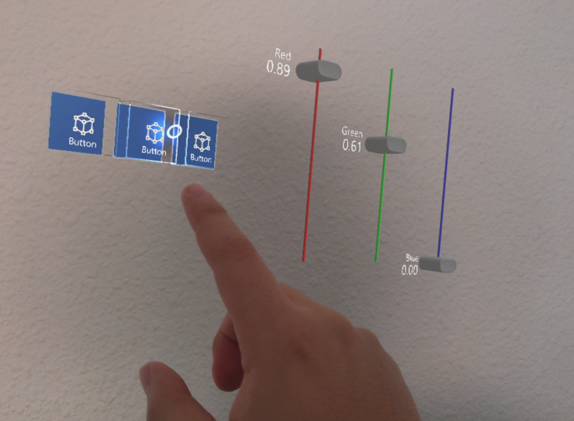
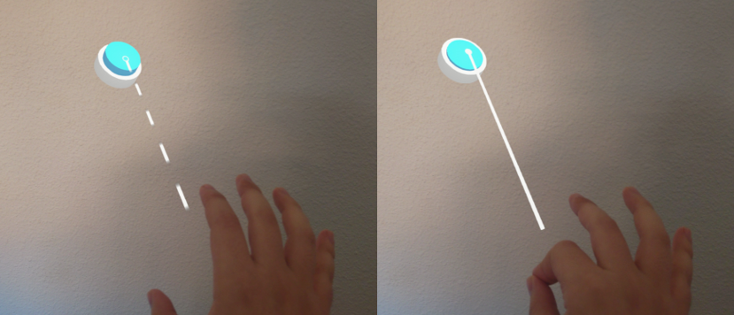

# Pointers and Control
---
MRTK introduces new ways to interact with controls beyond the traditional mouse pointer, using hand-tracking features available on supported devices.

There are two main interaction methods:

1. **Near Interaction**: When a user is close to a control, they can interact by touching it with their index finger. This is enabled by the _near pointer_ mechanism.

2. **Far Interaction**: When the user is farther away but still wants to interact, they can use the _far pointer_. Through hand tracking, this appears as a light ray extending from their hand, which they can use to point and click. The gesture for clicking at a distance is known as an _air-tap_.

|||
|:--:|:--:|
| **Near Pointer Interaction Example** | **Far Pointer Interaction Example usage** |

In devices that support hand-tracking, MRTK automatically creates the necessary pointers in the _XRScene_.

## Desktop Development
These interaction methods are also available in desktop-based Evergine projects. The pointers can be controlled via the keyboard and mouse.

- Press and hold the **left shift** key to activate the right-hand pointer or the **space** key to activate the left-hand pointer. You can then move the pointer using the mouse.
- Use the **mouse wheel** to move the pointer closer to or farther from the camera.
- Use the **left mouse** button to perform the _air-tap_ gesture, allowing interaction with distant controls.
- Press and hold the **left control** key to rotate the selected pointer using the mouse.