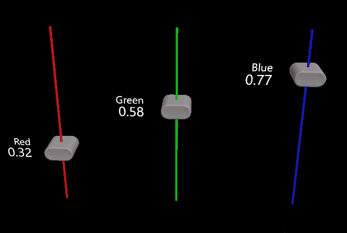
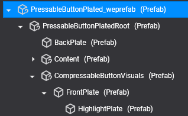
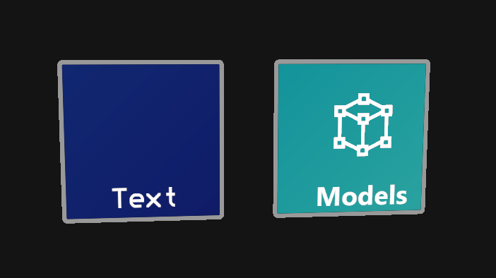
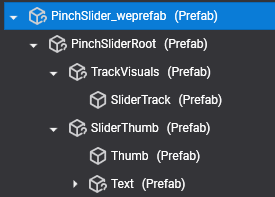
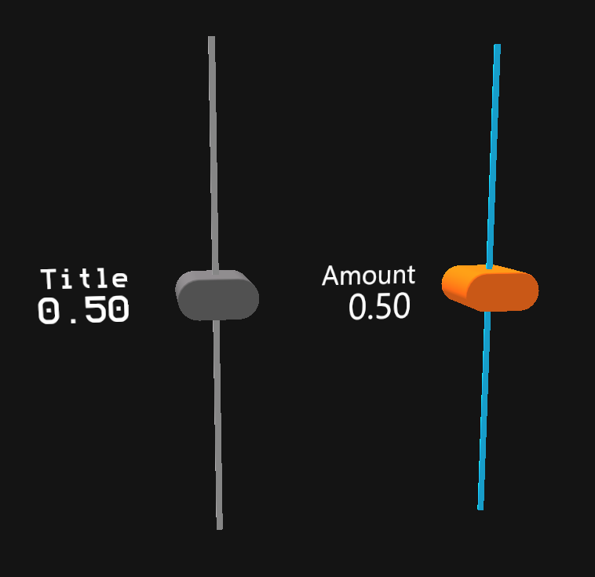

# Using Prefabs and Customization
---
MRTK provides ready-made controls in the form of _prefabs_ to simplify application development, including fundamental components like _buttons_ and _sliders_. These prefabs are available in the _Prefabs_ folder within the MRTK dependency.

|||
|:--:|:--:|
| **Buttons** | **Sliders** |

## Customization
When a prefab control is instantiated in Evergine, its component hierarchy becomes visible in Evergine Studio. This allows you to customize the look and feel of individual instances directly within the editor.

|||
|:--:|:--:|
| **Button Prefab Hierarchy** | **Button Before and After Customization** |

|||
|:--:|:--:|
| **Slider Prefab Hierarchy** | **Slider Before and After Customization** |