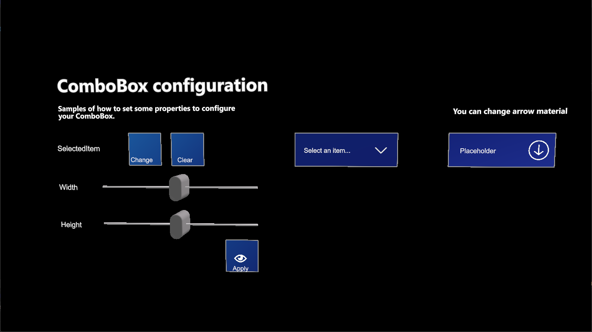

# ComboBox

The _ComboBox_ user control allows users to select an option from a dropdown list. It is distributed via a prefab named _ComboBox.weprefab_.

## Configuration properties

| Property               | Description                                                                                   |
|-----------------------|-----------------------------------------------------------------------------------------------|
| IsPopupOpen           | Indicates if the item selection popup is open.                                              |
| DataSource            | This is the data adapter used to populate data. [Learn more about data adapters](#data-adapters). |
| SelectedItem          | Gets or sets the selected item.                                                              |
| PlaceholderText       | Gets or sets the placeholder text to be displayed when no element has been selected.         |
| ArrowMaterial         | Material for the drop-down arrow.                                                            |
| Size                  | Sets the ComboBox dimensions.                                                                 |
| MaxItemsHeight        | Gets or sets the maximum height for the items area.                                          |

## Events

| Event                   | Description                                       |
|-------------------------|---------------------------------------------------|
| SelectedItemChanged     | Raised when the selection is changed.            |
