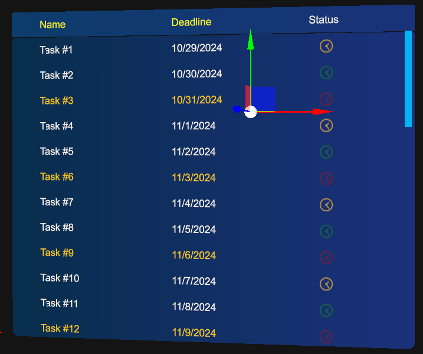

# List View

The List View control helps you display data presented in rows and columns. It allows the presentation of different elements in its cells, not just text; you can include any kind of 3D element. 

The List View control is distributed with a prefab named _ListView.weprefab_.


## Populate data

To populate data, you should use what we name **data adapters**, inspired by Android adapters, acting as a link between the UI and data. By implementing this class, you can define your own way of presenting the data in the List View. MRTK provides a built-in **ArrayAdapter** that supports data linking against an `IList<T>`. This offers a single-column list, with values taken using the `ToString()` method for each object in the list.

```csharp
public class ArrayAdapter<T> : DataAdapter
{
    private IList<T> data;

    public ArrayAdapter(IList<T> data)
    {
        this.data = data;
    }

    public IList<T> Data { get => this.data; }

    public override int Count => this.data.Count();

    public override object GetRowValue(int rowIndex) => this.GetTypedRowValue(rowIndex);

    public override int IndexOf(object @value) => this.data.IndexOf((T)@value);

    public virtual T GetTypedRowValue(int rowIndex) => this.data.ElementAt(rowIndex);

    public override CellRenderer GetRenderer(int rowIndex, int columnIndex)
    {
        var textRenderer = TextCellRenderer.Instance;
        var element = this.GetRowValue(rowIndex);
        textRenderer.Text = element?.ToString();

        return textRenderer;
    }
}
```

In the MRTK demo project, you have some samples of how to create your own Data Adapters and use them to populate your lists. A nice possibility here is to create design-time adapters that let you visualize how your data will be presented, showing it directly in your scene from Evergine Studio.

In data adapters, you can define how to render each cell. For this, you can create your own cell renderer by extending the `CellRenderer` class to define your own cell layout. As a built-in cell, we provide **TextCellRenderer**, which displays data in 3D text.



```csharp
class TaskStatusCellRenderer : CellRenderer
{
    private readonly AssetsService assetsService;

    public TaskStatusCellRenderer(AssetsService assetsService)
    {
        this.assetsService = assetsService;
    }

    public TaskStatus Status { get; set; }

    public override void Render(Entity parent)
    {
        var statusMaterial = assetsService.Load<Material>(this.GetStatusMaterialId());

        parent.AddChild(new Entity()
            .AddComponent(new Transform3D
            {
                LocalPosition = new Vector3(0.01f, -0.008f, 0),
                LocalScale = new Vector3(0.008f, 0.008f, 0.001f),
            })
            .AddComponent(new MaterialComponent() { Material = statusMaterial })
            .AddComponent(new PlaneMesh
            {
                PlaneNormal = PlaneMesh.NormalAxis.ZPositive,
            })
            .AddComponent(new MeshRenderer()));
    }

    private Guid GetStatusMaterialId()
    {
        switch (Status)
        {
            case TaskStatus.Pending:
                return EvergineContent.Materials.Samples.ListView.Task_Status_Red;
            case TaskStatus.InProgress:
                return EvergineContent.Materials.Samples.ListView.Task_Status_Yellow;
            case TaskStatus.Done:
                return EvergineContent.Materials.Samples.ListView.Task_Status_Green;
            default:
                throw new ArgumentOutOfRangeException();
        }
    }
}
```

There is also the concept of **Column Definition**, which lets you decide each column's title, percentage size, and header text color. The sum of the percentages of all columns must equal 1.

```csharp
listView.DataSource = new SampleTasksAdapter(allTasks, this.assetsService);
listView.Columns = new[]
{
    new ColumnDefinition { Title = "Name", PercentageSize = 0.4f, HeaderTextColor = Color.Yellow },
    new ColumnDefinition { Title = "Deadline", PercentageSize = 0.4f, HeaderTextColor = Color.Yellow },
    new ColumnDefinition { Title = "Status", PercentageSize = 0.2f, HeaderTextColor = Color.White }
};
```

## Configuration Properties

| Property                    | Description                                                                                                   |
|-----------------------------|---------------------------------------------------------------------------------------------------------------|
| ContentPadding              | Padding for contents inside the list view. Right now, it's just considered for vertical padding.             |
| ElasticTime                 | The elastic time when the content goes to the edges.                                                         |
| ZContentDistance            | Gets or sets the Z content distance relative to the content's local Z axis.                                  |
| RowHeight                   | Indicates the height of each row. We only support a fixed size for all rows right now.                       |
| DataSource                  | This is the data adapter used for the list view to be populated.                                             |
| SelectedIndex               | Gets or sets the selected element index.                                                                     |
| SelectedItem                | Gets or sets the selected item.                                                                              |
| Columns                     | Indicates column definitions for the list view.                                                               |
| HeaderEnabled               | Indicates if the header should be displayed or not.                                                          |
| ShowLoadingIndicator        | Indicates if the loading indicator should be displayed. This should be controlled by custom logic for your app.|
| LoadingIndicator            | Sets the entity that you want to act as the loading indicator. We provide a default spinner indicator, but you can define your own. |

## Public Methods
| Method            | Description                                                                                 |
|-------------------|---------------------------------------------------------------------------------------------|
| Refresh           | Forces a refresh of the list view. This rebuilds the entire hierarchy, so use with caution.|
| RefreshHeader     | Refreshes only the header part.                                                            |
| ScrollTo          | Scrolls the list view content to a given element index. You can also specify the position of the element (top, center, bottom). Several overloads allow for data bound to a specific row or a specific scroll offset value. |

## Events
| Event                    | Description                                                       |
|--------------------------|-------------------------------------------------------------------|
| SelectedItemChanged      | Raised when the selection is changed.                             |
| Scrolled                 | Raised when the content is scrolled.                             |
