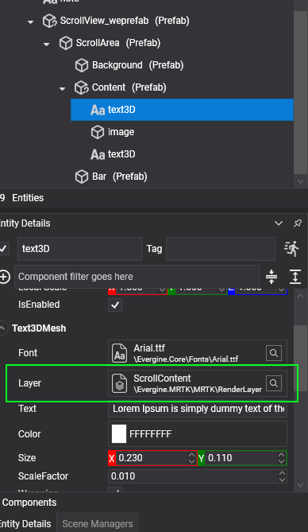

# Scroll view
The _Scroll View_ control in MRTK provides a scrollable panel to organize and display UI elements that exceed the available display space, adding a vertical scroll bar to the panel. Currently, only vertical scrolling is supported.

This control is distributed as a prefab named _ScrollView.weprefab_, making it easy to integrate into your project.

## Usage
When placing elements within a _Scroll View_, ensure that any Text3D or materials used in the content area are rendered in a dedicated layer named **ScrollContent**. This setup is essential for correct rendering and smooth scrolling performance.

|          |          |
|----------|----------|
|   |      |
| Scroll view layer for text  | Scroll view layer for materials     |

## Configuration properties
The _Scroll View_ control offers several properties for customizing its appearance and behavior:

| Property               | Description                                                                                             |
|------------------------|---------------------------------------------------------------------------------------------------------|
| **ContentPadding**     | Vertical padding for the contents within the scroll view.                                               |
| **ElasticTime**        | Duration of the elastic animation when the content reaches the edges of the scroll area.                |
| **ZContentDistance**   | Adjusts the z-axis distance of the content within the local z-axis of the scroll view.                  |
| **BarWidth**           | Width of the scroll bar.                                                                                |
| **Debug**              | Enables or disables debug mode.                                                                         |
| **Size**               | Sets the dimensions of the scroll view panel.                                                           |
| **DisplayScrollBar**   | Determines whether the scroll bar is visible.                                                           |
| **ScrollPosition**     | Retrieves the current scroll position.                                                                  |

## Public Methods
| Method            | Description                                                                                 |
|-------------------|---------------------------------------------------------------------------------------------|
| AddContent           | Adds an entity into content container You invoke this to add content dynamically. Also, you can specify content position and size for layout calculations.|                |
| Refresh           | Forces a refresh of the list view. This rebuilds the entire hierarchy, so use with caution.|                |
| ScrollTo          | Scrolls the list view content to a given element index. You can also specify the position of the element (top, center, bottom). Several overloads allow for data bound to a specific row or a specific scroll offset value. |

## Events
The _Scroll View_ control includes an event for detecting user interaction:

| Event        | Description                            |
|--------------|----------------------------------------|
| **Scrolled** | Triggered when the content is scrolled.|
