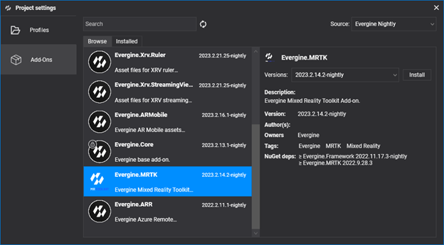
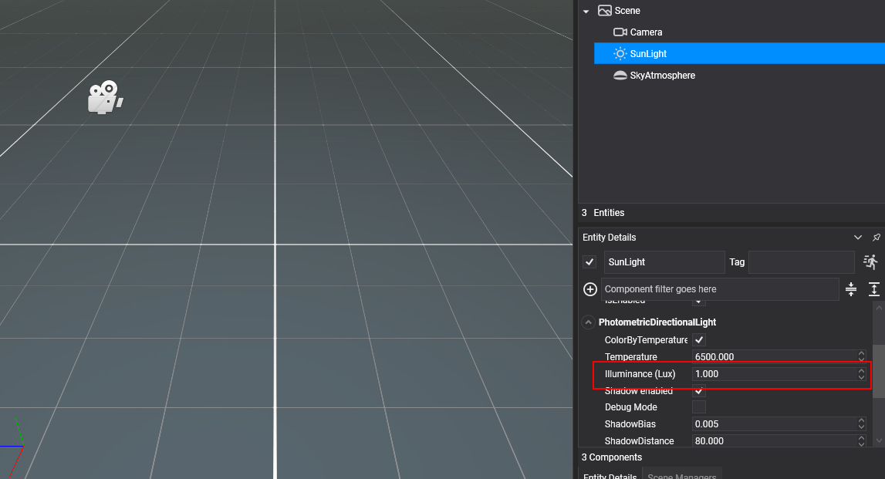

# Getting Started

---

Follow these steps to prepare your environment for running XRV on your target device.

## Project Setup

**1. Create a new project**

Use [Evergine Launcher](../../evergine_launcher/create_project.md) to start a new project. Along with Windows, select an additional template for your target device. For Meta Quest or Pico headsets, you can choose from two different templates.

**2. Add the MRTK Add-on** 

Open Evergine Studio and add the MRTK add-on to your project. Refer to [this guide](../../addons/index.md) for instructions on adding add-ons.



**3. Add the Evergine.XRV.Core Add-on**

With MRTK installed, add the _Evergine.XRV.Core_ add-on via the project management dialog.


> [!NOTE]
> XRV add-ons are available as NuGet packages. For nightly builds, update `nuget.config` to include the Evergine nightly feed:
>```xml
><?xml version="1.0" encoding="utf-8"?>
><configuration>
>  <packageSources>
>    <add key="nuget.org" value="https://api.nuget.org/v3/index.json" />
>    <add key="Evergine Nightly" value="https://pkgs.dev.azure.com/plainconcepts/Evergine.Nightly/_packaging/>Evergine.NightlyBuilds/nuget/v3/index.json" />
>  </packageSources>
></configuration>
>```

**4. Adjust SunLight Illuminance**

In your default scene, set the SunLight entity’s Illuminance value to 1.



## Code Setup

**1. Configure the Application Constructor**

Register the background scheduler in your `Application` constructor.

```csharp
public MyApplication()
{
    this.Container.RegisterType<Settings>();
    this.Container.RegisterType<Clock>();
    this.Container.RegisterType<TimerFactory>();
    this.Container.RegisterType<Random>();
    this.Container.RegisterType<ErrorHandler>();
    this.Container.RegisterType<ScreenContextManager>();
    this.Container.RegisterType<GraphicsPresenter>();
    this.Container.RegisterType<AssetsDirectory>();
    this.Container.RegisterType<AssetsService>();
    this.Container.RegisterType<ForegroundTaskSchedulerService>();
    this.Container.RegisterType<WorkActionScheduler>();

    BackgroundTaskScheduler.Background.Configure(this.Container);
}
```

**2. Implement XRScene in Your Scene Class**

Modify your scene class to inherit from `XRScene`.

```csharp
public class MyScene : XRScene
{
    protected override Guid CursorMatPressed => EvergineContent.MRTK.Materials.Cursor.CursorPinch;

    protected override Guid CursorMatReleased => EvergineContent.MRTK.Materials.Cursor.CursorBase;

    protected override Guid HoloHandsMat => EvergineContent.MRTK.Materials.Hands.QuestHands;

    protected override Guid SpatialMappingMat => Guid.Empty;

    protected override Guid HandRayTexture => EvergineContent.MRTK.Textures.line_dots_png;

    protected override Guid HandRaySampler => EvergineContent.MRTK.Samplers.LinearWrapSampler;

    protected override Guid LeftControllerModelPrefab => Guid.Empty;

    protected override Guid RightControllerModelPrefab => Guid.Empty;

    protected override float MaxFarCursorLength => 0.5f;

    //...
}
```

**3. Add Microsoft.Bcl.AsyncInterfaces Package**

Include `Microsoft.Bcl.AsyncInterfaces` in your shared project:

```xml
<PackageReference Include="Microsoft.Bcl.AsyncInterfaces" Version="7.0.0" />
```

**4. Initialize XrvService**

Set up an `XrvService` instance within `OnPostCreateXRScene`.

**MyApplication.cs**

```csharp
public override void Initialize()
{
    base.Initialize();
    this.InitializeXrv();

    // ...
}

private void InitializeXrv()
{
    var xrv = new XrvService();
    this.Container.RegisterInstance(xrv);
}
```

**MyScene.cs**

```csharp
protected override void OnPostCreateXRScene()
{
    base.OnPostCreateXRScene();
    var xrv = Application.Current.Container.Resolve<XrvService>();
    xrv.Initialize(this);
}
```

## Platform Setup

### Android

If you encounter build errors like the following:

```
error XA2002: Cannot resolve reference: `Evergine.Editor.Extension`, referenced by `Evergine.MRTK.Editor`. Please add a NuGet package or assembly reference for `Evergine.Editor.Extension`, or remove the reference to `Evergine.MRTK.Editor`.
```

Add `Evergine.Editor.Extension` to your project. For passthrough capabilities, uncomment related code in `MainActivity.cs` and in the Android manifest.

Also, to make use of the passthrough capability, remember to uncomment the related parts of your code in MainActivity.cs and in the Android manifest file.

## Add More Modules

At this point, you can open the hand menu with default buttons for Settings and Help. To extend functionality, consider adding any [XRV modules](modules/index.md), [creating your own module](modules/customModule/index.md), or using the XRV API to add new elements.


You can also take a look at our [XRV sample](https://github.com/EvergineTeam/XRV/tree/develop/samples) that includes all our public modules.