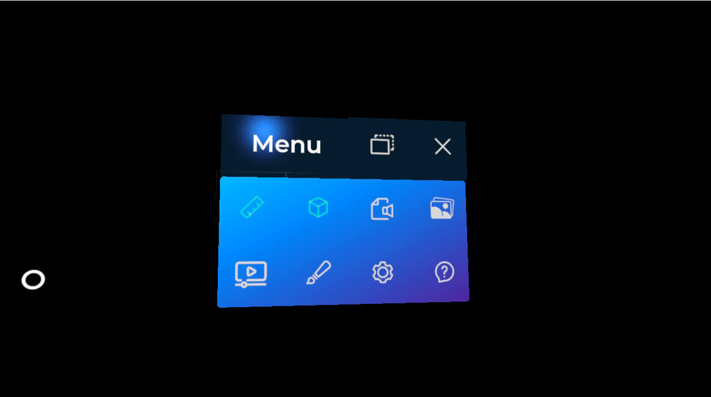

# Hand Menu

One of the main features that XRV offers is the hand menu. This is an element that shows a set of buttons that can be added or removed programmatically, and its container is attached to the user's wrist. When the user turns their palm, the menu will be displayed or hidden depending on the palm's orientation. It works for both the left and right hands.


Each one of the configured modules for an XRV application has the possibility to add a new button to this menu. To do this, in the module definition class, just create an instance for the _HandMenuButton_ property.

```csharp
public class MyModule : Module 
{
    public override MenuButtonDescription HandMenuButton { get; protected set; }

    public override void Initialize(Scene scene)
    {
        this.HandMenuButton = new MenuButtonDescription 
        {
            // Button configuration here
        };
    }
}
```

If you set a _null_ value to this property, no button will be automatically added to the hand menu.

### Hand Menu Button Configuration
Here you will find a table with elements that can be configured for each one of the hand menu buttons using _MenuButtonDescription_.

| Property | Description |
| ------ | ------------------- |
| **IconOn** | Material identifier to be used when the button is in the _on_ state for a toggle button, or just the button icon for a non-toggle button. |
| **IconOff** | Material identifier to be used when the button is in the _off_ state (for toggle buttons only). |
| **IsToggle** | Indicates if the button should be a toggle button or not. |
| **TextOn** | Button text to be used when the button is in the _on_ state for a toggle button, or just the button icon for a non-toggle button. This property is a _Func\<string>_ to let the user define different values depending on the application's display language. |
| **TextOff** | Button text to be used when the button is in the _off_ state (for toggle buttons only). This property is a _Func\<string>_ to let the user define different values depending on the application's display language. |
| **VoiceCommandOn** | Voice command to activate the button when it is in the _on_ state for a toggle button, or just the button icon for a non-toggle button. |
| **VoiceCommandOff** | Voice command to activate the button when it is in the _off_ state (for toggle buttons only). |

### Attaching/Detaching the Hand Menu
The user has the option to detach the menu from their hand using the _Detach_ button located at the top of the menu. When doing this, the menu will change its layout and behave like a standard window. The user can choose to make it follow them or stay pinned wherever they want.



To bring the menu back to the wrist, the user just has to press the detached menu's _Close_ button.

### Adding Buttons Programmatically

You can also add or remove buttons programmatically, apart from the buttons that you may have added (or not) from your own application module definitions. Note that _XrvService_ exposes a _HandMenu_ property that allows you to apply some custom configurations to the menu. The menu buttons collection can be modified at runtime.

```csharp
var xrv = Application.Current.Container.Resolve<XrvService>();
var handMenu = xrv.HandMenu;
var buttonDefinition = new MenuButtonDescription 
{
    // Button configuration here
}

// adding a new button
handMenu.ButtonDescriptors.Add(buttonDefinition);

// removing a defined button
handMenu.ButtonDescriptors.Remove(buttonDefinition);
```

### Hand Menu Layout

We don't support modifying the built-in hand menu shape or layout. You can only modify the number of buttons per column. This property has a minimum size of 4 buttons per column, as this is necessary for the detached menu state.

To modify the number of buttons per column, use the following code snippet:

```csharp
handMenu.ButtonsPerColumn = 5;
```

### Hand Menu Starting Tutorial
A tutorial animation can be displayed every time the application is started, to let users know that they should turn their hand if they want to display the menu and interact with the application.


To hide this animation on application start, you can use this code snippet. Note that you should deactivate the flag after XRV initialization (the hand menu will not be available before that).

```csharp
var xrv = Application.Current.Container.Resolve<XrvService>();
xrv.Initialize(this);
xrv.HandMenu.DisplayTutorial = false;
```