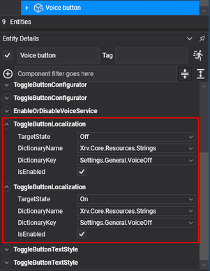

# Localization

If you want to create an application that supports different target languages, you may find the localization mechanism provided by _XRV_ useful. It scans your assemblies for embedded resource files (.resx) and provides a set of _Evergine_ components that let you choose dictionary name-entry pairs for 3D texts or buttons. Lookup assemblies must be decorated with the _EvergineAssembly_ attribute with _UserProject_ or _Extension_ as the value.

> [!NOTE]
> In its current state, we only support _English_ (fallback) and _Spanish_ as available 
> languages for applications. We plan to add extension points in the future to 
> allow developers to add new languages.

You can easily change the current UI culture:
```csharp
var localization = this.xrvService.Localization;
localization.CurrentCulture = CultureInfo.GetCultureInfo("es");
```

When the culture changes, a _CurrentCultureChangeMessage_ is published in [PubSub](messaging.md), indicating the value of the new UI culture. It also changes the current thread's _CurrentUICulture_ and _CurrentCulture_ values.

## Built-in Components for Localization

We provide a set of components to control localization for button texts and 3D texts:
- **Text3dLocalization**: For localized text in _Text3DMesh_ components.
- **ButtonLocalization**: To localize button text for entities with the _StandardButtonConfigurator_ component.
- **ToggleButtonLocalization**: To localize toggle button text for entities with the _ToggleStateManager_ component. You should have one component instance for each of the toggle states.


For a toggle button, as we mentioned, you must add one component for each of the toggle states.
\
\


## Get Localized String from Code

To retrieve a localized string, use the localization service.
```csharp
var localization = this.xrvService.Localization;
var localizedString = this.localization.GetString(() => Resources.Strings.MyString);
```

### Hand Menu Buttons

_MenuButtonDescription_ provides a way to set localized text for hand menu buttons. If your button is a toggle button, you can also indicate different strings for each toggle state.

```csharp
var localization = this.xrvService.Localization;
var description = new MenuButtonDescription()
{
    TextOn = () => localization.GetString(() => Resources.Strings.MyString),
    TextOff = () => localization.GetString(() => Resources.Strings.MyString),
};
```

### Tab Items

_TabItem_ lets you set a _Func<string>_ that will be invoked on the first run or when the current culture changes.

```csharp
var localization = this.xrvService.Localization;
var item = new TabItem()
{
    Name = () => localization.GetString(() => Resources.Strings.MyString),
    Contents = this.HelpContent,
};
```

### Window Title

_WindowConfigurator_ also uses a specific _Func<string>_ property to provide localized text for the window title.

```csharp
var windowsSystem = this.xrvService.WindowsSystem;
var localization = this.xrvService.Localization;
var window = windowsSystem.CreateWindow(config => 
{
    config.LocalizedTitle = () => localization.GetString(() => Resources.Strings.MyString),
});
```

### Alert Dialogs

The _WindowsSystem_ API has overload methods for both _ShowAlertDialog_ and _ShowConfirmationDialog_, where you can assign _Func<string>_ callbacks to provide localized dialogs.

```csharp
var windowsSystem = this.xrvService.WindowsSystem;
var dialog = windowsSystem.ShowAlertDialog(
    () => localization.GetString(() => Resources.Strings.MyAlertTitle),
    () => localization.GetString(() => Resources.Strings.MyAlertMessage),
    () => localization.GetString(() => Resources.Strings.MyAlertOk));
```