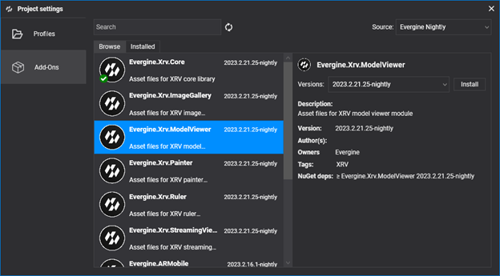
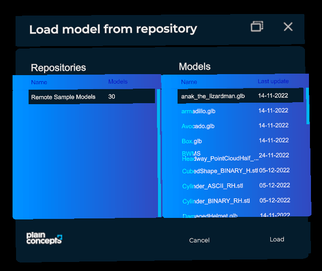
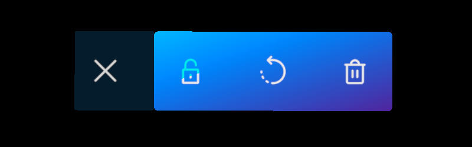

# Model Viewer Module

One of the most common tasks while developing an XR experience is loading 3D models. With this module, you have a way to load models from a remote location into your application. When loaded, a model can be moved, rotated, and scaled thanks to its bounding box. Transformations can be performed by near or far interaction, indiscriminately.


This module allows you to define an unlimited number of model repositories; each repository can contain an unlimited number of 3D models.

| Properties               | Description                                                                        |
| ------------------------ | ---------------------------------------------------------------------------------- |
| `NormalizedModelEnabled` | If true, it will override the original scale of the model and set the same for all models. |
| `NormalizedModelSize`    | Size in meters for models when loaded                                              |
| `Repositories`           | Array of model repositories.                                                       |

A repository has the following properties:

| Properties   | Description                                     |
| ------------ | ----------------------------------------------- |
| `Name`       | This name will be displayed on the model load list. |
| `FileAccess` | Models data source. Please refer to the [Storage](../../storage.md) section for more information. |

## Installation

This module is packaged as an [Evergine add-on](../../../index.md). To use it in your project, just install it from the _Project Settings > Add-Ons_ window.



Then, register the module programmatically within your XRV service instance.

```csharp
FileAccess modelsDataSource = <Create FileAccess instance>;
var xrv = new XrvService()
    .AddModule(new ModelViewerModule
    {
        Repositories = new Repository[]
                       {
                            new Repository()
                            {
                                Name = "Remote Sample Models",
                                FileAccess = loadModelFileAccess,
                            }
                       },
        NormalizedModelEnabled = true,
        NormalizedModelSize = 0.2f,
    });
```

## Usage

- To open the model selection window, just tap on  hand menu button.
- Select a model from the _Models_ list. Each repository can have a different set of models. Once you know which model you want to load, just press the _Load_ button.



### Manipulation

Using manipulators, you can move, scale, and rotate models. Manipulators are shown over the bounding box.


We have marked interaction areas with colors, depending on their manipulation possibilities.
- **Red**: Scale, pinch on corners and drag to scale the model.
- **Green**: Roll, pinch on the upper middle manipulator and drag for roll rotation.
- **Blue**: Pitch, pinch on the side middle manipulator and drag for pitch rotation.
- **Pink**: Stretch, pinch on the center manipulator and drag for stretch scale.

### Actions

Each model has a submenu with a set of options. Tap on the  button to expand the list of available actions.
- : Manipulation is disabled for the model. It cannot be moved, rotated, or scaled until it is unlocked again.
- : Reset model to original scale and orientation. Position won't be modified.
- : Removes the model from virtual space.

