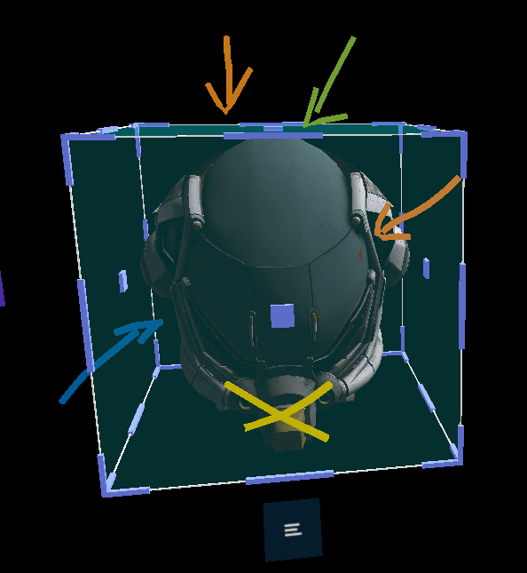
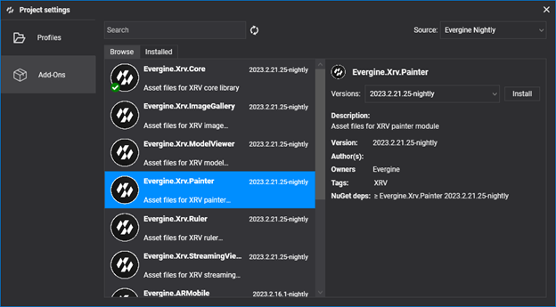
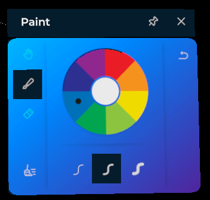

# Painter Module

If you need to draw 3D lines in virtual space, this module is a good option. It lets you draw lines with different colors and thicknesses, so it could be useful for drawing attention to certain elements like, for example, 3D models.



A remarkable capability of this drawing tool is that you can use both hands at the same time. Also, you can undo any drawing or deletion action, or even remove all drawn lines at any moment.

## Installation

This module is packaged as an [Evergine add-on](../../../index.md). To use it in your project, just install it from the _Project Settings > Add-Ons_ window.



Then, just register the module programmatically within your XRV service instance.

```csharp
var xrv = new XrvService()
    .AddModule(new PainterModule());
```
## Usage

- To open the painter window, tap on the  hand menu button.



> [!NOTE]
> Drawing or removing lines is only available while the painter window is open.

- The color selection wheel lets users change the current color. The active color is marked with a selection indicator.


- You can choose between a set of thicknesses that will be applied when a new line is drawn.
    -  Thin.
    -  Medium.
    -  Thick.

- There are buttons to undo previous actions or remove all lines. The full set of actions is listed below.
    -  : Pinch fingers and drag to draw a line.
    -  : Pinch fingers and drag to remove a line.
    -  : Do nothing.
    -  : Undo the last action.
    -  : Clear all lines.