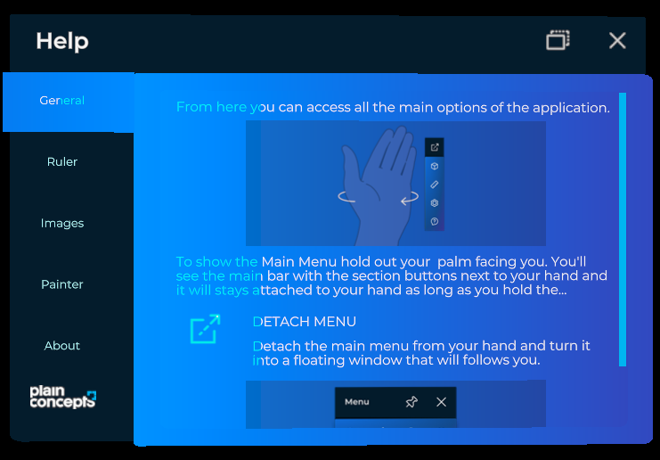

# Tabs Control

The Tabs control provides basic infrastructure and functionality for adding tabbed panels to your application. It offers a container and a tab navigation system.



It includes the following properties for customizing the control:

| Properties     | Description                                     |
| -------------- | ----------------------------------------------- |
| `Size`         | Sets the size for the container.                     |
| `SelectedItem` | Sets the selected tab and displays the associated content. |
| `Builder`      | Returns a `TabControlBuilder`.                     |

## Create a Tab Control programmatically

The easiest way to create a tab instance is to use the `TabControlBuilder`, which provides features related to adding content to the tab control.

| Methods                     | Description                                 |
| --------------------------- | ------------------------------------------- |
| `AddItem`                   | Adds a single item to the tab control.                         |
| `AddItems`                  | Adds a set of items to the tab control.                        |
| `WithSize`                  | Specifies a size for the tab control.       |
| `WithActiveItemTextColor`   | Specifies the text color for the active tab item.   |
| `WithInactiveItemTextColor` | Specifies the text color for the inactive tab item. |

```csharp
var tabEntity = TabControl.Builder
    .Create()
    .WithSize(new Vector2(0.3f, 0.2f))
    .AddItem(new TabItem
    {
        Name = () => "Tab Name",
        Contents = () => this.CreateContent(), // Function to set content entity
    })
    .Build();  
```

In _XRV_, we use this tab control builder in configuration and help windows. If you want a window where the only content entity is a tab control, you can utilize the _TabbedWindow_ class.

## Tab items definition

`TabItem` provides the tabs and content for the tab control.

| Properties | Description                       |
| ---------- | --------------------------------- |
| `Name`     | The name of the tab               |
| `Data`     | General-purpose data associated with the tab. |
| `Order`    | The order in which the tab should be displayed.            |
| `Contents` | The content associated with the tab item.         |