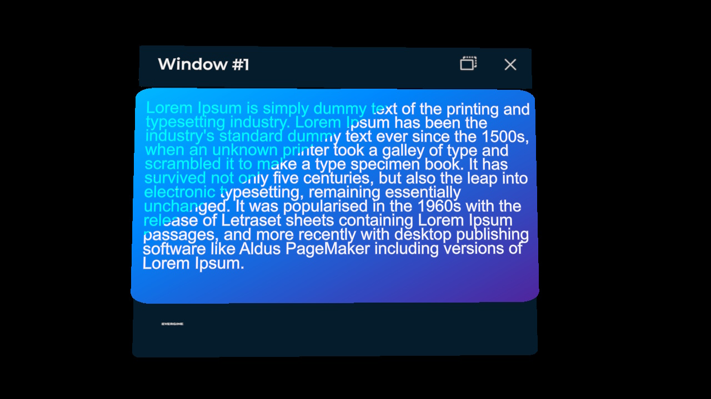
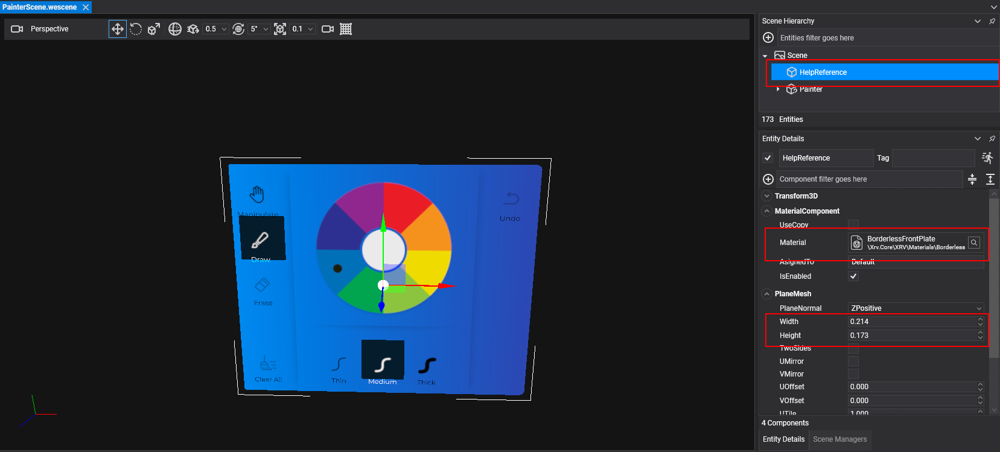

# Windows System

One of the main features that XRV offers is the _Windows System_, which helps you with built-in windows whose contents can be customized by you. It also includes built-in alert and confirmation dialogs that you can include within your UI logic to notify or ask for confirmation from application users and execute some logic or another based on their decisions.



## Windows Interaction

When a window is created, it will include some default buttons that allow users to modify window behavior or visibility.
- Window position behavior can be changed. You can choose how the window is placed relative to the user. To change the position mode, just use the window button to toggle between the following behaviors:
    -  Follow mode: the window will follow the user wherever they move if they go farther than 0.6 meters. In this mode, the window will also change its orientation to face the user if they move around.
    -  Pinned mode: when switched to this mode, the window will stay in the position and orientation it had when the button was pressed. In this mode, the user can also manipulate the position and orientation of the window using the pinch gesture on the surface area of the window, including both the title bar and content area.
- Press  to close the window.

## Create and Show a Window Programmatically

To create a window, you can access the _Windows System_ that is exposed by _XrvService_. This window creation has a callback to configure the window, with different options that we will enumerate in the section below. You can create as many windows as you want.

```csharp
var xrv = Application.Current.Container.Resolve<XrvService>();
var windowSystem = xrv.WindowSystem;

// Setting Window
var window = xrv.WindowSystem.CreateWindow(config =>
{
    config.Title = "Window #1";
    config.Size = new Vector2(0.3, 0.2);
});

// Show window (empty in this case)
window.Open();
```

Windows include different built-in parts and layers:
- Title bar: this is on the top of the window and also contains action buttons on the right side of the window.
- Back plate: it has the same material as the title bar, and the only content it includes is an optional logo image.
- Front plate: this will be drawn over the back plate and is intended to be placed behind window contents.


### Window Instance Options
Each window instance that is returned by the _Windows System_ offers a set of options that developers can change based on their criteria. You can also open or close any window programmatically or subscribe to events about that window being opened or closed.

| Properties             | Description                                                                             |
| ------------------- | --------------------------------------------------------------------------------------- |
| `AllowPin`   | If this option is disabled, the default toggle button to let users change window positioning behavior, as previously mentioned, will not be available for a window instance. |
| `DistanceKey`   | This lets developers specify the distance key that will be used to place the window once opened. |
| `EnableManipulation`   | When set to false, this option will not let users change window orientation and positioning when the pinned mode is active. |

| Methods             | Description                                                                             |
| ------------------- | --------------------------------------------------------------------------------------- |
| `Open`   | Opens the window instance. |
| `Close`   | Closes the window instance. |

| Events             | Description                                                                             |
| ------------------- | --------------------------------------------------------------------------------------- |
| `Opened`   | Occurs when the window instance is opened. |
| `Closed`   | Occurs when the window instance is closed. |

### Window Instance Configuration

In the configuration callback, you can use the following properties to change how the window is displayed.

| Properties             | Description                                                                             |
| ------------------- | --------------------------------------------------------------------------------------- |
| `Content`   | This property lets you set an entity that will be placed as window contents. Here you can set whatever you want: buttons, 3D text, images, etc. We will talk later about the easiest way to layout your windows' contents and how to set up window parameters like size to fit its contents. |
| `DisplayFrontPlate`   | Front plate can be optionally hidden using this flag. |
| `DisplayBackPlate`   | Back plate can be optionally hidden using this flag. |
| `DisplayLogo`   | Controls logo visibility for the window. This image is located in the bottom-left corner of the back plate. |
| `FrontPlateOffsets`   | XY front plane offset relative to the window back plate. |
| `FrontPlateSize`   | Front plate width and height in meters. |
| `LocalizedTitle`   | Lets you specify a callback function to set a [localized title](../localization.md) for the window. |
| `LogoMaterial`   | To change the default logo image, you can set your own material here. |
| `Size`   | You can set the window width and height in meters. |
| `Title`   | Lets you specify a fixed title string for your window. |


### How-To: Create Own Window with Contents
If you want to create your own window, you should first know the size of its contents, but calculating this manually could be tricky. We are going to quickly explain the steps we follow in this case.

1. Create a new scene that will contain your window contents. Window contents will then be exported to a prefab that will be loaded as window contents.
2. Create a new mesh with _BorderlessFrontPlate_ material. This plane will help as a guide to know how contents will fit in the final window.
3. Set _PlaneMesh_ width and height with the desired size. 

4. Create your window layout.
5. Create a prefab from your contents entity. Do not include guide reference in the prefab, just the _Painter_ entity in this case. Remember that you should not save your changes after creating the prefab.
6. Instantiate your window from the code and set its size with the same values as your reference.

```csharp
var contentsSize = new Vector2(0.214f, 0.173f);
var window = windowsSystem.CreateWindow(config => 
{
    config.Size = contentsSize;
    config.FrontPlateSize = contentsSize;
    config.Content = this.assetsService.Load<Prefab>(<Prefab GUID here>).Instantiate();
});
```

## Built-In Dialogs

_XRV_ also offers two built-in dialog types that you can use to request a user action before making a decision. An important thing here is that, unlike window creation, there can only be a single instance of an alert or confirmation dialog at a time in the application. We limit this to avoid dialog stacks that would make users uncomfortable while using the application.

- Alert dialog: this may be used to alert the user about anything that happens while using the application, but where the user can choose no option, just confirm the dialog. 
- Confirmation dialog: in this case, we can use this type of dialog to ask the user for confirmation about an action, for example, removing a 3D model from the virtual space.

Here you have an example of how to use the _Windows System_ to show an alert or confirmation dialog.

```csharp
var dialog = windowsSystem.ShowConfirmationDialog(...); // or ShowAlertDialog
dialog.Closed += Dialog_Closed;

private void Dialog_Closed(object sender, EventArgs e)
{
    if (dialog is ConfirmDialog confirm)
    {
        dialog.Closed -= this.Dialog_Closed;

        if (confirm.Result == confirm.AcceptOption.Key)
        {
            // Do something only if the user taps on the accept option            
        }
    }
}
```
In the sample, you can notice that we are subscribing to the _Closed_ event. This is safe as long as you unsubscribe from the event in the callback method, as we only allow a single dialog to be open at a time. This means, if we have another part of the code that has already opened a dialog and is waiting for the response, this new dialog opening will cause the _Closed_ event to be invoked for the previously opened dialog.

_XRV_ dialogs have a property named _Result_ that you can check to know which button has been pressed by the user.

**Alert Dialog**

| Result Value             | Description                                                                                         |
| ------------------- | --------------------------------------------------------------------------------------------------- |
| AlertDialog.AcceptKey | When the user presses the dialog _Accept_ button. |
| _null_ | When the user presses the dialog _Close_ button, or another part of the code invokes _ShowAlertDialog_. |

**Confirmation Dialog**

| Result Value             | Description                                                                                                       |
| ------------------- | ----------------------------------------------------------------------------------------------------------------- |
| ConfirmationDialog.AcceptKey | When the user presses the dialog _Accept_ button. |
| ConfirmationDialog.CancelKey | When the user presses the dialog _Cancel_ button. |
| _null_ | When the user presses the dialog _Close_ button, or another part of the code invokes _ShowConfirmationDialog_. |

## Other Things You Can Do with _Windows System_
The _Windows System_ instance also provides two properties that may be helpful for developers:

| Properties             | Description                                                                             |
| ------------------- | --------------------------------------------------------------------------------------- |
| `Distances`   | You can register or modify predefined window distances. |
| `OverrideIconMaterial`   | This property allows you to set a custom material that will override the default window logo material. So, you don't need to go instance by instance replacing the default logo material. |

### Window Distances Definition
_XRV_ provides a set of predefined window distances, but you can add as many as you want to your application.

| Distance Key          | Value (in meters) | Usage                                                           |
| ------------------- | --------------------------------------------------------------------------------------- |
| `NearKey`   | 0.35 | This is the distance used by default for alert and confirmation dialogs. |
| `MediumKey`   | 0.5 | This is the distance used by default for the rest of the windows. |
| `FarKey`   | 1 | This is not used at all by built-in elements of _XRV_ but you can use it for your own purposes. |

To override or add a new distance, you can use the _SetDistance_ method.

```csharp
// override an existing key
windowsSystem.Distances.SetDistance(Xrv.Core.UI.Windows.Distances.NearKey, 0.45f);

// adding a new key
windowsSystem.Distances.SetDistance("custom", 0.5f);

// use distance key in a window
window.DistanceKey = "custom";
```

## Examples

### Get Windows System in Component

```csharp
public MyComponent : Component 
{
    [BindService]
    private XrvService xrvService = null;

    private windowSystem =>  xrvService.WindowSystem;

    private void ShowAlert()
    {
        var dialog = this.windowSystem.ShowAlertDialog("Alert Title", "Sample Content.", "OK");
        dialog.Closed += this.OnAlertClosed();
    }

    private void ShowConfirmation()
    {
        var dialog = this.windowSystem.ShowConfirmationDialog("Confirmation Title", "Sample Content.", "No", "Yes");
        dialog.Closed += this.OnConfirmationClosed();
    }

    private void OnAlertClosed(object sender, EventArgs e)
    {
        if (sender is AlertDialog dialog) 
        {
            dialog.Closed -= this.OnAlertClosed();
        }
    }

    private void OnConfirmationClosed(object sender, EventArgs e)
    {
        if (sender is ConfirmationDialog dialog) 
        {
            dialog.Closed -= this.OnConfirmationClosed();
        }
    }
}
```