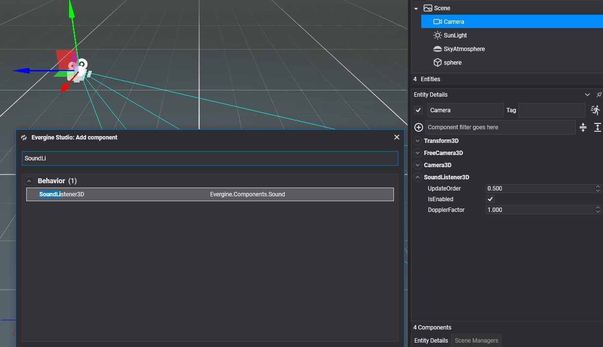

# Using Audio from Evergine Studio

3D spatialized audio allows simulating sounds in a 3D environment. The goal is to reproduce audio in a way that replicates how we hear sound in the real world.

Spatial sounds are very useful for simulating environments in _Virtual Reality / Augmented Reality_ because this feature adds more realism to the experience.

In Evergine, there are two components to simulate audio/spatial audio:

| Component  | Description  |
| ----       | ----         |
| **SoundListener3D** | Represents a listener. Usually, this component is used with the camera entity. |
| **SoundEmitter3D** | Represents an emitter. This component can be added to any entity in your scene to emit a 3D sound. |

## Sound Listener
To add a sound listener component to the main camera, select the camera and click the button with the  in the **Entity Details** panel and search for the component.

| Properties | Description |
| ----       | ----        |
| **DopplerFactor** | Changes in the frequency of a wave relative to a listener who is moving relative to the sound emitter. The value is a positive float, and the default value is 1.0. |

## Sound Emitter
To add a sound emitter component to any scene entity, select the entity and click the button with the  in the **Entity Details** panel and search for the component.

| Properties | Description |
| ----       | ----        |
| **Audio**      | The audio asset. **_Note: The audio must be mono to work as spatial sound._**|
| **Volume**     | The audio volume. The value is between [0.0-1.0], and the default value is 1.0. |
| **Pitch**      | The quality that makes it possible to judge sounds as _higher_ or _lower_ in the sense associated with musical melodies. The value is between [0.0-1.0], and the default value is 1.0.  |
| **IsMuted**    | Indicates whether the emitter is muted.  |
| **Distance Scale Factor** | This is only used to calculate the Doppler effect on the sound effect. |
| **Play Automatically**    | The emitter starts playing the sound automatically. |
| **Loop**                  | The emitter plays in loop mode. |
| **Apply3D**               | Indicates whether the position of the emitter with respect to the listener will be used to simulate spatial sound. |