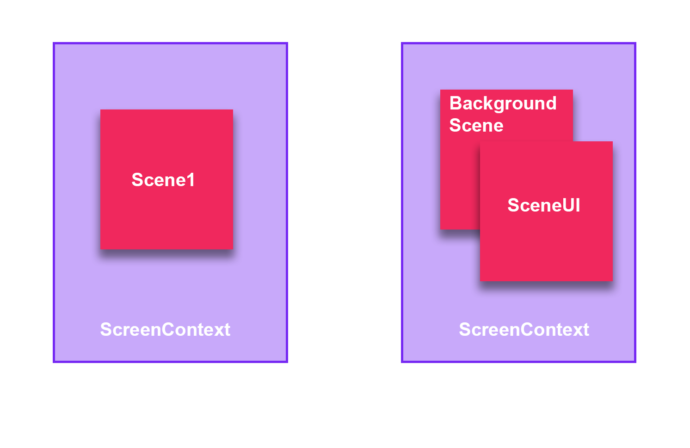
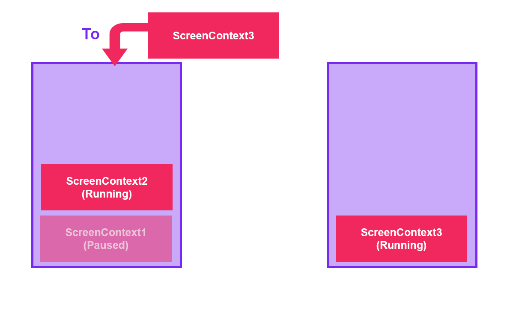
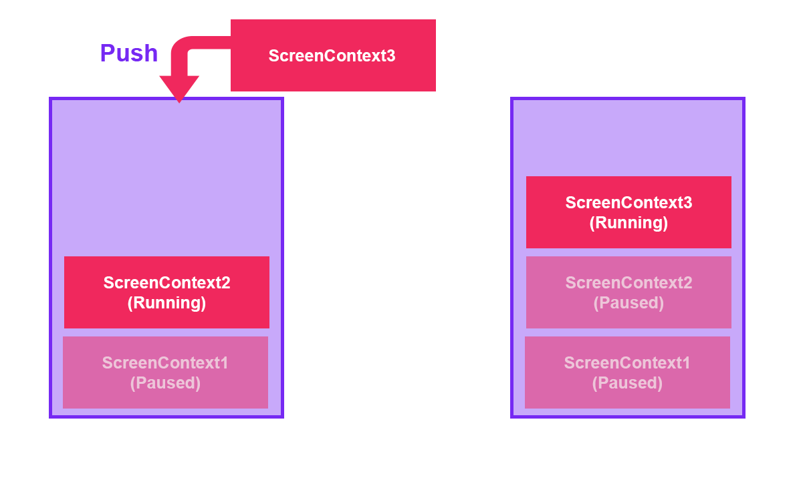
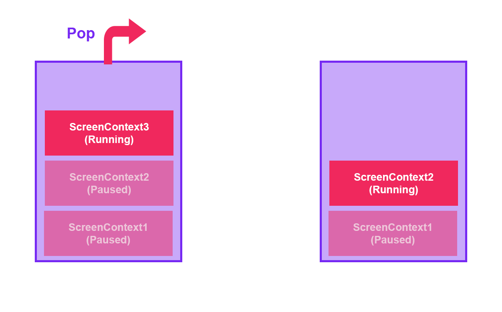

# ScreenContext Manager

The **ScreenContext Manager** allows you to load a ScreenContext with single or multiple scenes simultaneously and transition to other ScreenContexts while the application is running. The ScreenContext Manager is used to control the flow of your application through multiple scenes.

## ScreenContext

A **ScreenContext** can be simple, containing only a single scene, or complex, containing multiple scenes.



## Transition to Other ScreenContexts

The ScreenContext Manager has the **To**, **Push**, and **Pop** methods to transition between different ScreenContexts.

| Method  | Description |
| ----    | ----        |
|   To    | <p>The ScreenContextManager stack unloads and clears all ScreenContexts enqueued before and loads only the new ScreenContext.</p><p>By default, the method disposes of all ScreenContexts previously in the stack, but this behavior can be modified using an overloaded method with the parameter _doDispose_.</p></br>  |
|  Push   | <p>The ScreenContextManager stack pauses the last enqueued ScreenContext and enqueues the new ScreenContext. Only the top ScreenContext is running.</p> </br>. |
|  Pop    | <p>The ScreenContextManager stack unloads and dequeues the ScreenContext located at the top, and the previous ScreenContext in the stack will start running.</p> <p>By default, the method disposes of the dequeued ScreenContext, but this behavior can be modified using an overloaded method with the parameter _doDispose_.</p></br> |

## Using ScreenContext Manager

The **ScreenContext Manager** is only available from code, so it is not possible to configure it from Evergine Studio. If you inspect the **MyApplication** class created by the Evergine project template, you can see the **Initialize** method with the following code:

```csharp
public override void Initialize()
{
    base.Initialize();

    // Get ScreenContextManager
    var screenContextManager = this.Container.Resolve<ScreenContextManager>();
    var assetsService = this.Container.Resolve<AssetsService>();

    // Navigate to scene
    var scene = assetsService.Load<MyScene>(EvergineContent.Scenes.MyScene_wescene);
    ScreenContext screenContext = new ScreenContext(scene);
    screenContextManager.To(screenContext);
}
```
In the code above, a simple ScreenContext is created with the MyScene scene, and the ScreenContextManager transitions to this ScreenContext using the **To** method explained before.

In addition, you can assign names to the ScreenContexts using:

```csharp
ScreenContext screenContext = new ScreenContext("Menu", scene);
```

To find the ScreenContext in the stack, you can use the following line:

```csharp
var menuScreenContext = screenContextManager.FindContextByName("Menu");
```

## ScreenContext Behaviors

When a ScreenContext is paused, the update and draw methods of the scenes inside the ScreenContext will not run. This behavior can be modified using the **Behavior** parameter in the ScreenContext class.

```csharp
ScreenContext screenContext = new ScreenContext("Menu", scene)
{
    Behavior = ScreenContextBehaviors.UpdateInBackground | ScreenContextBehaviors.DrawInBackground
};
```

| Behavior | Description |
| ----     | ----        |
| UpdateInBackground | The scenes inside the ScreenContext keep updating when the ScreenContext is paused. |
| DrawInBackground   | The scenes inside the ScreenContext keep drawing when the ScreenContext is paused. |