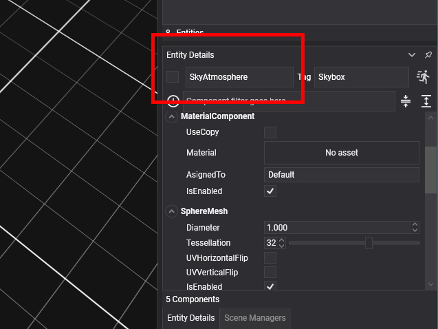
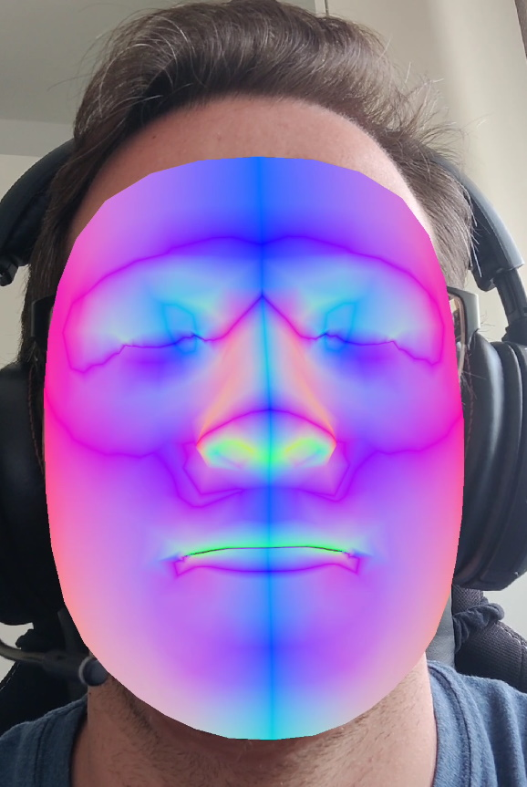
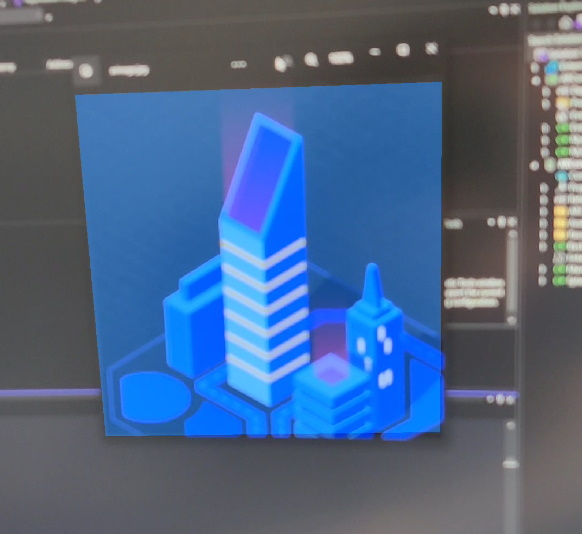

# ARMobile (Experimental)
_ARMobile_ is an extension designed to work with augmented reality experiences, so you will need compatible devices to run these kinds of applications. Currently, the only supported platform is _Android (ARCore)_, but we also plan to support _iOS (ARKit)_ in the future. ARMobile is based on the [XR Platform](../../xr/index.md).

> [!NOTE]
> Please note that the _Evergine.ARMobile_ extension is in an experimental state, so it has some limitations and known issues described in the [Known issues](#known-issues) section.

## Create a Project Using ARMobile
To make it easier to create _ARMobile_ projects, we have developed a new project template for _Android ARCore_. It works with _OpenGL_ as the graphics backend due to limitations related to _ARCore_, which does not support _Vulkan_.

You also need to open the _Evergine Studio_ add-ons manager and add the _Evergine.ARMobile_ add-on.

Once _Evergine Studio_ loads the default scene, you need to make some changes to ensure it works properly with _ARMobile_.
- For the scene's 3D camera, set the background color to #00000000 and remove the _FreeCameraBehavior_ component.
- Disable the _SkyAtmosphere_ entity.
- Go to the _Scene Managers_ tab and add the _ARMobileManager_ scene manager.

## Built-in ARMobile Add-on Prefabs
The _ARMobile_ add-on provides a set of prefabs that you can use for common _AR_ scenarios. Expand _Dependencies > Evergine.ARMobile > Prefabs_ to find the following prefabs: _Cursor_, _Face_, _FeaturePoints_, _Image_, and _Planes_.

### Cursor Prefab
This prefab draws a cursor whose orientation changes depending on surface detection. Drag and drop the _Cursor_ prefab into your scene and set its position to (0, 0, 0).

If you select the prefab entity, you will notice that apart from plane mesh components, there is an _ARMobileHitTestBehavior_ that lets you choose how plane collision is detected: every frame or just when the user taps on the screen.

### Face Prefab
The _Face_ prefab allows you to use face tracking capabilities from the _AR_ platform. Drag and drop the _Face_ prefab to your scene and set its position to (0, 0, 0). Then, go to _Scene Managers_ and check _FaceTrackingEnabled_.

When using face tracking detection, the rear camera is no longer used, and the front camera is used instead. Because of this, any other _AR_ mode like image tracking or plane detection will not work.

If you select the prefab entity, you can use the attached _MaterialComponent_ to change the face material. You will also notice a component called _XRFaceTrackingMesh_ that creates a face mesh from native buffers.

### Feature Points Prefab
This prefab uses [LineBatch3D](xref:Evergine.Framework.Graphics.LineBatch3D) to render feature points in green, orange, or red, corresponding to more confident to less confident results. Confidence is saved in the _W_ field of the _Points_ property in [XRFeaturePoints](xref:Evergine.Framework.XR.FeaturePoints.XRFeaturePoints). Drag and drop the _FeaturePoints_ prefab to your scene, set its position to (0, 0, 0), and enable feature points detection in the _ARMobileManager_ scene manager.

### Image Prefab
With the image prefab, you can easily track images and place 3D objects when those images are detected, and their real-world position changes. It includes a _MaterialComponent_ that you can change to use a custom material for the plane that appears once the target image has been detected. Drag and drop the _Image_ prefab to your scene, set its position to (0, 0, 0), and enable image detection in the _ARMobileManager_ scene manager.

Under _Dependencies > Evergine.ARMobile > AR_, you will find the default images dataset. It includes a single image named _arimage.jpg_. The dataset file is in _CSV_ format:
- Each line represents a single image from the dataset.
- The first column is the relative path to the image file. The second column is the expected image size in the real world, measured in meters. For the default image, we expect it to be 20 centimeters wide.
- For each of the images, we use the file name (without extension) as the image name, which we internally register in the dataset database. This is why the default _ImageName_ value for the _XRImageTracking_ component in the _Image_ prefab is _arimage_, as this is the file name for the default image in the _Evergine.ARMobile_ add-on.

If you want a custom set of images, create your own dataset within your project folders. Then, change the _ImageDataSetPath_ value in the _ARMobileManager_ scene manager to match your dataset path. To ensure your images are optimal for tracking, please follow platform recommendations:
- For Android: Use the [arcoreimg tool](https://developers.google.com/ar/develop/augmented-images/arcoreimg) to evaluate your images' quality.

### Planes Prefab
We provide this prefab to visualize detected planes. Drag and drop the _Planes_ prefab into your scene and set its position to (0, 0, 0). Then, go to _Scene Managers_ and select a plane detection mode.

The prefab includes a [XRPlaneRenderer](xref:Evergine.Components.XR.XRPlaneRenderer) that lets you change the material used to draw the planes.

## Known Issues
As the _ARMobile_ extension is in an experimental state, you may encounter some issues while running applications. Here is a list of known issues:
- The application crashes when returning from the background.
- In Debug configuration, you may see some _Google.AR.Core.Exceptions.DeadlineExceededException_ exceptions written to the output console, depending on the _ARMobileManager_ configuration.
- When dragging AR prefabs into the scene, ensure that their _Transform3D_ location is set to (0, 0, 0). Any other position could cause an _OpenGL_ rendering issue resulting in a full-screen green texture.