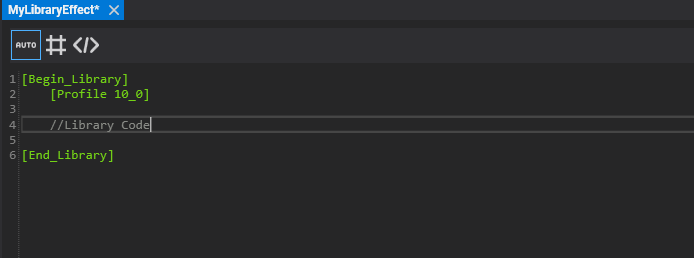
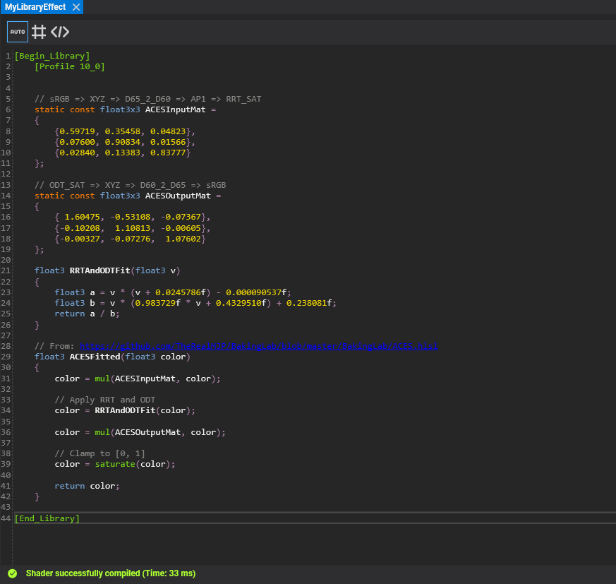
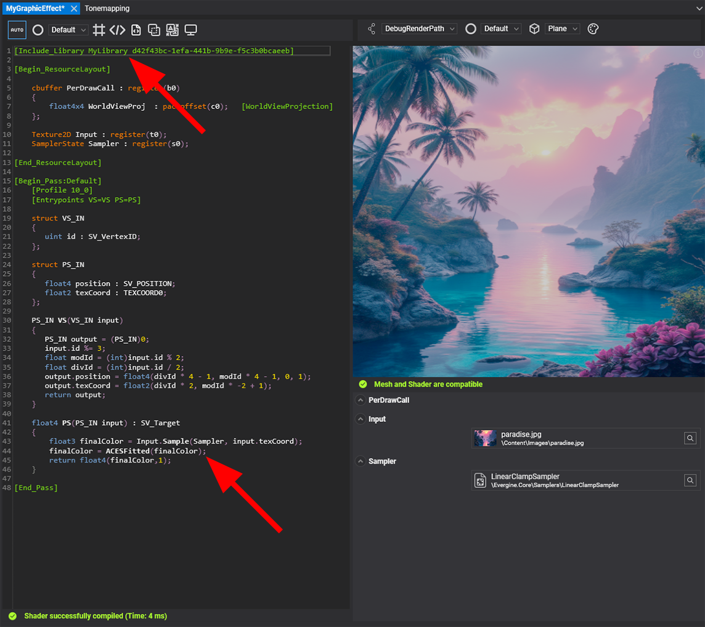
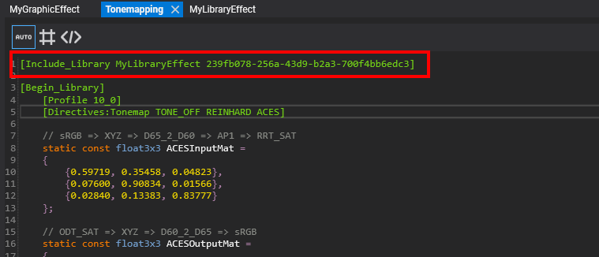
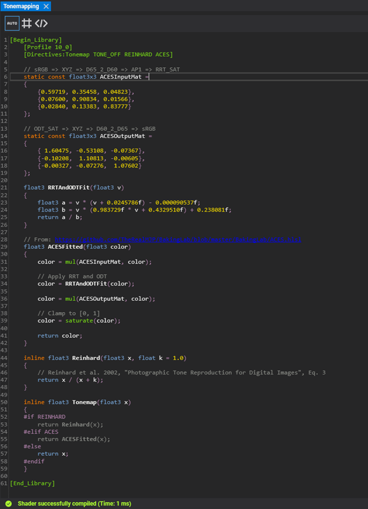
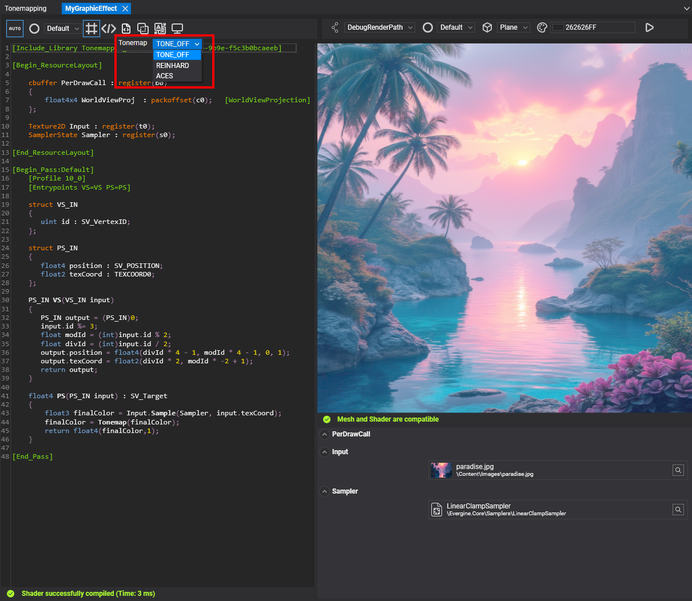
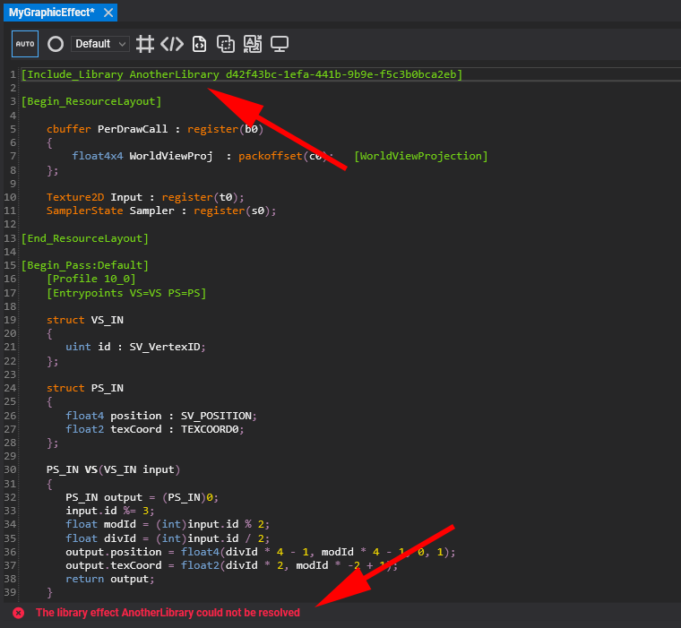
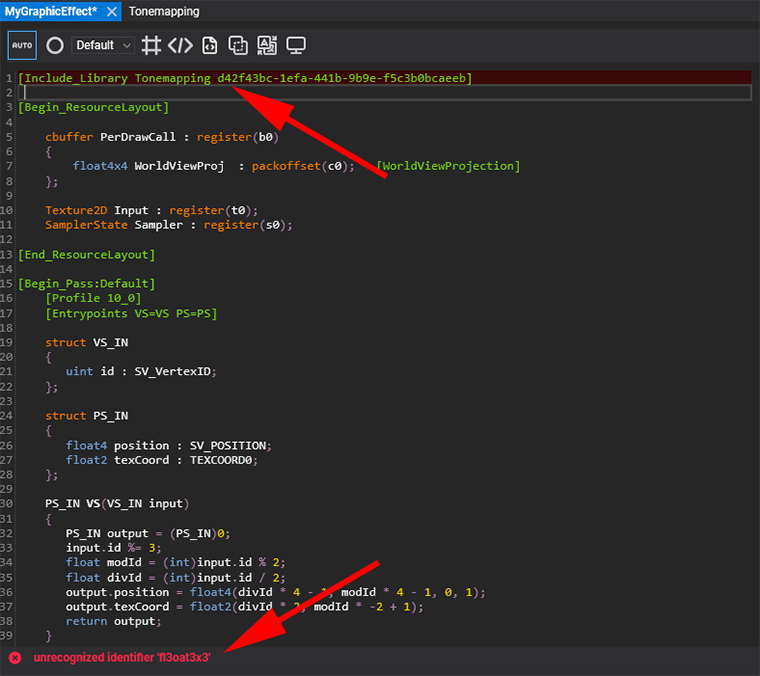

# Library Effect
---

### What is a Library Effect?
A Library Effect acts as a collection of static variables, constants, directives, and reusable functions that can be referenced from your Graphics and Compute effects. By simply including the library in your effect files, you can centralize shared logic and keep your effect codebase clean and maintainable.

### Creating a Library Effect
You can create a new Library Effect from the Evergine Studio Asset Menu or by right-clicking on the Asset Details Panel and selecting the relevant option.

### Defining a Library Effect
Every new Library Effect must start with the [Begin_Library] metatag and end with the [End_Library] metatag. Library Effects are compiled in the same way as any other effect, so you need to specify the compilation profile version, just as you would when defining passes. This ensures that any potential issues can be caught and debugged early, even before the library is used in other effects.

### Structuring Your Libraries
Inside a Library Effect, you can define common variables, constants, and functions that you want to reuse across your Graphics or Compute effects. In the example below, a Tonemapping library is created with the logic for implementing an ACES color adjustment.

### Using a Library Effect in Other Effects
To use a Library Effect in your Graphics or Compute effects, simply include it using the following metatag:

[Include_Library LibraryName LibraryIdentifierNumber]

* **LibraryName:** A human-readable name for your library.
* **LibraryIdentifierNumber:** A unique GUID that identifies the library effect asset.

The advantage of using the GUID is that it remains independent of the asset’s relative path. This means you can move your library assets around the project’s content folders without breaking the references.
To make it easier to include a library in your effects, you can drag and drop the library effect asset from the Asset Details Panel into another effect opened in the Effect Editor. This action will automatically create the reference in your code.

**Example: Using the my library in a Graphics Effect**
Below is an example of how to use the previously defined Tonemapping library in a Graphics Effect.

### Library Effect Dependencies and Recursive Includes
Library Effects can also reference other Library Effects, enabling you to build more complex effects by combining multiple libraries. This approach helps you organize your code into a logical dependency tree and ensures better modularity and separation of concerns.

### Using Directives in Your Library Effects
You can leverage directives inside your Library Effects to control the flow of your HLSL code, making it possible to create multiple variations of your library depending on the values of these directives.

When you import a Library Effect into your Graphics or Compute Effect, its directives are also imported, merging with the directives of the effect itself and all its dependent libraries. This results in a single, unified group of directives that the effect can utilize.

### Managing Errors with the Effect Analyzer
The Evergine Effect Editor has been enhanced with a new Effect Analyzer that provides detailed information about the new [Include_Library] metatags and helps you manage any issues that may arise when working with Library Effects. Here are some common scenarios and how the Effect Analyzer handles them:

1. **Unresolved Reference:** If an included library has an incorrect Library Identifier Number, the analyzer will report that the reference to the library cannot be resolved.

2. **Library Compilation Error:** If your Library Effect contains a mistake or code error, the analyzer will highlight the include line in your main effect and show the error inside the library itself.

3. **Cross-Reference Issues:** If an effect includes a library that, in turn, includes another library, and a cyclic dependency is detected, the analyzer will report a cross-reference issue.

