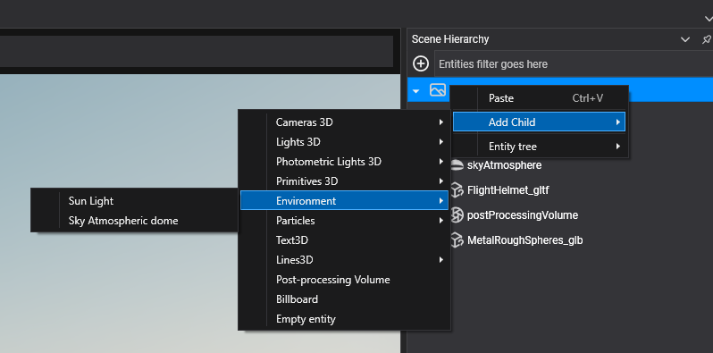

# Sky Atmosphere


This is the default method to create environment lighting in Evergine. When you create a new scene in Evergine Studio, it will use this method to provide the environmental lighting.

It creates an HDR sky texture that physically simulates the properties of the atmosphere. Additionally, it uses a [Directional Light](../lights.md#directional-lights--photometric-directional-light) to control the atmosphere light dispersion, as well as the light intensity and color.

# SunComponent

This component is used to mark a Directional Light as the light source that will use the atmosphere controller. When you create an Evergine Scene, it will create a Directional Light with a SunComponent.

Changing the Directional Light's rotation allows you to change the visual atmosphere, simulating effects like sunset, sunrise, or daylight:

<video width="600" autoplay loop><source src="images/sky_atmosphere.mp4" type="video/mp4"></video>

This component has no properties; its only purpose is to mark a Directional Light as the Sun source.

> [!NOTE]
> Only the first light with a SunComponent will be used.

## AtmosphereController component

This component is responsible for controlling the physical properties of the atmosphere and rendering the sky dome texture.


| Property | Default | Description |
| --- | --- | --- |
| **RayleighScattering** | 5.5, 13, 22.4 | Rayleigh scattering coefficient for each color channel wavelength (Red, Green, and Blue). |
| **RayleighScaleHeight** | 8000 | Scale height for Rayleigh scattering, measured in meters. |
| **PlanetRadiusInKm** | 6371 | Radius of the planet in kilometers. |
| **AtmosphereRadiusInKm** | 6471 | Radius of the atmosphere in kilometers. |
| **MieScatteringCoefficient** | 21 | Mie scattering coefficient. |
| **MieScaleHeight** | 12000 | Mie scattering scale height in meters. |
| **MiePreferredScattering** | 0.758 | Mie preferred scattering direction. |
| **ModifySunColor** | true | This will force the adjustment of the Sun color. |
| **SunIntensity** | 22.0 | The Sun's intensity. |
| **SunDiskEnabled** | true | Indicates if the environment will create a sun disk. |
| **SunDiskSize** | 0.02 | The size of the sun disk in degrees. |

These properties allow you to simulate the atmospheres of other worlds, like Mars (atmosphere obtained from [here](https://argos.vu/wp-content/uploads/2021/06/18591764.pdf)):


Or you can simulate any exotic atmosphere:


## Using Sky Atmosphere

### In Evergine Studio

You can add two entities from Evergine Studio under the Environment menu entry:
- **Sun Light:** This will create a Photometric Directional Light marked as a Sun Light with the `SunComponent`.
- **Sky Atmospheric dome:** This will create a sphere mesh with the `AtmosphereController` component to create the atmosphere. This entity also has the "Skybox" tag.



### From Code

Here is a small code snippet to create the two entities needed to create a sky atmosphere:

```csharp
protected override void CreateScene()
{
    // Create the sun light
    var sun = new Entity()
        .AddComponent(new Transform3D() { LocalRotation = new Vector3(-2, 0, 0) }) // Add some rotation to the light...
        .AddComponent(new PhotometricDirectionalLight())
        .AddComponent(new SunComponent());

    this.Managers.EntityManager.Add(sun);

    // Create the sphere sky dome
    var skyDome = new Entity()
        .AddComponent(new Transform3D())
        .AddComponent(new MaterialComponent())
        .AddComponent(new SphereMesh())
        .AddComponent(new MeshRenderer())
        .AddComponent(new AtmosphereController());

    this.Managers.EntityManager.Add(skyDome);
}
```