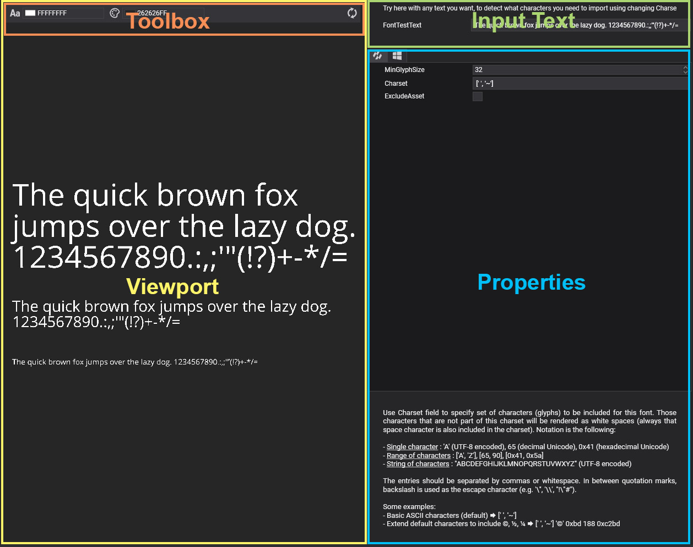

# Font Editor
---

**Font Editor** allows you to edit font assets. Double-clicking on a font asset shown in [Assets Details](../../evergine_studio/interface.md) will open this editor. The editor is composed of three main parts:

## **Viewport**

Displays the result of the current font configuration. The viewport includes a toolbox at the top that allows you to change the font color and background color.

## **Input Text**

In this area, you can input different texts to test the font configuration in the viewport. By default, the paragraph _"The quick brown fox jumps over the lazy dog. 1234567890.:,;'"(!?)+-*/="_ appears, which tests all letters, numbers, and punctuation marks. However, if you modify the charset to include additional characters, you can test them by including them in this input text.

## **Properties**

The font properties that you can configure are:

| Property      | Default Value | Description   |
| ---- | ---- | ---- | 
| **MinGlyphSize**  | 32            | The minimum glyph size used to render a font glyph in the atlas. When a font is very thin or has thin parts such as ligatures, it may be necessary to increase this size for accurate rendering. Increasing the size results in a larger atlas and a heavier font asset. |
| **Charset**       | ['','~']      | Sets the character set. 
The charset is a text with UTF-8 or ASCII encoding. The following syntax is correct:
 <ul><li>Single character: _'A'_ (UTF-8 encoded), _65_ (decimal Unicode), _0x41_ (hexadecimal Unicode)</li><li>Range of characters: _['A', 'Z']_, _[65, 90]_, _[0x41, 0x5a]_</li> <li>String of characters: _"ABCDEFGHIJKLMNOPQRSTUVWXYZ"_ (UTF-8 encoded)</li> </ul> 
Entries should be separated by commas or whitespace. Inside quotation marks, the backslash is used as the escape character (e.g., '\'', '\\', "!\"#"). The order in which characters appear is not considered.
|