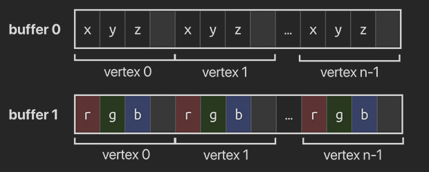
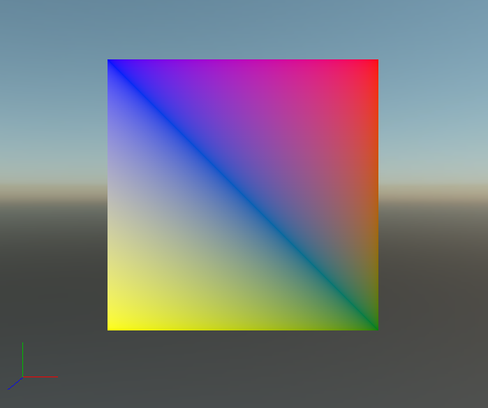

# Meshes


## Introduction

A mesh is a single drawable element, a fundamental structure used to represent 3D objects in a scene. It is composed of vertices (points in 3D space) that are connected to form polygons, typically triangles. It also is rendered with only one **Material**.

Each vertex in a mesh can hold additional information, such as normals (which define the direction a surface is facing), UV coordinates (which map textures to the object), and color or other custom data. This allows the mesh to have detailed surface characteristics, like how it reflects light or how a texture is applied to it. 

Complex models contains multiple meshes with multiple materials, as defined in this article.

#### Parameters
The *Evergine* mesh class contains the following parameters.

| Property | Type | Description |
|----------| ---- |-------------|
| **VertexBuffers** | `VertexBuffer[]`. | Array containing  the vertex buffers of the mesh (explained [here](#vertex-buffers)) |
| **IndexBuffer** | `IndexBuffer`. | The mesh index buffer. Can be null (explained [here](#index-buffers))|
| **Buffers** | `Buffer[]`. | Array containing all the **Buffer** instances of every vertex buffer. |
| **Offsets** | `int[]`. |Array containing all the vertex offsets of every vertex buffer. |
| **PrimitiveTopology** | `PrimitiveTopology`. | Enumeration containing the type of geometric topology used for the  mesh.  Its values are: <li>Undefined</li><li>PointList</li><li>LineList</li><li>LineStrip</li><li>TriangleList</li><li>TriangleStrip</li><li>LineListWithAdjacency</li><li>TriangleListWithAdjacency</li><li>Patch_List</li> |
| **InputLayouts** | `InputLayouts`. | Object containing the LayoutDescription of every vertex buffer.|
| **Primitive Count** | `int`. | The number of primitives of the mesh. |
| **ElementCount** | `int`. | The number of elements in the mesh. It's affected by the topology (For example, 1 triangle contains 3 elements, but 1 line is made of 2).|
| **VertexSize** | `ushort`. | The memory size (in bytes) of a single vertex.
| **AllowBatching** | `bool`. | If the mesh can be used in dynamic and static batching.|

## Vertex Buffers

The *VertexBuffer* class in Evergine represents a buffer that holds the vertex data required for rendering 3D objects. 
It mainly contains the **Buffer** that contains the raw data and the **LayoutDescription** declaring what kind of vertex information it has.
The Vertex Buffer plays a crucial role in managing the vertex layouts and size, ensuring that this data can be processed efficiently by the GPU. The VertexBuffer class handles data organization and allows developers to define how vertex attributes like positions, normals, and textures are stored.

### Interleaved and Non-Interleaved Data

It's common to think of a vertex as a single entity (an object that holds all its relevant data). However, we can also get vertex attributes from separate streams, where the data for each attribute (like position, normals, or colors) is stored in contiguous memory blocks: one for positions, another for normals, and so on.

This approach offers several advantages. For example, it allows vertex data to be accessed by different Vertex Shaders without wasting bandwidth or cache space. In cases where a vertex is processed for a shadow map, the vertex function might only require the position, not the other attributes. If all vertex data is stored together, the GPU would have to traverse more memory to retrieve only the needed data. Additionally, optimizing the layout of this data within a struct can be tricky due to alignment and cache considerations.


#### Interleaved Vertex Attributes


#### Non-interleaved Vertex Attributes



As we can see,  vertex data can be arranged either with all attributes of a vertex stored together (**interleaved**) or with each attribute type stored together across all vertices (**non-interleaved**).

### Parameters
| Property | Type | Description |
|----------|------|-------------|
| **Buffer** | `Buffer`. | Buffer containing the vertex data. The buffer must contain the flag  `BufferFlag.VertexBuffer`. Otherwise it won't be accepted.|
| **Size** | `int`. | Size of the buffer in bytes. |
| **Offset** | `int`. | The offset in  bytes of the buffer data. |
| **Data** | `IntPtr`. | Pointer of the raw memory data of the buffer. | 
| **LayoutDescription** | `LayoutDescription`. | Description of the different **ElementDescription** instances, explaining the type of information, semantics, stride and offsets the vertex contains, allowing to properly extract the data. |
| **VertexCount** | `int`. | The number of vertices to be fetched from the buffer. |

### Predefined Vertices structures.
In order to make it easier for developers, **Evergine** contains a set of structs that can be used to define vertices with different kind of information. Our predefine types are:

| Type | Description | 
| ---- | ----------- |
| **VertexPosition** | Struct of vertex containing only `Position`. |
| **VertexPositionColor** | Struct of vertex containing the properties `Position` and `Color`. |
| **VertexPositionColorDualTexture** | Struct of vertex containing the properties `Position`, `Color`, `TexCoord` and `TexCoord2`. |
| **VertexPositionColorTexture** | Struct of vertex containing the properties `Position`, `Color` and `TexCoord`. |
| **VertexPositionDualTexture** | Struct of vertex containing the properties `Position`, `TexCoord` and `TexCoord2`. |
| **VertexPositionNormal** | Struct of vertex containing the properties `Position` and `Normal`. |
| **VertexPositionNormalColor** | Struct of vertex containing the properties `Position`, `Normal` and `Color`. ||
| **VertexPositionNormalColorDualTexture** | Struct of vertex containing the properties `Position`, `Normal`, `Color`, `TexCoord` and `TexCoord2`. |
| **VertexPositionNormalColorTexture** | Struct of vertex containing the properties `Position`, `Normal`, `Color` and `TexCoord`. |
| **VertexPositionNormalDualTexture** | Struct of vertex containing the properties `Position`, `Normal`, `TexCoord` and `TexCoord2`. |
| **VertexPositionNormalTangentColorDualTexture** | Struct of vertex containing the properties `Position`, `Normal`, `Tangent`, `Color`, `TexCoord` and `TexCoord2`. |
| **VertexPositionNormalTangentTexture** | Struct of vertex containing the properties `Position`, `Normal`, `Tangent`, `Color`, and `TexCoord`. |
| **VertexPositionNormalTexture**  | Struct of vertex containing the properties `Position`, `Normal` and `TexCoord`. |
| **VertexPositionTexture** | Struct of vertex containing the properties `Position` and `TexCoord`. |

The advantage of using this structures is that they provide the **LayoutDescription** of that vertex. However, you can create your own **VertexBuffers** with your own arrays, but you will have to build the **LayoutDescription**.


## Index Buffers

3D meshes you'll be rendering often have vertices that are shared across multiple triangles. This occurs even with simple shapes, like a rectangle:

Rendering a rectangle requires two triangles, which would normally mean a vertex buffer containing 6 vertices. However, two of these vertices would need to be duplicated, resulting in a 50% redundancy. This issue becomes more pronounced with complex meshes, where a single vertex is typically shared among 3 triangles. To solve this inefficiency, we use an index buffer.

An index buffer is essentially a list of references to the vertices in the vertex buffer. This allows for rearranging the vertex data and reusing vertices across multiple triangles without duplicating data. In the example of a rectangle, if the vertex buffer contains four unique vertices, the index buffer would reference these vertices, with the first three indices forming the top-right triangle, and the last three creating the bottom-left triangle.

#### Parameters
| Property | Type | Description |
|----------|------|-------------|
| **Buffer** | `Buffer`. | Buffer containing the indices data. The buffer must contain the flag  `BufferFlag.IndexBuffer`. Otherwise it won't be accepted. |
| **Size** | `int`. | Size of the buffer in bytes. |
| **Offset** | `int`. | The offset in  bytes of the buffer data. |
| **Data** | `IntPtr`. | Pointer of the raw memory data of the buffer. | 
| **IndexFormat** | `IndexFormat`. | The type of index. Can be **Uint16** (_unsigned short_) or **UInt32** (_unsigned int_). |
| **FlipWinding** | `bool`. | If true, the triangle side is defined in counter clock-wise order. |
| **IndexCount** | `int`. | Number of indices. |


## Create Mesh from Code


### Simple mesh using a predefined type

The next code explain how to create a simple mesh. It uses the **VertexPositionColor** struct for defining its data:

```csharp
// Vertices and indices data.
ushort[] indexData = new ushort[] { 0, 1, 2, 0, 2, 3 };

VertexPositionColor[] vertexData = new VertexPositionColor[]
{
    new VertexPositionColor(new Vector3(-0.5f, 0.5f, 0.0f), Color.Blue),
    new VertexPositionColor(new Vector3(0.5f, 0.5f, 0.0f), Color.Red),
    new VertexPositionColor(new Vector3(0.5f, -0.5f, 0.0f), Color.Green),
    new VertexPositionColor(new Vector3(-0.5f, -0.5f, 0.0f), Color.Yellow),
};

// Vertex Buffer
var vBufferDescription = new BufferDescription()
{
    SizeInBytes = (uint)Unsafe.SizeOf<VertexPositionColor>() * (uint)this.vertexData.Length,
    Flags = BufferFlags.ShaderResource | BufferFlags.VertexBuffer,
    Usage = ResourceUsage.Default
};

// We create the buffer using the vertex array data previously defined.
Buffer vBuffer = graphicsContext.Factory.CreateBuffer(this.vertexData, ref vBufferDescription);
VertexBuffer vertexBuffer = new VertexBuffer(vBuffer, VertexPositionColor.VertexFormat);

// Index Buffer
var iBufferDescription = new BufferDescription()
{
    SizeInBytes = (uint)(sizeof(ushort) * this.indexData.Length),
    Flags = BufferFlags.IndexBuffer,
    Usage = ResourceUsage.Default,
};

// We create the buffer using the ushort array data previously defined.
Buffer iBuffer = graphicsContext.Factory.CreateBuffer(this.indexData, ref iBufferDescription);
var indexBuffer = new IndexBuffer(iBuffer);

// Create Mesh using the previously defined vertex buffer and index buffer.
return new Mesh(new VertexBuffer[] { vertexBuffer }, indexBuffer, PrimitiveTopology.TriangleList)
{
    BoundingBox = this.ComputeBoundingBox(),
};
```


### Simple mesh using your own arrays

This code, on the other hand, explain how to build your own mesh with your own data types.

```csharp
// Indices data array.
ushort[] indexData = new ushort[] { 0, 1, 2, 0, 2, 3 };

// Position data array.
Vector3[] positions = new Vector3[]
{
    new Vector3(-0.5f, 0.5f, 0.0f),
    new Vector3(0.5f, 0.5f, 0.0f),
    new Vector3(0.5f, -0.5f, 0.0f),
    new Vector3(-0.5f, -0.5f, 0.0f),
};

// Color data array.
Vector4[] colors = new Vector4[]
{
    Color.Blue.ToVector4(),
    Color.Red.ToVector4(),
    Color.Green.ToVector4(),
    Color.Yellow.ToVector4(),
};

// Vertex Buffer with the position attribute data.
var bufferPosDesc = new BufferDescription()
{
    SizeInBytes = (uint)Unsafe.SizeOf<Vector3>() * (uint)this.positions.Length,
    Flags = BufferFlags.ShaderResource | BufferFlags.VertexBuffer,
    Usage = ResourceUsage.Default,
};

Buffer bufferPos = graphicsContext.Factory.CreateBuffer(this.positions, ref bufferPosDesc);
LayoutDescription layoutPos = new LayoutDescription().Add(new ElementDescription(ElementFormat.Float3, ElementSemanticType.Position, 0, 0));
VertexBuffer vertexBufferPos = new VertexBuffer(bufferPos, layoutPos);

// Vertex Buffer with the color attribute data.
var bufferColorDesc = new BufferDescription()
{
    SizeInBytes = (uint)Unsafe.SizeOf<Vector4>() * (uint)this.colors.Length,
    Flags = BufferFlags.ShaderResource | BufferFlags.VertexBuffer,
    Usage = ResourceUsage.Default,
};

Buffer bufferColor = graphicsContext.Factory.CreateBuffer(this.colors, ref bufferColorDesc);
LayoutDescription layoutColor = new LayoutDescription().Add(new ElementDescription(ElementFormat.Float4, ElementSemanticType.Color, 0));
VertexBuffer vertexBufferColor = new VertexBuffer(bufferColor, layoutColor);

// Index Buffer
var iBufferDescription = new BufferDescription()
{
    SizeInBytes = (uint)(sizeof(ushort) * this.indexData.Length),
    Flags = BufferFlags.IndexBuffer,
    Usage = ResourceUsage.Default
};

Buffer iBuffer = graphicsContext.Factory.CreateBuffer(this.indexData, ref iBufferDescription);
var indexBuffer = new IndexBuffer(iBuffer);

// Create Mesh with the 2 previous vertex buffers and the index buffer.
return new Mesh(new VertexBuffer[] { vertexBufferPos, vertexBufferColor }, indexBuffer, PrimitiveTopology.TriangleList)
{
    BoundingBox = this.ComputeBoundingBox(),
};
```

In both cases the result will be the same:



>[!NOTE]
> In this [article](../models/create_model_from_code.md) is explained how to show this custom mesh into a new entity.

For a single mesh Model, **Evergine** offers an easy way creating it, just passing it as a parameter in its constructor: