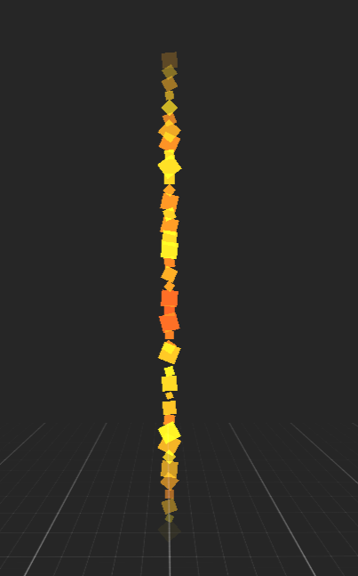
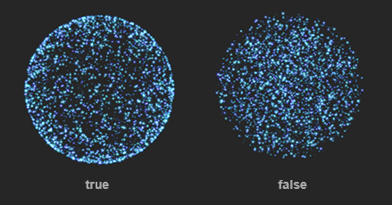
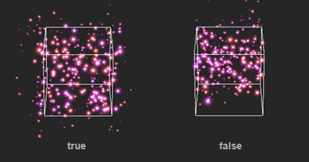
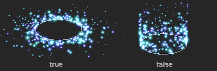

# Particle Emission Shapes

The particle system emission shape controls the **position** and **direction** of the particles when they are spawned.

### Common Parameters

All the emission shapes share the following properties:

| Property | Default Value  | Description |
|----------|----------------|-------------|
| Randomize Direction | _0_ | 

Randomness factor of the particle direction. A value of **0** means no random directions, **1** is total chaos, while intermediate values add a little bit of randomness while keeping the overall particle direction of the emission shape.

<video autoplay loop muted width="512" height="auto"><source src="images/randomize.mp4" type="video/mp4"></video>
 |
| Velocity Offset | _(0, 0, 0)_ | Velocity that is added on top of the initial particle velocity. |

## Point Shape

**Point Shape** emits the particles from the same position, using the **Up** vector of the particle entity as direction.

## Sphere Shape

<video autoplay loop muted width="auto" height="auto">
    <source src="images/sphere.mp4" type="video/mp4">
</video>

**Sphere Shape** uses a sphere for the emission. Its parameters control the size of the emission sphere, whether the particles are emitted from the sphere volume or only from its surface, and the direction of the new particles (from the sphere center or following the up vector).

| Property | Default Value | Description |
|----------|----------------|-------------|
| Radius | _1_ | The radius of the emission sphere  |
| From Surface | _false_ | 

**True** if the particles are spawned from the sphere surface, **false** if they are placed from inside the sphere volume. 

 |
| From Center | _true_ | 

If the particles are moving from the sphere center or all in the same direction (_Up vector_). 

 |

## Box Shape

<video autoplay loop muted width="auto" height="auto">
    <source src="images/box_shape.mp4" type="video/mp4">
</video>

**Box Shape** uses a box for the emission. Its parameters control the size of the emission box.

| Property | Default Value | Description |
|----------|----------------|-------------|
| Size | _(1, 1, 1)_ | The size of the emission box |
| From Center | _true_ | 

If the particles are moving from the box center or all in the same direction (_Up vector_).

 |

## Circle Shape

<video autoplay loop muted width="auto" height="auto">
    <source src="images/circle.mp4" type="video/mp4">
</video>

**Circle Shape** uses a circle for the emission. Its parameters control the size of the emission circle, whether the particles are emitted from the circle area or its circumference, and the direction of the new particles (from the circle center or following the up vector).

| Property | Default Value | Description |
|----------|----------------|-------------|
| Radius | _1_ | The radius of the emission circle  |
| From Circumference | _false_ | 

**True** if the particles are spawned from the circle circumference, **false** if they are placed inside the circle area.

 |
| From Center | _true_ | 

If the particles are moving from the center or all in the same direction (_Up vector_).

 |

## Edge Shape

<video autoplay loop muted width="auto" height="auto">
    <source src="images/edge_shape.mp4" type="video/mp4">
</video>

**Edge Shape** uses a line for the emission. Its parameters control the length of the edge or line and the direction of the new particles (from the line or following the up vector).

| Property | Default Value | Description |
|----------|----------------|-------------|
| Length | _1_ | The length of the emission line  |
| From Center | _true_ | 

If the particles are moving from the center or all in the same direction (_Up vector_).

 |

## Entity Shape

<video autoplay loop muted width="auto" height="auto">
    <source src="images/entity_shape.mp4" type="video/mp4">
</video>

**Entity Shape** is an emission shape where particles are emitted from a specific **Entity** in the scene. More specifically, the particle system uses the meshes of the entity and its children.

> [!Note]
> The target entity is not defined in the **Entity Shape Emitter** because it's part of the **Particle System** asset, hence is not bound to any specific scene. It's defined in the **ParticlesComponent** component, which can access the scene entities.

| Property | Default Value | Description |
|----------|----------------|-------------|
| Emission Source | _Vertex_ | The part of the mesh topology where the particles are emitted. Its values can be _Vertex_ or _Triangle_. |