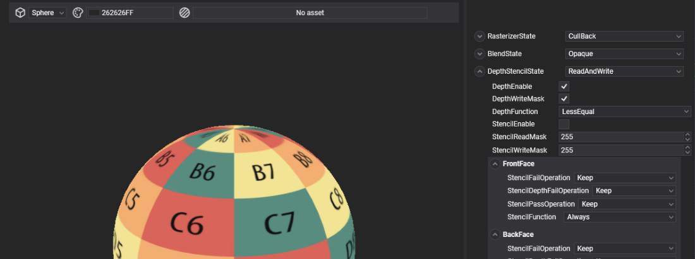

# RenderLayers
---

 

`RenderLayers` are used to group drawable components and control their rendering order and visual properties. Each `RenderLayer` defines a set of parameters that affect how the grouped elements are drawn. For example, you can group transparent elements into a specific `RenderLayer` to enable texture blending, or configure it to render objects in a `wireframe` or `solid` mode, or even use `stencil buffer` settings to achieve unique visual effects.

## In This Section
- [Create RenderLayer](create_renderlayer.md)
- [Using RenderLayer](using_renderlayer.md)
- [RenderLayer Editor](renderlayer_editor.md)

## RenderLayers and Materials
All [**materials**](../materials/index.md) require a `RenderLayer` to define their rendering behavior. Therefore, once a new `RenderLayer` is created, it must be assigned to the materials where it will be used.

## Default RenderLayers
By default, Evergine includes a set of predefined render layers through the [**Evergine.Core** package](../../addons/index.md). These default layers include:

#### Opaque
The **Opaque** layer is used to render objects that have no transparency and should be drawn solidly. Materials assigned to this layer do not allow any visibility through them, completely hiding any elements behind them. Objects in the **Opaque** layer are rendered first in the drawing order to ensure that transparent layers (like `Alpha`) are drawn correctly on top.

- **Typical Use**: Solid surfaces, structures, and objects that should not blend with the background or other elements.
- **Example**: Walls, furniture, and any other non-transparent object.

#### Alpha
The **Alpha** layer is designed for rendering transparent or semi-transparent objects. Materials in this layer allow for blending with the background and other objects. This layer typically utilizes alpha blending to achieve various levels of transparency, which is crucial for rendering effects like glass or water.

- **Typical Use**: Transparent surfaces, such as glass, water, or any object that requires blending with the scene.
- **Example**: Windows, liquid surfaces, and foliage with transparency.

#### AlphaDoubleSided
The **AlphaDoubleSided** layer is similar to the **Alpha** layer but is specifically used for rendering transparent objects that need to be visible from both sides. This layer is particularly useful for two-sided materials where transparency should be applied to both sides of a mesh, ensuring that it renders correctly regardless of the viewer's perspective.

- **Typical Use**: Objects that are visible from both sides and require transparency, such as leaves or thin fabrics.
- **Example**: Double-sided planes, such as billboards or foliage.

#### Additive
The **Additive** layer is used for rendering effects where light is added to the scene rather than subtracted. Materials in this layer use additive blending, which means that the colors of overlapping elements are combined in a way that brightens the scene. This is commonly used for effects like glowing objects or particle systems.

- **Typical Use**: Light-emitting objects and special effects that require a glow or bright appearance.
- **Example**: Fire, explosions, or any luminescent objects.

#### Skybox
The **Skybox** layer is specifically designed for rendering the environment background of a scene, typically represented as a cube or sphere that surrounds the entire scene. This layer allows for a panoramic or 360-degree view of the environment, creating a realistic backdrop for the scene without affecting the depth of other objects.

- **Typical Use**: Background environments and sky effects.
- **Example**: Sky textures, star fields, or panoramic landscapes.

These default `RenderLayers` cover the most common rendering configurations needed for typical projects. Additionally, `RenderLayers` are treated as a type of [**asset**](../../evergine_studio/assets/index.md) and have a dedicated editor, the [**RenderLayer Editor**](renderlayer_editor.md), which allows you to customize their parameters.

