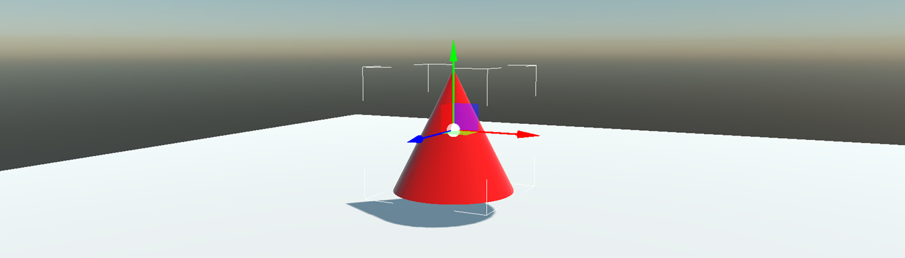

# Cone Collider

A cone-shaped collider.

## ConeCollider3D Component

To use a Cone Collider in Evergine, you only need to add a `ConeCollider3D` component to your entity:

### Properties

| Property | Default | Description | 
| --- | --- | --- |
| **Radius** | 0.5 | This property defines the radius of the cone collider. The **Radius** value can be used in two ways:<ul><li>If the entity has a mesh (with `MeshComponent`, for example), the Radius value is relative to the mesh extents.</li><li>If the entity does not have any meshes, the Radius value is used as scene units.</li></ul>|
| **Height** | 1 | This property defines the total height of the cone collider. The **Height** value can be used in two ways:<ul><li>If the entity has a mesh (with `MeshComponent`, for example), the Height value is relative to the mesh height.</li><li>If the entity does not have any meshes, the Height value is used as scene units.</li></ul>|
| **Offset** | 0,0,0 | Offsets the collider with respect to the owner entity. The **Offset** value can be used in two ways:<ul><li>If the entity has a mesh (with `MeshComponent`, for example), the Offset value is relative to the mesh extents.</li><li>If the entity does not have any meshes, the Offset value is used as scene units.</li></ul> |
| **Margin** | 0.04 | The physics engine uses a small collision margin for collision shapes to improve performance and reliability of the collision detection. |